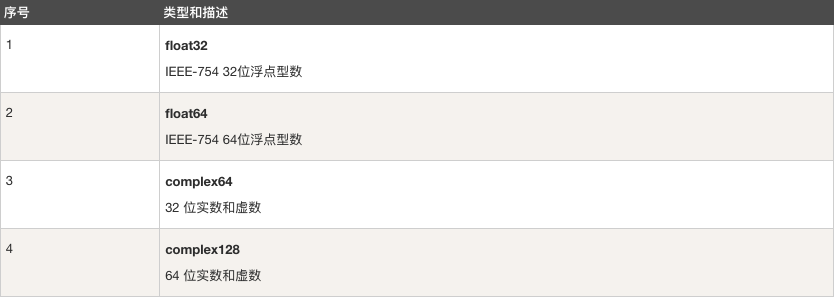
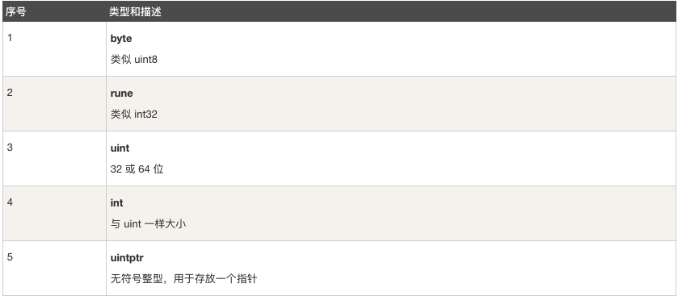
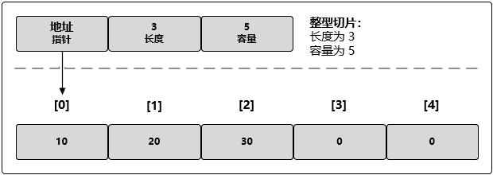
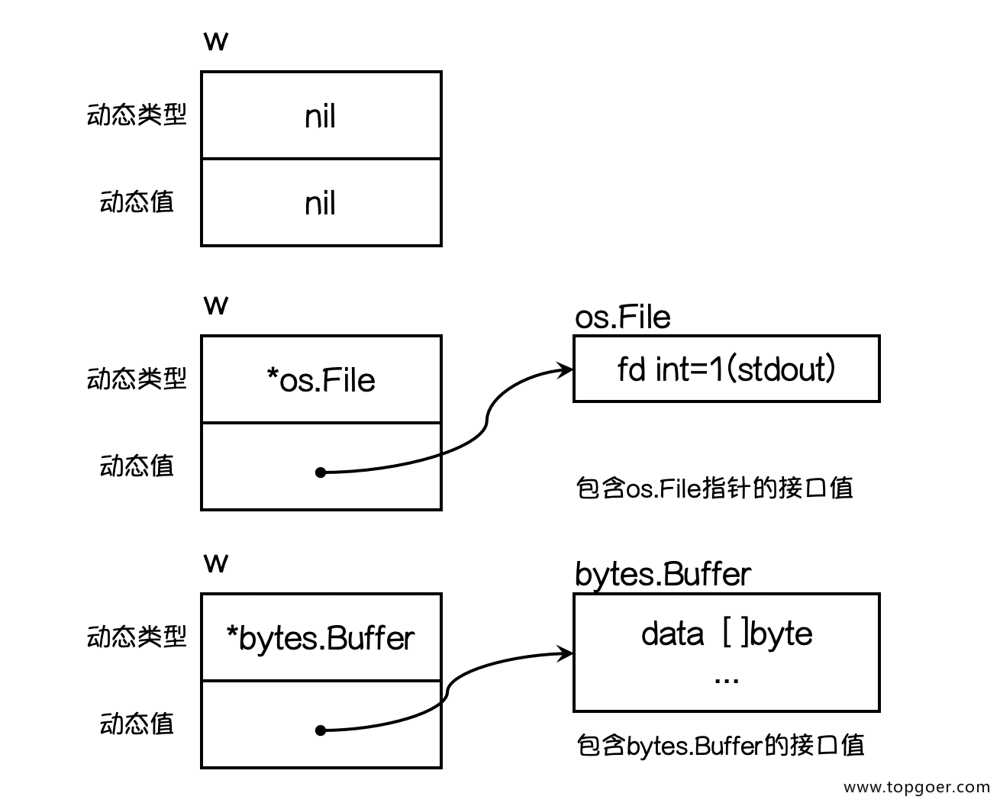
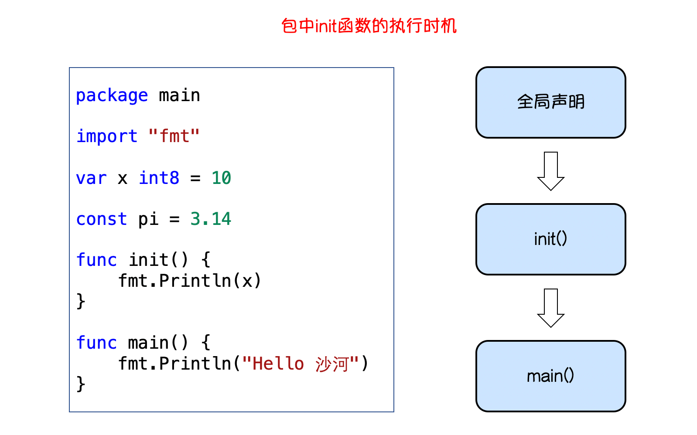
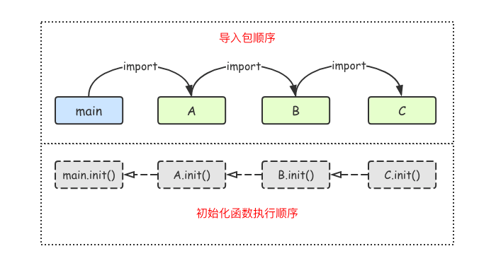

[参照文档地址](http://www.topgoer.com/)     [参照视频](https://www.bilibili.com/video/BV16E411H7og)

#  Go语言开发环境搭建

## 安装go开发包

[下载地址](https://golang.org/doc/)


# 编译

### 使用go build编译成二进制文件

1.在项目路径下执行go build,

2.在其他路径上至下go build，需要在后面加上项目路径（src目录下的路径）

3.go build -o xxx （-o:自定义打包文件名称）


# GO111MODULES管理项目

- 通过`go env`查看当前go环境配置
- 配置GO111MODULE环境变量，GO111MODULE存在三个值（默认值`auto`,`on`,`off`）
  - GO111MODULE=off
     go命令行将不会支持module功能，寻找依赖包的方式将会沿用旧版本的通过vendor目录或者GOPATH模式来查找。
  - GO111MODULE=on
     go命令行会使用modules，不会去GOPATH目录下查找。
  - GO111MODULE=auto（默认值）
     go命令行将会根据当前目录来决定是否启用module功能。下面两种情形将启用module功能：
     a. 当前目录在GOPATH/src之外且该目录包含go.mod文件
     b. 当前文件在包含go.mod文件的目录下面。
- 通过`go env -w GO111MODULE=on`来打开module管理
- 使用`go mod init {projectName}`初始化项目生成`.mod`文件
- `.mod`中包含当前包名称、引用的第三方包地址、当前golang SDK版本等，是项目管理配置文件

# Go语言基本结构

```go
import "fmt"
// 函数外只能防止标识符（变量、常量、函数、类型）的类型
//fmt.Println("Hello") // 非法

//程序的入口函数
func main(){
  fmt.Println("Hello World！")
}
```

# fmt中的三种打印方式

```go
	fmt.Print(isOk)             //终端输出要打印的内容
	fmt.Printf("name:%s", name) //%s:站位符 使用name这个变量去替换占位符
	fmt.Println(age)            //打印完内容会在后面加换位符
```


# 变量和常量

go语言中的变量必须先声明再使用

## 1.变量

1、`var s1 string`:声明一个保存字符串类型数据的s1

2、go语言中变量在非全局中声明了必须使用，不使用无法编译

```go
// 类型推导（根据值判断该变量类型）
var s2 = "20"
//简短变量声明 ,只能在函数里面用
s3 := "哈哈哈" //var s2 = "xxxx"简写
```

```go
//批量声明
var (
	name string // default:""
	age  int    // default:0
	isOk bool		// default:false
)
```

3、匿名变量

 	匿名变量不占用命名空间，不会分配内存，所以匿名变量之间不存在重复声明。

```
func foo() (int, string) {
	return 10, "Q1mi"
}

//匿名变量
x, _ := foo()
_, y := foo()
```

4、多变量声明

````go
//类型相同多个变量, 非全局变量
var vname1, vname2, vname3 type
vname1, vname2, vname3 = v1, v2, v3

var vname1, vname2, vname3 = v1, v2, v3 // 和 python 很像,不需要显示声明类型，自动推断

vname1, vname2, vname3 := v1, v2, v3 // 出现在 := 左侧的变量不应该是已经被声明过的，否则会导致编译错误


// 这种因式分解关键字的写法一般用于声明全局变量
var (
    vname1 v_type1
    vname2 v_type2
)


//多变量可以在同一行进行赋值，如：
var a, b int
var c string
a, b, c = 5, 7, "abc"
````


注意事项：

​		1.函数外的每个语句都必须以关键字开始（var、const、func等）

​		2.:=不能在函数外使用

​		3._多用于占位，表示忽略值

​		4.同一个作用域中不能声明同一个变量名

## 2.常量

### 定义

相对于变量，常量时恒定不变到值，多用于定义程序运行期间不会改变的那些值。常量的声明和变量声明非常类似，只是把`code`换成`const`，常量在定义的时候必须赋值。

```go
const pi = 3.1415926
const e = 2.7182
```

```go
//批量声明常量时，如何某一行声明后没有赋值，默认和上一行一致
const (
	n1 = 100 //100
	n2       //100
	n3       //100
)

```

### iota

`iota`时go语言的常量计数器，只能在常量的表达式中使用。

`iota`在const关键出现时将被重置为0。const中每新增一行常量声明将使`iota	`计数一次（iota可理解为const语句块中的行索引）。使用iota能简化定义，在定义枚举时很有用。

例：

```go
const (
		n1 = iota   // 0
		n2				  // 1
		n3					// 2
		n4					// 3
)
```

```go
package main

import "fmt"

func main() {
    const (
            a = iota   //0
            b          //1
            c          //2
            d = "ha"   //独立值，iota += 1
            e          //"ha"   iota += 1
            f = 100    //iota +=1
            g          //100  iota +=1
            h = iota   //7,恢复计数
            i          //8
    )
    fmt.Println(a,b,c,d,e,f,g,h,i)
}

// 结果0 1 2 ha ha 100 100 7 8
```

iota声明不同行才会 +1，在同一行内不会+1

```go
//多个常量声明在一行
const (
	d1, d2 = iota + 1, iota + 2  // 1 2
	d3, d4 = iota + 1, iota + 2  // 2 3
)
```

定义数量级

```go
//定义数量级
const (
	_  = iota
	KB = 1 << (10 * iota)
	MB = 1 << (10 * iota)
	GB = 1 << (10 * iota)
	TB = 1 << (10 * iota)
	PB = 1 << (10 * iota)
)

```

# Go语言基础之基本数据类型

Go语言中有丰富的数据类型，除了基本的数据类型、浮点型、布尔型、字符串外，还有数组、切片、结构体、函数、map、通道等。Go语言的基本类型和其他语言大同小异。

## 基本数据类型


## 整型

整型分为以下两大类：按长度分为：`int8`、`int16`、`int32`、`int64`，对应的无符号整型：`uint8`、`uint16`、`uint32`、`uint64`

其中，`uint8`就是我们熟知的`byte`型，`int16`对应c语言中的`short`型，`int64`对应c语言中的`long`型。

| 类型 | 描述 |
| :---- | :---- |
|**uint8** | 无符号 8 位整型 (0 到 255)|
|**uint16** | 无符号 16 位整型 (0 到 65535) |
|**uint32** | 无符号 32 位整型 (0 到 4294967295) |
|**uint64** | 无符号 64 位整型 (0 到 18446744073709551615) |
|**int8** | 有符号 8 位整型 (-128 到 127) |
|**int16** | 有符号 16 位整型 (-32768 到 32767) |
|**int32** | 有符号 32 位整型 (-2147483648 到 2147483647) |
|**int64** | 有符号 64 位整型 (-9223372036854775808 到 9223372036854775807) |

## 浮点型

Go语言支持两种浮点型：`float32`和`float64`。这两种浮点型数据格式遵循IEEE754 标准：float32的浮点数的最大范围约为3.4e38，可以使用常量定义：math.MaxFloat32。float64的浮点数最大约为1.8e308，可以使用常量定义：math.MaxFloat64



打印浮点数时，可以使用fmt包含动词%f，代码如下

```go
fmt.Printf("%f\n",math.Pi)
fmt.Printf("%.2f\n",math.Pi)
```

## 布尔值

Go语言中以`bool`类型进行声明布尔型数据，布尔型数据只有true（真）和false（假）两个值。

> 注意
>
> 布尔类型变量的默认值为false
>
> Go语言中不允许将整型强制转换为布尔型。
>
> 布尔型无法参加数值运算，也无法与其他类型进行转换。

## 其他数字类型



## 字符串

Go语言中字符串是双引号包裹的！！！

Go语言中单引号包裹的是字符！！！

```go
// 字符串
s := "hello 沙河"
// 单独的字母、汉子、符号表示一个字符
c1 := 'h'
c2 := '1'
```

### 字节编码

+ 字符串的字节默认使用UTF-8编码。
+ 支持Unicode字符

### 字符串定义

* 双引号（""）：双引号中的转义字符会被替换。
* 反引号（``）：反引号中原生字符串中的转义字符（如\n）会被原样输出。
* 单引号（''）：单引号中的单个字符，需要格式化输出，%c，否则输出字符码数。

### 字符串长度

+ `len()`：获取的是每个字符的UTF-8编码的***长度和***，而不是直接的字符串数量。如`len("hello,世界")`的结果不是8而是12.

+ `utf8.RuneCountInString()`：获取字符串真正的长度，上面的`utf8.RuneCountInString("hello,世界")`的结果为8.

  (注意)：需要import "unicode/utf8"

### 字符串拼接

##### 运算符+：

```go
str := "hello, " +
"world"
```

+ 字符串之间用加号”+“拼接。如何换行，+要放在当前行的末尾，不能放在一行的开头。
+ 使用这种拼接方式，里面的字符串是不可变的，每次运算多会产生一个新的、临时的字符串，个GC带来额外的负担，所以性能比较差。

#### fmt.Sprintf()

`fmt.Sprintf("%d:%s",2018,"年")`

+ 内部使用`[]byte`实现，不会产生临时的字符串
+ 内部逻辑复杂，还用到了`interface`，性能一般

##### strings.Join()

```go
strings.Join([]string{"hello","world"},"，")
```

+ Join会先根据**字符串数组**的内容，计算出一个拼接之后的长度，然后申请对应大小的内存，一个一个字符串填入。
+ 已有一个数组的情况下，这种拼接方式的效率很高，但如果没有，去构造这个数据的代价也不小。

##### byte.Buffer——<font color=red>优先推荐</font>

```go
var buffer bytes.Buffer
buffer.WriteString("hello")
buffer.WriteString(", ")
buffer.WriteString("world")
 
fmt.Print(buffer.String())
```

+ 使用这种拼接房方式，可以把字符串当成可变字符使用，对内存的增长也有优化。
+ 如果能预估字符串的长度，还可以用`buffer.Grow()`接口累设置capacity。

##### strings.Builder——<font color=red>推荐</font>

```go 
var b1 strings.Builder
b1.WriteString("ABC")
b1.WriteString("DEF")
 
fmt.Print(b1.String())
```

+ 内部通过slice来保存和管理内容。
+ 提供了Grow()来支持预定义容量，这样可以避免扩容而创建新的slice。
+ 非线程安全，性能上和`bytes.Buffer`相差无几。

## 数组

数组是同一种数据类型元素的集合。在Go语言中，数组从声明时就确认，使用时可以修改数组成员，但是数组大小不可变化，基本语法：

```go
//定义一个长度为3元素类型为int的数组a.
var a [3]int
```

### 声明数组(数组定义)

```go
var 数组变量名 [元素数量]T
```

比如：`var a [5]int`，数组的长度必须时变量，并且长度是数组的一部分。一旦定义，长度不能变。`[5]int`和`[10]int`是不同的类型。

```go
var a [3]int
var b [4]int
a = b //不可以这样做，因为此时a和b是不同的类型
```

数组之间可以通过下标从0开始，最后一个元素下标：`len-1`，访问越界（下标在合法范围之外），则触发访问越界，会panic。

+ 数组元素必须类型唯一，要么都是字符串，要么都是数字类型。如果想让数组元素类型为任意类型，可以是用空接口interface{}作为类型，当使用值时必须先做一个类型判断。

+ 声明时需要确定长度，如何采用不定长度的声明方式声明，在初始化时会自动确认好数组的长度。

+ | ① var arr [2]int //var 数组名称 [数组长度]数组元素类型       |
  | ------------------------------------------------------------ |
  | ② var arr = [2]int{1,2} //var 数组名称 = [数组长度]数组元素类型{元素1,元素2,...} |
  | ③ var arr = [5]string{3: "ab", 4: "cd"} //指定索引位置       |
  | ④ var arr = [...]int{1,2} //var 数组名称 = [...]数组元素类型{元素1,元素2,...}，不定长数组声明方式 |
  | ⑤ new()：创建的是**数组引针**,eg. var arr1 = new([5]int)     |

### 数组的初始化

```go
	//数组初始化
	//如果不初始化：默认元素都为零值（布尔值：false，整型和浮点型都是0，字符串：""）
	fmt.Println(a1, a2)
	//1、初始化方式1
	a1 = [3]bool{true, true, false}
	fmt.Println(a1)
	//2.初始化2
	//根据初始值自动推断数组长度
	a10 := [...]int{1, 2, 3, 4, 5}
	fmt.Println(len(a10))
	//3.初始化3
	//根据索引来初始化（剩余的用0来补充）
	a3 := [5]int{0: 1, 4: 2}
	fmt.Println(a3)
```

### 值传递和引用传递

```go
var arr1 = new([5]int)
arr := arr1
arr1[2] = 100
fmt.Println(arr1[2],arr[2])

var arr2 [5]int
newarr := arr2
arr2[2] = 100
fmt.Println(arr2[2],newarr[2])

// 程序输出
// 100 100
// 100 0
```

+ new([5]int)创建的是数组指针，arr和arr1指向同一地址，故而修改arr1时arr同样也生效；

+ 而newarr是由arr2值传递（拷贝），故而修改任何一个都不会改变另一个的值。

  

### 数组的遍历

```go
	//数组的遍历
	citys := [...]string{"北京", "上海", "成都"}
	//1.根据索引遍历
	for i := 0; i < len(citys); i++ {
		fmt.Println(citys[i])
	}
	//2.for range遍历
	for i, v := range citys {
		fmt.Println(i, v)
	}
```

### 多维数组

```go
//多维数组
	// [[x,x],[x,x],[x,x]]
	var a11 [3][2]int
	a11 = [3][2]int{
		[2]int{1, 2},
		[2]int{3, 4},
		[2]int{5, 6},
	}
	fmt.Println(a11)
	//多维数组的遍历
	for _, v := range a11 {
		for _, v2 := range v {
			fmt.Println(v2)
		}
	}
```

### 数组是值类型

数组是值类型，赋值和传参会复制整个数组。因此改变副文本的值，不会改变本身的值。

### 注意

1.数组支持"=="、"!="操作符，因为内存总是被初始化过的。

1.`[n]*T`表示指针数组，`*[n]T`表示数组指针。

## 切片（slice）

切片(slice)是 Golang 中一种比较特殊的数据结构，这种数据结构更便于使用和管理数据集合。切片是围绕动态数组的概念构建的，可以按需自动增长和缩小。切片的动态增长是通过内置函数 append() 来实现的，这个函数可以快速且高效地增长切片，也可以通过对切片再次切割，缩小一个切片的大小。因为切片的底层也是在连续的内存块中分配的，所以切片还能获得索引、迭代以及为垃圾回收优化的好处。

### 定义

+ 切片是引用（对底层数组一个连续片段的引用），不需要占用额外的内存，比数组效率高。
+ 一个切片为初始化前默认为null，长度为0.
+ 切片的长度可变，可以把切片看出一个长度可变的数组。

### 声明

```go
① 切分数组

var arr = [5]int{1,2,3,4,5} //数组

var s []type = arr[start:end:max] //切片（包含数组start到end-1之间的元素）,end-start表示长度，max-start表示容量

② 初始化

var s = []int{2, 3, 5, 7, 11} //创建了一个长度为 5 的数组并且创建了一个相关切片。

③ 切片重组

var s []type = make([]type, len, cap) //len 是数组的长度也是切片的初始长度,cap是容量，可选参数

简写为slice := make([]type, len)
```

### 切片的长度和容量

切片拥有自己的长度和容器，我们可以通过使用内置的`len()`函数求长度，使用内置的`cap()`函数求切片的容量。

切片是一个很小的对象，它对底层的数组(内部是通过数组保存数据的)进行了抽象，并提供相关的操作方法。切片是一个有三个字段的数据结构，这些数据结构包含 Golang 需要操作底层数组的元数据：



这 3 个字段分别是指向底层数组的指针、切片访问的元素的个数(即长度)和切片允许增长到的元素个数(即容量)。

**特点**

* 切片指向一个底层的数组。
* 切片的长度就是它元素的个数。
* 切片的容器是底层数组从切片的第一个元素到最后一个元素的数量。
* 

### 基于数组定义切片

由于切片的底层就是一个数组，所有我梦可以基于数组定义切片。

```go
func main(){
	// 基于数组定义切片
  a := [5]int{1,2,3,4,5}
  b := a[1:4]    //基于数组a创建切片，包含元素a[1],a[2],a[3]
  fmt.Println(b) //[2 3 4]
  fmt.Printf("type of b:%T",b) //type of b:[]int
}
```

还支持如下方式：

```go
c := a[1:] //从a[1]到末尾
c := a[:3] //从开始到a[3]
e := a[:] //从开始到末尾
```

总结：如何在剪切数组是，开始（或者结束）位置没有的话，默认为开头（或者末尾）位置进行剪切。

### 使用make( )函数创建切片

我们上面是基于数组来创建切片，如何需要动态的创建一个切片，我们就需要使用内置的`make()`函数，格式如下：

```go
var s []type = make([]type, len, cap) //len 是数组的长度也是切片的初始长度,cap是容量，可选参数,如何省略cap参数，cap就默认为len

```

### 切片的本质

切片就是一个框，框住了一块连续的内存。属于引用类型，真正的数据都保存在底层数组中。

### 切片不能直接比较

切片之间是不能直接比较的，我们不能使用`==`操作符来判断两个切片是否含有全部相等元素。切片唯一合法的比较操作是和`nil`比较。一个`nil`值的切片并没有底层数组，一个`nil`值的切片的长度和容器都是0。但是我们不能说一个长度和容器都是0的切片一定是`nil`,例如下面示例：

```go
var s1 []int				// len(s1)=0;cap(s1)=0;s1==nil
s2 := []int{}				// len(s2)=0;cap(s2)=0;s2!=nil
s3 := make([]int,0) // len(s3)=0;cap(s3)=0;s3!=nil
```

所以要判断一个切片是否是空，要使用`len(s) == 0`来判断，不应该使用`s == nil`来判断。

### 切片的赋值拷贝

下面的代码中演示了拷贝前后两个变量共享底层数组，对一个切片的修改会影响另一个切片的内容，这点需要特别注意。

```go
func main() {
	s1 := make([]int, 3)
	s2 := s1   			//将s1直接赋值给s2，s1和s2共用一个底层数组
	s2[0] = 100
	fmt.Println(s1) //[100 0 0]
	fmt.Println(s2) //[100 0 0]
}
```

### 切片的遍历

```go
func main() {
	//切片的遍历
	s3 := make([]int, 5, 10)
	for i := 0; i < len(s3); i++ {
		fmt.Println(i)
	}
	for i, v := range s3 {
		fmt.Println(i, v)
	}
}
```

### append()方法为切片添加元素

Go语言的内建函数`append`可以为切片动态添加元素。每个切片会指向一个底层数组，这个数字能容纳一定数量的元素。当底层数组不能容纳新增的元素时，切片就会自动按照一定的策略进行扩容，此时该切片指向的底层数组就会更换。“扩容”操作往往发生在`append()`函数。举个例子：

```go
func main{
	var numSlice []int
  for i:=0;i<10;i++{
    numSlice = append(numSlice,i)
    fmt.Printf("%v len:%d cap:%d ptr:%p\n",numSlice,len(numSlice),cap(numSlice),numSlice)
  }
}
```

### 切片的扩容规则

+ 首先判断，如何新申请容量（cap）大于2倍就容量（old.cap），最终容量（newcap）就是新申请的容量（cap）。
+ 否则判断，如何旧切片的长度小于1024，则最终容量（newcap）就是旧容量（old.cap）的两倍，即（newcap=doublecap）。
+ 否则判断，如何旧切片长度大于等于1024，则最终容量（newcap）从旧容量（old.cap）开始循环增加原来的1/4，即（newcap=old.cap，for{newcap += new cap/4}）直到最终容量（newcap）大于等于新申请的容量（cap），即（newcap=>cap）
+ 如果最终容量（cap）计算值溢出，则最终容量（cap）就是新申请容量（cap）。


需要注意的事，切片扩容还会根据切片中元素的类型不同而做不同的处理，比如`int`和`strint`类型处理方式就不一样。

### 使用copy()函数复制切片

由于切片类型是引用类型，所以a和b其实都指向了同一块内存地址。修改b的同时a的值也会发生变化。

Go语言内建的`copy()`函数可以迅速的将一个切片的数据复制到另一个切片空间，`copy()`函数的使用格式如下：

```go
copy(destSlice,srcSlice,[]T) //srcSlice:数据来源切片；destSlice：目标切片

//实例
	a1 := []int{1, 3, 5}
	a2 := a1 //赋值
	var a3 = make([]int, 10)
	copy(a3, a1) //copy
	a1[0] = 200
	fmt.Println(a1, a2, a3)
```

### 从切片中删除元素

Go语言中并没有删除切片的专用方法，我们可以使用切片本身的特性删除元素。代码如下：

```go
func main(){
  //从切片中删除元素
  a := []int{1,2,3,4,5,6,7,8,9}
  a = append(a[:1],a[3:]...)
  fmt.println(a) //[1 4 5 6 7 8 9]
}
```

## 指针

Go语言中不存在指针操作，只需要记住两个符号：

​	1.`&`：取地址

​	2.`*` :根据地址取值

### 指针取值

在对普通变量使用&操作符取地址后会获得这个变量的指针，然后可以对指针使用*操作，也就是指针取值，代码如下。

```go
// pointer
func main() {
	// 1.&:取地址
	n := 18
	fmt.Println(&n)
	p := &n
	fmt.Println(p)
	fmt.Printf("%T\n", p)
	//*：根据地址取值
	m := *p
	fmt.Println(m)
}
```

**总结**：取地址操作符`&`和取值符``*`是对互补操作符，`&`取出地址，`*`根据地址取出地址指向的值。

变量、指针地址、指针变量、取地址、取值的相互关系和特性如下：

+ 对变量进行取地址（&）操作，可以获得这个变量的指针变量。
+ 指针变量的值是指向地址。
+ 对指针变量进行取值（*）操作，可以获得指针变量的原变量的值。

### new和make

```go
func main(){
	var a *int
  *a = 100
  fmt.Println(*a)
  var b map[string]int
  b["沙河娜扎"]=100
  fmt.Println(b)
}
```

执行上面的代码会引发panic，为什么呢？在go语言中对于引用类型的变量，我们在使用的时候不仅要声明它，还要为他=分配内存空间，否则我们的值就没办法存储。而对于值的类型不需要分配内存空间，是因为他们在声明的时候已经默认分配好了内存空间。要分配内存，就引出来今天的new和make。Go语言中new和make是内建的两个函数，主要用来分配内存。

#### new

new是一个内置函数，它的函数签名如下：

```go
fun new(Type) *Type
```

其中：

+ Type表示类型，new函数只接受一个参数，这个参数是一个类型
+ *Type表示类型指针，new函数返回一个指向该类型内存地址的指针。

new函数不太常用，使用new函数得到的是一个类型的指针，并且该指针对应的值为该类型的零值。举个例子：

```go
func main(){
	a:=new(int)
	b:=new(bool)
	fmt.Printf("%T\n",a) // *int
	fmt.Printf("%T\n",b) // *bool
	fmt.Println(*a)			 // 0	
	fmt.Println(*b)			 // false
}
```

#### make

make也是用于内存分配的，区别于new，它只用于slice，map以及chan的内存创建，而且它返回的类型就是这三个本身，而不是它们的指针类型，因为这三种类型就是引用类型，所以就没有必要返回他们的指针了。make函数的函数签名如下：

```go
func make(t Type,size ...InterType) Type
```

make函数是无可替代的，我们在使用slice、map以及channel的时候，都需要使用make进行初始化，然后才可以对它们进行操作。

本节开始的示例中`var b map[string]int`只是声明变量b是一个map类型的变量，需要像下面的示例代码一样使用make函数进行初始化操作之后，才能对其进行键值对赋值：

```go
func main(){
	var b map[string]int
	b = make(map[string]int,10)
	b["沙河娜扎"] = 100
	fmt.Println(b)
}
```

make和new的区别

1.make和new都是用来申请内存的。

2.new很少用，一般用来给基本的数据类型申请内存，string\int，返回的是对应类型的指针（*string、*int）。

3.make是用来给`slice`、`map`、`chan`申请内存的，make函数返回的是对应的这三个类型本身。

## Map(集合)

Map是一种无序的键值对的集合。Map最重要的一点是通过key来快速检索数据，key类似于数据，key类似于索引，指向数据的值。

Map是一种集合，所以我们可以像迭代数组和切片那样迭代它。不过，Map是无序的，我们无法决定它的返回顺序，这是因为Map是使用hash表累实现。

### Map定义

Go语言中`map`的定义语法如下啊：

```go
map[keyType]ValueType
```

其中：

+ KeyType：表示键的类型。
+ ValueType：表示键对应的类型。

map类型的变量默认初始值为nil，需要使用make()函数来分配内存。语法为：

```go
make(map[keyType]ValueType,[cap])
```


其中cap表示map的容量，该参数虽然不是必须的，但是我们应该在初始化map的时候就为其指定一个合适的容量。

### 按照指定顺序遍历map

```go
func main(){
  rand.Seed(time.Now().UnixNano)//初始化随机数种子
  var scoreMap = make(map[string]int,200)
  for i := 0; i < 100; i++{
    key := fmt.Sprintf("stu%02d", i) //生成stu开头的字符串
    value := rand.Intn(100)
    scoreMap[key] = value
  }
  //取出map中的所有key存入切片keys
  var keys = make([]string,0,20)
  for key := range scoreMap {
    keys = append(keys,key)
  }
  //对切片进行排序
  sort.Strings(keys)
  //按照排序后的key遍历map
  for _, key := range keys{
    fmt.Println(key,scoreMap[key])
  }
}
```

### 元素类型为map的切片

```go
func main() {
	// 元素类型为map的切片
	var s1 = make([]map[int]string, 10)
	s1[0] = make(map[int]string, 1)
	s1[0][1] = "A"
	fmt.Println(s1) //[map[1:A] map[] map[] map[] map[] map[] map[] map[] map[] map[]]
}
```

### 元素为切片类型的map

```go
func main() {
	// 元素为切片类型的map
	var m1 = make(map[string][]int, 10)
	m1["s1"] = []int{1, 2, 3, 4, 5}
	fmt.Println(m1) //map[s1:[1 2 3 4 5]]
}
```


# Go语言流程控制

流程控制是每种编程语言控制逻辑走向和执行次序的重要部分，流程控制可以说是一门语言的”静脉“。

Go语言中最常用的流程控制有`if`和`for`，而`switch`和`goto`主要是为了简化代码、降低重复代码而生的结构，属于扩展类的流程控制。

## <font color=#C76934>if else(分支结构)</font>

<font color=#C76934>if条件判断基本写法</font>

Go语言中`if`条件判断的格式如下：

```go
if 表达式1{
	分支1
}else if 表达式2{
	分支2
}else{
	分支3
}
```

`if`条件判断语句中存在作用域，例如：

```go
if age := 20; age > 18 { //age在if中声明，{}外部无法访问，且乙方流程中的每个{}都有一个作用于（和js不同）
		fmt.Println("成年人")
	} else if age < 18 {
		fmt.Println("未成年")
	} else {
		fmt.Println("刚成年")
	}
	fmt.Println(age) //这里无法访问此时的age
```

## <font color=#C76934>for(循环结构)</font>

Go语言中的所有循环类型均可使用`for`关键字来完成。

for循环的基本格式如下：

```go
for 初始值;条件表达式;结束语句{
	循环体语句
}
```

条件表达式返回`true`是循环体不停地进行循环，直到条件表达式返回`false`时自动退出循环。

```go
func forDemo() {
	for i := 0; i <= 20; i++ {
		fmt.Printf("%d\n", i)
	}
}
```

for循环的初始语句可以省略，可以使用for语句外部的声明变量，但是初始语句后的分号必须要写，例如：

```go
func forDemo(){
	i := 0
	for ; i <= 10; i-- {
		fmt.Println(i)
	}
}
```

for循环的初始语句和结束语句都可以省略,例如：

```go
func forDemo(){
	i := 0
	for i <= 10 {
		fmt.Println(i)
		i ++
	}
}
```

### 无限循环

```go
for {
	循环语句
}
```

for循环可以通过`break`、`goto`、`return`、`panic`语句强制退出循环。

### for range(键值循环)

Go语言中可以使用`for range`遍历数组、切片、字符串、map及通道（channel）。通过`for range`遍历返回值有以下规律：

+ 数组、切片、字符串返回索引和值。
+ map返回键和值。
+ 通道（channel）只返回通道内的值。

```go 
	s := "Hello,沙河"       // 一个字符站1字节，utf8编码的在3字节
	for i, v := range s {  //i为对应的字节位置，v为对应的字节
		fmt.Printf("%d %c\n", i, v)
	}
```

## switch

+ switch 语句用于基于不同条件执行不同动作，每一个 case 分支都是唯一的，从上至下逐一测试，直到匹配为止。
+ switch 语句执行的过程从上至下，直到找到匹配项，匹配项后面也不需要再加 break。
+ switch 默认情况下 case 最后自带 break 语句，匹配成功后就不会执行其他 case，如果我们需要执行后面的 case，可以使用 **fallthrough** 。

```go
switch var1 {
    case val1:
        ...
    case val2:
        ...
    default:
        ...
}
```

+ 变量 var1 可以是任何类型，而 val1 和 val2 则可以是同类型的任意值。类型不被局限于常量或整数，但必须是相同的类型；或者最终结果为相同类型的表达式


Go语言规定每个`switch`中只能有一个`default`分支。

一个分支可以有多个值，多个case值中间使用英文逗号分隔。

```go
func testSwitch(){
	switch n := 7;n {
		case 1,3,5,7,9:
			fmt.Println("奇数")
		case 2,4,6,8,10:
			fmt.Println("偶数")
		default:
			fmt.Println(n)
	}
}
```

分支还可以使用表达式，这时候switch语句后面不需要在跟判断变量。例如：

```go
func switchDemo(){
	age := 20
	switch {
		case age <25:
			fmt.Println("好好学习吧")
		case age >= 25 && age < 35:
			fmt.Println("努力工作吧")
		case age >= 35:
			fmt.Println("保养头发吧")
		default:
			fmt.Println("好好活着吧")
	}
}
```

`fallthrough`语法可以执行满足条件的case的下一个case，是为了兼容c语言中的case设计的。

```go
  s := "a"
  switch {
    case s == "a":
    	fmt.Println("a")
    	fallthrough
    case s == "b":
    	fmt.Println("b")
    default:
    	fmt.Println("......")
  }
}
```


输出：

```
a
b
```

### Type Switch

switch 语句还可以被用于 type-switch 来判断某个 interface 变量中实际存储的变量类型。

Type Switch 语法格式如下：

```go
switch x.(type){
    case type:
       statement(s)      
    case type:
       statement(s)
    /* 你可以定义任意个数的case */
    default: /* 可选 */
       statement(s)
}
```

#### 实例：

```go
package main

import "fmt"

func main() {
    var x interface{}
    //写法一：
    switch i := x.(type) { // 带初始化语句
    case nil:
        fmt.Printf(" x 的类型 :%T\r\n", i)
    case int:
        fmt.Printf("x 是 int 型")
    case float64:
        fmt.Printf("x 是 float64 型")
    case func(int) float64:
        fmt.Printf("x 是 func(int) 型")
    case bool, string:
        fmt.Printf("x 是 bool 或 string 型")
    default:
        fmt.Printf("未知型")
    }
    //写法二
    var j = 0
    switch j {
    case 0:
    case 1:
        fmt.Println("1")
    case 2:
        fmt.Println("2")
    default:
        fmt.Println("def")
    }
    //写法三
    var k = 0
    switch k {
    case 0:
        println("fallthrough")
        fallthrough
        /*
            Go的switch非常灵活，表达式不必是常量或整数，执行的过程从上至下，直到找到匹配项；
            而如果switch没有表达式，它会匹配true。
            Go里面switch默认相当于每个case最后带有break，
            匹配成功后不会自动向下执行其他case，而是跳出整个switch,
            但是可以使用fallthrough强制执行后面的case代码。
        */
    case 1:
        fmt.Println("1")
    case 2:
        fmt.Println("2")
    default:
        fmt.Println("def")
    }
    //写法三
    var m = 0
    switch m {
    case 0, 1:
        fmt.Println("1")
    case 2:
        fmt.Println("2")
    default:
        fmt.Println("def")
    }
    //写法四
    var n = 0
    switch { //省略条件表达式，可当 if...else if...else
    case n > 0 && n < 10:
        fmt.Println("i > 0 and i < 10")
    case n > 10 && n < 20:
        fmt.Println("i > 10 and i < 20")
    default:
        fmt.Println("def")
    }
}
```

以上代码执行结果为：

```
    x 的类型 :<nil>
    fallthrough
    1
    1
    def
```


`goto`语句通过标签进行代码的无条件跳转。`goto`遇见可以在快速跳出循环、避免重复退出上有一定的帮助。Go语言中使用`goto`语句能简化一些代码的实现过程。例如双层嵌套的for循环要退出时：<font color=red>（尽量少用）</font>

```go
func gotoDemo(){
	var breakFlag bool
	for i:=0;i<10;i++{
		for j:=0;i<10;j++{
			if j == 2 {
				breakFlag = true;
				break
			}
			fmt.Printf("%v-%v\n",i,j)
		}
		//外层for循环判断
		if breakFlag {
			break
		}
	}
}
```

使用`goto`简化代码：<font color=red>（不推荐使用）</font>

```go
func gotoDemo(){
	for i:=0;i<10;i++{
		for j:=0;i<10;j++{
			if j == 2 {
        // 设置退出标签
				goto breakTag
			}
			fmt.Printf("%v-%v\n",i,j)
		}
	}
  return
  //标签
  breakTag:
  	fmt.Println("结束for循环")
}
```

## break跳出循环

`break`语句还可以在语句后面添加标签，表示退出某个标签对应的代码块，标签要求必须定义在对应的`for`、`switch`和`select`的代码块上。例如：

```go
func breakDemo(){
BREAKDEMO:
  for i := 0; i < 10; i++ {
    for j := 0; j < 10; j++{
      if j == 2 {
        	break BREAKDEMO
      }
      fmt.Printf("%v-%v\n",i,j)
    }
  }
  fmt.Println("结束for循环")
}
```

## continue(继续下次循环)

`continue`语句可以在结束当前循环，开始下一次循环迭代过程，仅限在for循环中使用。

在`continue`语句后面添加标签时，表示开始对应的循环。例如

```go
func continueDemo(){
forloop:
  for i := 0; i < 10; i++ {
    for j := 0; j < 10; j++{
      if j == 2 && i == 2 {
        	continue forloop
      }
      fmt.Printf("%v-%v\n",i,j)
    }
  }
}
```

# 运算符

运算符用于在程序运行时执行数学或者逻辑运算。

Go语言内置运算符有：

+ 算术运算符
+ 关系运算符
+ 逻辑运算符
+ 位运算符
+ 赋值运算符
+ 其他运算符

## 算术运算符

下表列出了所有Go语言的算术运算符。假定 A 值为 10，B 值为 20。

| 运算符 | 描述 |
| ------ | ---- |
| +      | 相加 |
| -      | 相减 |
| *      | 相乘 |
| /      | 相除 |
| %      | 求余 |

注意：`++`（自增）和`--`（自减）在Go语言中是单独的语句，并不是运算符，不能放在等号的右边赋值。

## 关系运算符

下表列出了所有Go语言的关系运算符。假定 A 值为 10，B 值为 20。

| 运算符 | 描述                                                         | 实例          |
| :----- | :----------------------------------------------------------- | ------------- |
| ==     | 检查两个值是否相等，如果相等返回 True 否则返回 False。       | (A==B)为false |
| !=     | 检查两个值是否不相等，如果不相等返回 True 否则返回 False。   | (A!=B)为true  |
| >      | 检查左边值是否大于右边值，如果是返回 True 否则返回 False。   | (A>B)为false  |
| <      | 检查左边值是否小于右边值，如果是返回 True 否则返回 False。   | (A<B)为true   |
| >=     | 检查左边值是否大于等于右边值，如果是返回 True 否则返回 False。 | (A>=B)为false |
| <=     | 检查左边值是否小于等于右边值，如果是返回 True 否则返回 False。 | (A<=B)为true  |

## 逻辑运算符

下表列出了所有Go语言的逻辑运算符。假定 A 值为 True，B 值为 False。

| 运算符 | 描述                                                         | 实例               |
| ------ | ------------------------------------------------------------ | ------------------ |
| &&     | 逻辑 AND 运算符。 如果两边的操作数都是 True，则条件 True，否则为 False。 | (A && B) 为 False  |
| \|\|   | 逻辑 OR 运算符。 如果两边的操作数有一个 True，则条件 True，否则为 False。 | (A \|\| B) 为 True |
| !      | 逻辑 NOT 运算符。 如果条件为 True，则逻辑 NOT 条件 False，否则为 True。 | !(A && B) 为 True  |

## 位运算符

位运算符对整数在内存中的二进制位进行操作。

下表列出了位运算符 &, |, 和 ^ 的计算：

| p    | q    | p&q  | p\|q | p^q  |
| ---- | ---- | ---- | ---- | ---- |
| 0    | 0    | 0    | 0    | 0    |
| 0    | 1    | 0    | 1    | 1    |
| 1    | 1    | 1    | 1    | 0    |
| 1    | 0    | 0    | 1    | 1    |

Go 语言支持的位运算符如下表所示。假定 A 为60，B 为13：

| **运算符** | **描述**                                                     | **实例**                               |
| ---------- | ------------------------------------------------------------ | -------------------------------------- |
| &          | 按位与运算符"&"是双目运算符。 其功能是参与运算的两数各对应的二进位相与。 | (A & B) 结果为 12, 二进制为 0000 1100  |
| \|         | 按位或运算符"\|"是双目运算符。 其功能是参与运算的两数各对应的二进位相或 | (A\|B) 结果为 61, 二进制为 0011 1101   |
| ^          | 按位异或运算符"^"是双目运算符。 其功能是参与运算的两数各对应的二进位相异或，当两对应的二进位相异时，结果为1。 | (A ^ B) 结果为 49, 二进制为 0011 0001  |
| <<         | 左移运算符"<<"是双目运算符。左移n位就是乘以2的n次方。 其功能把"<<"左边的运算数的各二进位全部左移若干位，由"<<"右边的数指定移动的位数，高位丢弃，低位补0。 | A << 2 结果为 240 ，二进制为 1111 0000 |
| >>         | 右移运算符">>"是双目运算符。右移n位就是除以2的n次方。 其功能是把">>"左边的运算数的各二进位全部右移若干位，">>"右边的数指定移动的位数 | A >> 2 结果为 15 ，二进制为 0000 1111  |

## 赋值运算符

下表列出了所有Go语言的赋值运算符。

| **运算符** | **描述**                                       | **实例**                              |
| ---------- | ---------------------------------------------- | ------------------------------------- |
| =          | 简单的赋值运算符，将一个表达式的值赋给一个左值 | C = A + B 将 A + B 表达式结果赋值给 C |
| +=         | 相加后再赋值                                   | C += A 等于 C = C + A                 |
| -=         | 相减后再赋值                                   | C -= A 等于 C = C - A                 |
| *=         | 相乘后再赋值                                   | C *= A 等于 C = C * A                 |
| /=         | 相除后再赋值                                   | C /= A 等于 C = C / A                 |
| %=         | 求余后再赋值                                   | C %= A 等于 C = C % A                 |
| <<=        | 左移后赋值                                     | C <<= 2 等于 C = C << 2               |
| >>=        | 右移后赋值                                     | C >>= 2 等于 C = C >> 2               |
| &=         | 按位与后赋值                                   | C &= 2 等于 C = C & 2                 |
| ^=         | 按位异或后赋值                                 | C ^= 2 等于 C = C ^ 2                 |
| \|=        | 按位或后赋值                                   | C \|= 2 等于 C = C \| 2               |

## 其他运算符

| **运算符** | **描述**         | **实例**                   |
| ---------- | ---------------- | -------------------------- |
| &          | 返回变量存储地址 | &a; 将给出变量的实际地址。 |
| *          | 指针变量。       | *a; 是一个指针变量         |

## 运算符优先级

| 优先级 | 运算符           |
| ------ | ---------------- |
| 5      | * / % << >> & &^ |
| 4      | + - \| ^         |
| 3      | == != < <= > >=  |
| 2      | &&               |
| 1      | \|\|             |

<font color=green>当然，你可以通过使用括号来临时提升某个表达式的整体运算优先级。</font>

# 函数

Go语言中支持函数、匿名函数和闭包，并且函数在Go语言中属于“一等公民”。

## 函数的定义

Go语言中定义函数使用`func`关键字，具体如下：

```go
func 函数名(参数)(返回值){
	函数体
}
```

其中：

* 函数名：由字母、数字、下划线组成。但函数名的第一个字母不能是数字。在同一个包内，函数名称也不能重名。
* 参数：参数由参数变量和参数变量的类型组成，多个参数之间使用“，”分割。
* 返回值：返回值由返回值和其变量类型组成，也可以只写返回值的类型，多个返回值必须用“（）”包裹，并用“，”分割。
* 函数体：实现指定功能的代码块。

```go
package main

import "fmt"

//函数

//函数存在的意义？
//函数是一段代码的封装
//把一段逻辑抽象出来封装到一个函数中，给它起个名字，每次用到它的时候直接调用
//使用函数能够让代码更清晰、更简洁。

//函数的定义
func sum(x int, y int) (ret int) {
	return x + y
}

//没有返回值的函数
func f1(x int, y int) {
	fmt.Println(x + y)
}

//没有参数但由返回值的函数
func f3() int {
	return 100
}

//参数可以命名也可以不命名
//命名的返回值就相当于函数中声明一个变量
func f4(x int, y int) (ret int) {
	ret = x + y
	fmt.Println(ret)
	return
}

//多个返回值
func f5() (int, string) {
	return 1, "沙河"
}

//参数的类型简写
//(当参数中连续两个参数的类型一致时，我们可以将非最后一个参数的类型省略)
func f6(x, y int, m, n string, i, j bool) int {
	return x + y
}

//可边长参数
//可边长参数必须放在参数最后
func f7(x string, y ...int) {
	fmt.Println(x) //下雨了
	fmt.Println(y) //[30 1 12 4 4 1 14 1] y的类型是切片 []int
}

//Go语言中函数没有默认参数这个概念
func main() {
	r := sum(10, 20)
	fmt.Println(r)
	f1(1, 2)
	fmt.Println(f3())
	fmt.Println(f4(11, 22))
	fmt.Println(f5())
	num := f6(6, 5, "", "", true, false)
	fmt.Println(num)
	f7("下雨了", 30, 1, 12, 4, 4, 1, 14, 1)
}

```

注意：在一个命名函数中不能在声明命名函数。

## defer语句

Go语言中`defer`语句会将其后面跟随的语句进行延迟出来。在`defer`归属的函数即将返回时，将延迟出来的语句按`defer`定义的逆序进行执行，也就是说，先被`defer`语句最后被执行，最后`defer`的语句，最先被执行。

```go
func main(){
	fmt.Println("start")
	defer fmt.Println(1)
	defer fmt.Println(2)
	defer fmt.Println(3)
	fmt.Println("end")
}
```

输出结构：

```go
start
3
2
1
end
```

由于`defer`语句延迟调用的特性，所以`defer`语句非常方便的处理资源释放问题。比如：资源清理、文件关闭、解锁及记录时间。

## defer执行时机

在Go语言的函数中`return `语句在底层并不是原子操作，它分为给返回值赋值和RET指令两步。而`defer`语句执行的时机就在返回值赋值操作后，RET指令执行前。具体如下图：


示例：

```go

//Go语言中函数的return不是原子操作，在底层是分为两步来执行
//第一步：返回值赋值
//第二步：真正的return返回
//函数中如果存在defer，那么defer执行的时机是在第一步和第二步之间
func f1() int {  
	x := 5
	defer func() {
		x++
	}()
	return x  // 5
}
func f2() (x int) {
	defer func() {
		x++
	}()
	return 5 // 6
}
func f3() (y int) {
	x := 5
	defer func() {
		x++
	}()
	return x // 5
}
func f4() (x int) {
	defer func(x int) {
		x++
	}(x)
	return x // 0
}
func f5()(x int){
  defer func(x int) int {
    x++
    return x
  }(x)
  return 5 //5
}
```


# 函数的进阶

## 变量作用域

### 全局变量

全局变量是定义在函数外部的变量，它在程序整个运行周期内都有效。在函数中可以访问到全局变量。

```go
package main

import "fmt"
//定义全局变量
var num int64 = 10
func testGlobalVar(){
	fmt.Printf("num:%d\n",num)//函数中可以访问全局变量num
}
func main(){
	testGlobalVar() //num:10
}
```

### 局部变量

局部变量又分为两种：函数内定义的变量无法在该函数外使用，例如下面代码main函数中无法使用testLocalVar函数中定义的变量x:

```go
func testLocalVar(){
	//定义一个函数局部变量x，仅在该函数内生效
	var x int64 = 100
	fmt.Printf("x=%d\n",x)
}
func main(){
	testLocalVar()
	fmt.Println(x) //此时无法使用变量x
}
```

如何局部变量和全局变量重名，优先访问局部变量。

在`if`或者`for`语句块中的变量不能在语句外部访问。

## 函数类型和变量

### 定义函数类型

我们可以使用`type`关键字来定义一个函数类型，具体格式如下：

```go
type calclation func(int, int) int
```

上面语句定义了一个`calculation`类型，它是一种函数类型，这种函数接受两个int类型的参数并且返回一个int类型的返回值。

简单来说，凡是满足这个条件的函数都是calculation类型的函数，例如下面的add和sub是calculation类型。

```go
func add(x, y int) int {
	return x + y
}
func sub(x, y int) int {
	reutrn x - y
}
```

## 匿名函数

没有名字的函数，一般在函数内部使用。

```go
func main() {
	//匿名函数
	f := func() {
		fmt.Println("匿名函数")
	}
	f()
	//立即执行函数
	func() {
		fmt.Println("立即执行函数")
	}()
}
```

## 闭包

闭包指的是一个函数和与其相关的引用环境组合而成的实体。简单来说，`闭包=函数+引用环境`。

下面例子：

```go
func adder() func(int) int{
  var x int
  return func(y int) int {
    x += y
    return x
  }
}
func main(){
  var f = adder()
  fmt.Println(f(10))
  fmt.Println(f(20))
  fmt.Println(f(30))
  
  f1 := addre()
  fmt.Println(f(40))
  fmt.Println(f(50))
}
```

变量`f`是一个函数并且它应用了其外部作用域中的`x`变量，此时`f`就是一个闭包。在`f`的生命周期内，变量`x`也一直有效。

进阶示例：

```go
package main

import (
	"fmt"
	"strings"
)

//闭包
//示例1
func makeSuffixFunc(suffix string) func(string) string {
	return func(name string) string {
		if !strings.HasSuffix(name, suffix) {
			return name + suffix
		}
		return name
	}
}

//示例2
func calc(base int) (func(int) int, func(int) int) {
	add := func(i int) int {
		base += i
		return base
	}
	sub := func(i int) int {
		base -= i
		return base
	}
	return add, sub
}
func main() {
	jpgFunc := makeSuffixFunc(".jpg")
	txtFunc := makeSuffixFunc(".text")
	fmt.Println(jpgFunc("test")) //test.jpg
	fmt.Println(txtFunc("test")) //test.text

	f1, f2 := calc(10)
	fmt.Println(f1(1)) //11
	fmt.Println(f2(2)) //9
}
```

## 内置函数

| 内置函数       | 介绍                                                         |
| -------------- | ------------------------------------------------------------ |
| close          | 主要用来关闭channel                                          |
| len            | 用来求长度，比如string、array、slice、map、channel           |
| new            | 用来分配内存，主要用来分配值类型，比如int、struct。返回的是指针 |
| make           | 用来分配内存，主要用来分配引用类型，比如chan、map、slice     |
| append         | 用来追加元素到数组、slice中                                  |
| panic和recover | 用来做错误处理                                               |

### panic/recover

Go语言中目前是没有异常机制，但是使用`panic/recover`模式来处理错误。`panic`可以在任何地方引发，但`recover`只有在`defer`调佣的函数中有效。示例：

```go
func funcA(){
  fmt.Println("func A")
}
func funcB(){
  panic("panic in B")
}
func funcC(){
  fmt.Println("func C")
}
func main(){
  funcA()
  funcB()
  funcC()
}
```

程序运行期间`funcB`中引发了`panic`导致程序崩溃，异常退出了。这个时候我们就可以通过`recover`将程序恢复回来，继续执行。

```go
//panic 和 recover
func funcA() {
	fmt.Println("A")
}
func funcB() {
	defer func() {
		err := recover()
    //如果程序出现了panic错误，可以通过recover恢复过来
    if err!=nil{
      fmt.Println(err)
    }
		fmt.Println("模拟数据库连接...")
	}()
	panic("出现了严重的错误！！！") //程序崩溃退出
	fmt.Println("B")
}
func funcC() {
	fmt.Println("C")
}
func main() {
	funcA()
	funcB()
}
```

注意：

​	1.recover()必须搭配defer使用。

​	2.defer一定要在可能引发panic的语句之前定义。

### fmt

标准库`fmt`提供了一下几种输出相关函数。

#### Print

`Print`系列函数会将内容输出到系统的标准输出，区别在于`Print`函数直接输出内容，`Printf`函数支持格式化输出字符串，`Println`函数会在输出内容的结尾添加一行换行符。

```go
func Print(a ...interface{}) (n int,err error)
func Printf(format string,a ...interface{}) (n int,err error)
// Pirntf("格式化字符串",值)
// %T：查看类型  %d：十进制   %b：二进制   %o：八进制   %x：十六进制   %c：字符   %s：字符串
// %p：指针   %v：值   %f：浮点数   %t：布尔值
func Println(a ...interface{}) (n int,err error)
```

#### Fprint

Fprint系列函数会将内容输出到一个io.Writer接口类型的变量w中，我们通常用这个函数往文件中写入内容。

```go
func Fprint(w io.Writer, a ...interface{}) (n int, err error)
func Fprintf(w io.Writer, format string, a ...interface{}) (n int, err error)
func Fprintln(w io.Writer, a ...interface{}) (n int, err error)
```

举个例子：

```go
// 向标准输出写入内容
fmt.Fprintln(os.Stdout, "向标准输出写入内容")
fileObj, err := os.OpenFile("./xx.txt", os.O_CREATE|os.O_WRONLY|os.O_APPEND, 0644)
if err != nil {
    fmt.Println("打开文件出错，err:", err)
    return
}
name := "枯藤"
// 向打开的文件句柄中写入内容
fmt.Fprintf(fileObj, "往文件中写如信息：%s", name)
```

注意，只要满足io.Writer接口的类型都支持写入。

#### Sprint

Sprint系列函数会把传入的数据生成并返回一个字符串。

```go
func Sprint(a ...interface{}) string
func Sprintf(format string, a ...interface{}) string
func Sprintln(a ...interface{}) string
```

简单的示例代码如下：

```go
s1 := fmt.Sprint("枯藤")
name := "枯藤"
age := 18
s2 := fmt.Sprintf("name:%s,age:%d", name, age)
s3 := fmt.Sprintln("枯藤")
fmt.Println(s1, s2, s3)
```

#### Errorf

Errorf函数根据format参数生成格式化字符串并返回一个包含该字符串的错误。

```go
func Errorf(format string, a ...interface{}) error
```

通常使用这种方式来自定义错误类型，例如：

```go
err := fmt.Errorf("这是一个错误")
```

#### 通用站位符

| 站位符 | 说明                               |
| ------ | ---------------------------------- |
| %v     | 值的默认格式表示                   |
| %+v    | 类似%v，但输出结构体时会添加字段名 |
| %#v    | 值的Go语法表示                     |
| %T     | 打印值的类型                       |
| %%     | 百分号                             |

#### 布尔型

| 占位符 | 说明        |
| ------ | ----------- |
| %t     | true或false |

#### 整型

| 占位符 | 说明                                                         |
| ------ | ------------------------------------------------------------ |
| %b     | 二进制                                                       |
| %c     | 对应的uincode                                                |
| %d     | 十进制                                                       |
| %o     | 八进制                                                       |
| %x     | 十六进制，使用a-f                                            |
| %X     | 十六进制，使用A-F                                            |
| %U     | 表示Unicode格式：U+1234,等价于“U+%o4X”                       |
| %q     | 该值对应的单引号括起来的go语法字符字面值，必要时会采用安全的转义表示 |

#### 浮点数与复数

| 占位符 | 说明                                                     |
| ------ | -------------------------------------------------------- |
| %d     | 无小数部分，二进制指数的科学计数法，如-123456p-78        |
| %e     | 科学计数法，如-1234.456e+78                              |
| %E     | 科学计数法，如-1234.456eE+78                             |
| %f     | 有小数部分但无指数部分，如123.456                        |
| %F     | 等价于%f                                                 |
| %g     | 根据实际情况采用%e或者%f格式（以获得更简洁、准确的输出） |
| %G     | 根据实际情况采用%E或者%F格式（以获取更简洁、准确的输出） |

#### 字符串和[]byte

| 占位符 | 说明                                                         |
| ------ | ------------------------------------------------------------ |
| %s     | 直接输出字符串或者[]type                                     |
| %q     | 该值对应的双引号括起来的go语法字符串字面值，必要时会采用安全的转义表示 |
| %x     | 每个字节用两字符十六进制数表示（使用a-f                      |
| %X     | 每个字节用两字符十六进制数表示（使用A-F                      |

#### 宽度标识符

宽度通过一个紧跟在百分号后面的十进制数指定，如果未指定宽度，则表示值时除必需之外不做填充。精度通过（可选的）宽度后跟点号后跟点十进制指定。如何未指定精度，会使用默认精度；如果点号后没有跟数字，表示精度为o。

| 占位符 | 说明               |
| ------ | ------------------ |
| %f     | 默认宽度，默认精度 |
| %9f    | 宽度9，默认精度    |
| %.2f   | 默认宽度，精度2    |
| %9.f   | 宽度9，精度2       |
| %9.f   | 宽度9，精度0       |

### 其他flag

| 占位符 | 说明                                                         |
| ------ | ------------------------------------------------------------ |
| "+"    | 总是输出数值的正负号；对%q（%+q）会生成全部是ASCII字符的输出（通过转义）； |
| ""     | 对数值，正数前加空格而负数前加负号；对字符串采用%x或%X时（%x或%X）会给各打印的字节之间加空格。 |
| "_"    | 在输出右边填充空白而不是默认的左边（即从默认的右对齐切换为左对齐）； |
| "#"    | 八进制数前加o（%#o），十六进制数前加ox（%#x）或者oX（%#X），指针去掉前的ox（%#p），对%q（%#q），对%U（%#U）会输出空格和单引号括起来的go字面值。 |
| "o"    | 使用o而不是空格填充，对于数值类型会把填充的o放在正负号后面； |

## 递归函数

递归，就是在运行的过程中调用自己。

语法格式如下：

```go
func recursion() {
   recursion() /* 函数调用自身 */
}

func main() {
   recursion()
}
```

Go 语言支持递归。但我们在使用递归时，开发者需要设置退出条件，否则递归将陷入无限循环中。

递归函数对于解决数学上的问题是非常有用的，就像计算阶乘，生成斐波那契数列等。

# Go语言基础结构体

Go语言中没有“类”的概念，也不支持“类”的继承等面向对象的概念。Go语言中通过结构体的内嵌再配合接口比面向对象具有更高的扩展和灵活性。

# 类型别名和自定义类型

## 自定义类型

在Go语言中有一些基本的数据，如`string`、`整型`、`浮点型`、`布尔`等数据类型，Go语言中可以使用`type`关键字来定义自定义类型。

自定义类型是定义一个全新的类型。我们呢过可以基于内置的基本类型定义，也可以通过struct定义。例如：

```gp
//将MyInt定义为int类型
type MyInt int
```

通过`Type`关键字的定义，`MyInt`就是一种新的类型，它具有`int`的特性。

## 类型别名

类型别名规定：TypeAlias只是Type的别名，本质上TypeAlias与Type是同一个类型。就像一个孩子小时候有小名、乳名，上学后用学名，英语老师又会给它起英文名，但这些名字都指的是他本人。

```
type TypeAlias = Type
```

我们之前见的`rune`和`byte`就是类型别名，它们定义如下：

```go
type byte = uint8
type rune = int32
```

## 类型定义和类型别名的区别

类型别名与类型定义表面上只有一个等号的差异，我们通过下面的这段代码来理解它们之间的区别。

```go
package main

import "fmt"

//自定义类型和别名

//type后面跟的是类型
type myInt int     //自定义类型
type yourInt = int //类型别名

func main() {
	var n myInt
	n = 100
	fmt.Println(n)        //100
	fmt.Printf("%T\n", n) //main.myInt

	var m yourInt
	m = 100
	fmt.Println(m)        //100
	fmt.Printf("%T\n", m) //int

	var c rune
	c = '中'
	fmt.Println(c)        //20013
	fmt.Printf("%T\n", c) //int32
}
```

结果显示n的类型是`main.myInt`，表示main包下面定义的类型。m的类型是`int`。myInt类型只会在代码中存在，编译完成是并不会有myInt类型。

# 结构体

Go语言中基本数据类型可以表示一下事物的基本属性，但是当我们想表达一个事物的全部或者部分属性时，这时候再用单一的基本数据类型明显就无法满足需求了，Go语言提供了一种自定义数据类型，可以封装多个基本数据类型，这种数据类型叫结构体，英文名叫`struct`。也就是我们可以通过`struct`来定义自己的类型了。

结构体是值类型，赋值的时候是拷贝。

## 结构体的定义

使用`type`和`struct`关键字来定义结构体，具体代码格式如下：

```go
type 类型名 struct {
	字段名 字段类型
	字段名 字段类型
	...
}
```

其中：

+ 类型名：标识自定义结构体的名称，在同一个包内不能重复。
+ 字段名：标识结构体字段名。结构体中的字段名必须唯一。
+ 字段类型：标识结构体字段的具体类型。

```go
package main
import "fmt"
//结构体
type person struct {
	name   string
	age    int
	gender string
	hobby  []string
}
func main() {
	//声明一个person类型的变量zhangsan
	var zhangsan person
	//通过字段赋值
	zhangsan.name = "zhangsan"
	zhangsan.age = 20
	zhangsan.gender = "男"
	zhangsan.hobby = []string{"篮球", "足球"}
	//访问变量zhangsan的字段
	fmt.Printf("%T\n", zhangsan) //main.person
	fmt.Println(zhangsan)        //{zhangsan 20 男 [篮球 足球]}
	fmt.Println(zhangsan.name)   //zhangsan
}
```

## 匿名结构体

```go
//匿名结构体
	var s struct { //使用var声明变量作为结构体名
		x string
		y int
	}
	s.x = "hehehe"
	s.y = 100
	fmt.Printf("type:%T value:%v \n", s, s) //type:struct { x string; y int } value:{hehehe 100}

```

## 创建指针类型的结构体

我们还可以通过`new`关键字对结构体进行实例化，得到的是结构体的地址。格式如下：

```go
var p2 = new(person)
fmt.Printf("%T\n",p2)  //*main.person
fmt.Printf("p2=%#v\n",p2) //p2=&main.person{name:"",city:"",age:0}
```

从打印的结果中我们可以看出`p2`值一个结构体指针。

需要注意的是在Go语言中指出对结构体指针直接使用`.`来访问结构体成员。

```go
var p2 = new(person)
p2.name="小王子"
p2.age=18
p2.city="上海"
fmt.Printf("p2=%3v\n",p2) //p2=&main.person{name:"小王子",city:"上海",age:18}
```

## 取结构体的地址实例化

使用`&`对结构体进行取地址操作相当于对该结构体类型进行了一次`new`实例化操作。

```go
p3:=&person{}
fmt.Printf("%T\n",p3) //*main.person
fmt.Printf("p3=%#v\n",p3) //p3=&main.person{name:"",city:"",age:0}
p3.name = "七米"
p3.age = 30
p3.city="成都"
fmt.Printf("p3=%#v\n",p3)//p3=&main.person{name:"七米",city:"成都",age:30}
```

`p3.name="七米"`其实在底层是`(*p3).name="七米"`,这是Go语言帮我们实现的语法糖。

## 结构体初始化

没有初始化的结构体，其成员变量都是对应类型的零值。

```go
//结构体是值类型
type person struct {
	name, sex string
	age       int
}
func main(){
  //结构体指针1
	var p2 = new(person)
	fmt.Printf("%#v %p\n", p2) //&main.person{name:"", sex:"女", age:0}
}

```

### 使用键值对初始化

使用键值对对结构体进行初始化，键对应结构体的字段，值对应字段的初始值。

```go
	var p3 = person{
		name: "展博",
		age:  20,
		sex:  "男",
	}
	fmt.Printf("%#v %p\n", p3, &p3) //main.person{name:"展博", sex:"男", age:20} 0xc00006e2d0
```

也可以对结构体指针进行键值对初始化，例如 ：

```go
	//key-value初始化,使用的值列表的形式初始化，值的顺序要和结构体定义时字段的顺序一致
	p3 := &person{
		name: "展博",
		age:  20,
		sex:  "男",
	}
	fmt.Printf("%#v %p\n", p3, &p3) //main.person{name:"展博", sex:"男", age:20} 0xc00006e2d0
```

当某些字段没有初始值时，该字段可以不写。此时，没有指定初始值的字段的值就是该字段类型的零值。

```go
p7 :=&person{
	city:"北京"
}
fmt.Printf("p7=%#v\n",p7) // p7=&main.person{name:"",city:"北京",age:0}
```

### 使用值的列表初始化

初始化结构体的时候可以简写，也就是简写时可以不用写键，直接写值：

```go
	//key-value初始化,使用的值列表的形式初始化，值的顺序要和结构体定义时字段的顺序一致
	p4 := &person{
		"lilei",
		"男",
		20,
	}
	fmt.Printf("%#v %p\n", p4, &p4) //main.person{name:"lilei", sex:"男", age:20} 0xc00006e330
```

使用这种格式初始化时，需要注意：

+ 必须初始化结构体所有字段。
+ 初始值的填充顺序必须与字段就在结构体中的声明顺序一致。
+ 该方式不能和键值初始化方式混用。

## 结构体内存分布

结构体占用一块连续的内存。

```go
//结构体占用一块连续的内存空间
type x struct {
	a int8 // 8bit->1byte
	b int8
	c int8
}

func main() {
	m := x{
		int8(10),
		int8(20),
		int8(30),
	}
	fmt.Printf("%p\n", &m.a) //0xc000124002
	fmt.Printf("%p\n", &m.b) //0xc000124003
	fmt.Printf("%p\n", &m.c) //0xc000124004
}
```

【进阶知识】关于Go语言中的内存对齐推荐阅读：[在Go中恰到好处的内存对齐](https://segmentfault.com/a/1190000017527311?utm_campaign=studygolang.com&utm_medium=studygolang.com&utm_source=studygolang.com)

## 构造函数

返回一个结构体变量的函数。

```go

//构造函数
type person struct {
	name string
	age  int
}
//构造函数：约定成俗以new开头
//返回的是结构体还是结构体指针
//当结构体比较大的时候尽量使用结构体指针，减少程序的内存开销
func newPerson(name string, age int) *person {
	return &person{
		name,
		age,
	}
}

type dog struct {
	name string
}

func newDog(name string) dog {
	return dog{
		name,
	}
}
func main() {
	var p = newPerson("lilei", 30) //main.person{name:"lilei", age:30}

	p2 := newPerson("周林", 90) //main.person{name:"周林", age:90}
	fmt.Printf("%#v %#v\n", p, p2)
	d1 := newDog("林狗")
	fmt.Printf("%#v\n", d1) //main.dog{name:"林狗"}
}

```

## 方法和接受者

Go语言中的`方法（Method）`是一种作用于特定类型变量的函数。这种特定类型变量叫做`接收者（Receiver）`。接受者的概念就类似于其他语言中的`this`或者`self`。

方法的定义格式如下：

```
func (接受者变量 接受者类型) 方法名(参数列表)(返回参数){
	函数体
}
```

其中：

+ 接收者变量：接收者中的参数变量名在命名时，官方建议使用接收者类型名的第一个小写字母，而不是`self`、`this`之类的命名。例如，`Person`类型的接收者变量应该命名为`p`，Connector类型的接收者变量应该命名为c等。
+ 接收者类型：接收者类型参数类型，可以是指针和非指针类型。
+ 方法名、参数列表、返回参数：具体格式与函数定义相同。

```go
//方法和接收者
type dog struct {
	name string
	age  int
}

//构造函数
func newDog(name string, age int) dog {
	return dog{
		name,
		age,
	}
}

//方法是作用于特定类型的函数
//d:形参 dog:类型
//接收者表示的是调用该方法的具体类型变量，多用类型名首字母小写表示
func (d dog) wang() {
	fmt.Println("汪汪汪", d.name)
}
func main() {
	d1 := newDog("zhoulin", 20)
	d1.wang() //汪汪汪 zhoulin
}
```

### 什么时候应该使用指针类型接收者

+ 需要修改接收者中的值。
+ 接收者是拷贝代价比较到的大对象。
+ 保证一致性，如果有某个方法使用了指针接收者，那么其他的方法也应该使用指针接收者。

### 任意类型添加方法

在Go语言中，接收者的类型可以是任何累，不仅仅是结构体，任何类型都可以拥有方法。举个例子，我们基于内置的`int`类型使用type关键字可以定义新的自定义类型，然后为我们的自定义类型添加方法。

```go
//MyInt 将int定义为MyInt类型
type MyInt int
//SayHello 为MyInt添加一个SayHello的方法
func (m MyInt) SayHello(){
	fmt.Println("Hello,我是一个int。")
}
func mian(){
	var m1 MyInt
	m1.SayHello() //Hello，我是一个int。
	m1 = 100
	fmt.Printf("%#v %T\n",m1,m1) //100 main.MyInt
}
```

***注意事项***：非本地类型不能定义方法，也就是说我们不能给别的包的类型定义方法。

## 函数版学生系统

```go
package main

import (
	"fmt"
	"os"
)

//学习管理系统函数版
/*
	需求
	查看、新增、删除 学生

*/
var (
	allStuden map[int64]*studen
)

type studen struct {
	id   int64
	name string
}

func newStudent(id int64, name string) *studen {
	return &studen{id, name}
}
func showAllStuden() {
	if len(allStuden) == 0 {
		fmt.Println("没有学生")
	}
	//遍历所有的学生
	for k, v := range allStuden {
		fmt.Printf("学号：%d 姓名：%s\n", k, v.name)
	}
}
func addStuden() {
	//向allStuden中添加一个新的学生
	//创建一个新学生
	var (
		id   int64
		name string
	)
	fmt.Println("请输入学号：")
	fmt.Scanln(&id)
	fmt.Println("请输入姓名")
	fmt.Scanln(&name)
	var stu = newStudent(id, name)
	//追加到allStuden中
	allStuden[id] = stu

}
func deleteStuden() {
	var (
		id int64
	)
	fmt.Println("请输入要删除学号：")
	fmt.Scanln(&id)
	for k := range allStuden {
		fmt.Println(k)
		if k == id {
			delete(allStuden, id)
			fmt.Printf("学号为%d的学生已删除\n", id)
		} else {
			fmt.Println("没有找到该学生")
		}
	}
}
func main() {
	allStuden = make(map[int64]*studen, 48)
	for {
		//1.打印菜单
		fmt.Println("欢迎光临学生管理系统！！！")
		fmt.Println(`
			1、查看所有学生
			2、新增学生
			3、删除学生
			4、退出
		`)
		//2.等待用户选择
		fmt.Println("请输入你要干啥：")
		var choice int
		fmt.Scanln(&choice)
		fmt.Printf("你选择了%d这个选项！\n", choice)

		//3.执行对应的函数
		switch choice {
		case 1:
			showAllStuden()
		case 2:
			addStuden()
		case 3:
			deleteStuden()
		case 4:
			os.Exit(1) //退出
		default:
			fmt.Println("滚！")
		}
	}

}

```

## 结构体的匿名字段

<font color=red>不常用</font>

结构体允许其成员字段在生命时没有字段名而只有类型，这种没有名字的字段称为匿名字段。

```go
//Person结构体Person类型
type Person struct{
	string
	int
}
func main(){
	p1:=Person{
		"小王子",
		18,
	}
  fmt.Printf("%#v\n",p1)  //main.Person{string:"小王子",int:18}
  fmt.Println(p1.string,p1.int) //小王子 18
}
```

匿名字段默认采用类型名作为字段名，结构体要求字段名称必须唯一，因此一个结构体中同种类型的匿名字段只鞥有一个。

## 嵌套结构体

一个结构体中还可以嵌套其他的结构体或者指针。

```go

//嵌套结构体
type address struct {
	province string
	city     string
}
type workPlace struct {
	province string
	city     string
}
type person struct {
	name    string
	age     int
	address //匿名嵌套结构体
	// workPlace
	//address address
}
type company struct {
	name string
	addr address
}

func main() {
	p1 := person{
		name: "zhouling",
		age:  90,
		address: address{
			province: "山东",
			city:     "威海",
		},
	}
	fmt.Println(p1)
	fmt.Println(p1.name, p1.address.city)
	fmt.Println(p1.city) //先在自己的结构体中查找这个字段，如果不存在就去匿名嵌套结构体中查找字段,当有两个或多个匿名嵌套结构体存在相同字段时，就不能使用简写
}

```

### 结构体的”继承“

Go语言中使用结构体也可以实现其他编程语言中的面向对象的继承。

```go
//结构体默认实现其他语言中的"继承"
type animal struct {
	name string
}

//给amimal实现一个移动的方法
func (a animal) move() {
	fmt.Printf("%s会动！\n", a.name)
}

//狗类
type dog struct {
	feet   uint8
	animal //animal拥有的方法，dog也有了
}

//给狗实现一个汪汪汪的方法
func (d dog) wang() {
	fmt.Printf("%s在叫:汪汪汪~\n", d.name)
}
func main() {
	d1 := dog{
		feet: 4,
		animal: animal{
			name: "zhoulin",
		},
	}
	fmt.Println(d1)
	d1.wang()
	d1.move()
}
```

## 结构体与JSON

```go
package main

import (
	"encoding/json"
	"fmt"
)

//结构体与JSON
//1.序列化：把Go语言中的结构体变量--》json格式的字符串
//2.反序列化：json格式的字符串--》Go语言中能识别的结构体变量
type person struct {
	Name string `json:"name" db:"name" ini:"name"` //设置在不同数据类型下显示的别名
	Age  int    `json:"age"`
}

func main() {
	p1 := person{
		Name: "周林",
		Age:  9000,
	}
	//序列化
	b, err := json.Marshal(p1)
	if err != nil {
		fmt.Printf("marshal failed,err:%v\n", err)
		return
	}
	fmt.Printf("%#v\n", string(b))
	//反序列化
	str := `{"name":"理想","age":18}`
	var p2 person
	json.Unmarshal([]byte(str), &p2) //传指针是为了能在json.Unmarshal中修改这个值
	fmt.Printf("%#v\n", p2)
}
```

# 接口（interface）

在Go语言中接口（interface）是一种类型，一种抽象的类型。

interface是一组method的集合，是duck-type programming的一种体现。接口做的事情就像是定义一个协议（规则），只要一台机器有洗衣服和甩干的功能，我就称它为洗衣机。不关心属性（数据），只关心行为（方法）。

为了保护你的Go语言职业生涯，请牢记接口（interface）是一种类型。

## 接口的定义

Go语言提倡面向接口编程。

```
   接口是一个或多个方法签名的集合。
    任何类型的方法集中只要拥有该接口'对应的全部方法'签名。
    就表示它 "实现" 了该接口，无须在该类型上显式声明实现了哪个接口。
    这称为Structural Typing。
    所谓对应方法，是指有相同名称、参数列表 (不包括参数名) 以及返回值。
    当然，该类型还可以有其他方法。

    接口只有方法声明，没有实现，没有数据字段。
    接口可以匿名嵌入其他接口，或嵌入到结构中。
    对象赋值给接口时，会发生拷贝，而接口内部存储的是指向这个复制品的指针，既无法修改复制品的状态，也无法获取指针。
    只有当接口存储的类型和对象都为nil时，接口才等于nil。
    接口调用不会做receiver的自动转换。
    接口同样支持匿名字段方法。
    接口也可实现类似OOP中的多态。
    空接口可以作为任何类型数据的容器。
    一个类型可实现多个接口。
    接口命名习惯以 er 结尾。
```

每个接口由数个方法组成，接口的定义如下：

```go
type 接口类型名 interface{
	方法名1（参数列表1）返回值列表1
	方法名2（参数列表2）返回值2
	...
}
```

其中：

+ 1.接口名：使用type将接口定义为自定义的类型名。Go语言的接口在命名时，一般会在单词后面添加er，如有写操作的接口叫Writer，有字符串功能的接口叫Stringer等。接口名最好要能突出该接口的类型含义。
+ 2.方法名：当方法名首字母是大写且这个接口类型名首字母也是大写时，这个方法可以被接口所在的包（package）之外的代码访问。
+ 3.参数列表、返回值列表：参数列表和返回值列表中的参数变量名可以省略。

举个例子：

```go
type writer interface{
	Write([]byte) error
}
```

## 实现接口的条件

一个对象只要全部实现了接口中的方法，那么就实现了这个接口。换句话说，接口就是一个需要实现的方法列表。

定义一个Sayer接口：

```go
//Sayer接口
type Sayer interface {
	say()
}
```

定义dog和cat两个结构体：

```go
type dog struct{}
type cat struct{}
```

因为Sayer接口里只有一个say方法，所以我们只需要给dog和cat分别实现say方法就可以实现Sayer接口了。

```go
//dog实现Sayer接口
func (d dog) say(){
	fmt.Println("汪汪汪")
}
//cat实现了Sayer接口
func (c cat) say(){
	fmt.Println("喵喵喵")
}
```

## 接口类型变量

接口类型变量能够存储所有实现了该接口的实例。 例如上面的示例中，Sayer类型的变量能够存储dog和cat类型的变量。

```go
func main() {
    var x Sayer // 声明一个Sayer类型的变量x
    a := cat{}  // 实例化一个cat
    b := dog{}  // 实例化一个dog
    x = a       // 可以把cat实例直接赋值给x
    x.say()     // 喵喵喵
    x = b       // 可以把dog实例直接赋值给x
    x.say()     // 汪汪汪
}
```

## 值接收者和指针接收者实现接口的区别

使用值接收者实现接口和使用指针接收者的区别。

是哦那个值接收者实现实现接口，结构体类型和结构体指针类型的变量都能存。

指针接收者实现接口只能存结构体指针。

实例：

我们有一个Mover接口和一个dog结构体。

```go
type Mover interface {
    move()
}

type dog struct {}
```

## 值接收者实现接口

```go
func (d dog) move() {
    fmt.Println("狗会动")
}
```

此时实现接口的是dog类型：

```go
func main() {
    var x Mover
    var wangcai = dog{} // 旺财是dog类型
    x = wangcai         // x可以接收dog类型
    var fugui = &dog{}  // 富贵是*dog类型
    x = fugui           // x可以接收*dog类型
    x.move()
}
```

从上面的代码中我们可以发现，使用值接收者实现接口之后，不管是dog结构体还是结构体指针`*dog`类型的变量都可以赋值给该接口变量。因为Go语言中有对指针类型变量求值的语法糖，dog指针fugui内部会自动求值`*fugui`。

## 类型与接口的关系

###  一个类型实现多个接口

一个类型可以同时实现多个接口，而接口间彼此独立，不知道对方的实现。 例如，狗可以叫，也可以动。我们就分别定义Sayer接口和Mover接口，如下： Mover接口。

```go
// Sayer 接口
type Sayer interface {
    say()
}

// Mover 接口
type Mover interface {
    move()
}
```

dog既可以实现Sayer接口，也可以实现Mover接口。

```go
type dog struct {
    name string
}

// 实现Sayer接口
func (d dog) say() {
    fmt.Printf("%s会叫汪汪汪\n", d.name)
}

// 实现Mover接口
func (d dog) move() {
    fmt.Printf("%s会动\n", d.name)
}

func main() {
    var x Sayer
    var y Mover

    var a = dog{name: "旺财"}
    x = a
    y = a
    x.say()
    y.move()
}
```

### 多个类型实现同一接口

Go语言中不同的类型还可以实现同一接口 首先我们定义一个Mover接口，它要求必须由一个move方法。

```go
// Mover 接口
type Mover interface {
    move()
}
```

例如狗可以动，汽车也可以动，可以使用如下代码实现这个关系：

```go
type dog struct {
    name string
}

type car struct {
    brand string
}

// dog类型实现Mover接口
func (d dog) move() {
    fmt.Printf("%s会跑\n", d.name)
}

// car类型实现Mover接口
func (c car) move() {
    fmt.Printf("%s速度70迈\n", c.brand)
}
```

这个时候我们在代码中就可以把狗和汽车当成一个会动的物体来处理了，不再需要关注它们具体是什么，只需要调用它们的move方法就可以了。

```go
func main() {
    var x Mover
    var a = dog{name: "旺财"}
    var b = car{brand: "保时捷"}
    x = a
    x.move()
    x = b
    x.move()
}
```

上面的代码执行结果如下：

```
 旺财会跑
 保时捷速度70迈
```

并且一个接口的方法，不一定需要由一个类型完全实现，接口的方法可以通过在类型中嵌入其他类型或者结构体来实现。

```go
// WashingMachine 洗衣机
type WashingMachine interface {
    wash()
    dry()
}

// 甩干器
type dryer struct{}

// 实现WashingMachine接口的dry()方法
func (d dryer) dry() {
    fmt.Println("甩一甩")
}

// 海尔洗衣机
type haier struct {
    dryer //嵌入甩干器
}

// 实现WashingMachine接口的wash()方法
func (h haier) wash() {
    fmt.Println("洗刷刷")
}
```

## 接口嵌套

接口与接口间可以通过嵌套创造出新的接口。

```go
// Sayer 接口
type Sayer interface {
    say()
}

// Mover 接口
type Mover interface {
    move()
}
// 接口嵌套
//type animal interface {
//    say()
//    move()
//}
type animal interface {
    Sayer
    Mover
}
```

嵌套得到的接口的使用与普通接口一样，这里我们让cat实现animal接口：

```go
type cat struct {
    name string
}

func (c cat) say() {
    fmt.Println("喵喵喵")
}

func (c cat) move() {
    fmt.Println("猫会动")
}

func main() {
    var x animal
    x = cat{name: "花花"}
    x.move()
    x.say()
}
```


## 空接口

### 空接口定义

空接口是指没有定义任何方法的接口。因此任何类型都实现了空接口。

空接口类型的变量可以存储任意类型的变量。

```go
func main() {
    // 定义一个空接口x
    var x interface{}
    s := "pprof.cn"
    x = s
    fmt.Printf("type:%T value:%v\n", x, x)
    i := 100
    x = i
    fmt.Printf("type:%T value:%v\n", x, x)
    b := true
    x = b
    fmt.Printf("type:%T value:%v\n", x, x)
}
```

### 空接口的应用

#### 空接口作为函数的参数

使用空接口实现可以接收任意类型的函数参数。

```go
// 空接口作为函数参数
func show(a interface{}) {
    fmt.Printf("type:%T value:%v\n", a, a)
}
```

####  空接口作为map的值

使用空接口实现可以保存任意值的字典。

```go
// 空接口作为map值
    var studentInfo = make(map[string]interface{})
    studentInfo["name"] = "李白"
    studentInfo["age"] = 18
    studentInfo["married"] = false
    fmt.Println(studentInfo)
```

## 类型断言

空接口可以存储任意类型的值，那我们如何获取其存储的具体数据呢？

###  接口值

一个接口的值（简称接口值）是由一个具体类型和具体类型的值两部分组成的。这两部分分别称为接口的动态类型和动态值。

我们来看一个具体的例子：

```go
var w io.Writer
w = os.Stdout
w = new(bytes.Buffer)
w = nil
```

请看下图分解：



想要判断空接口中的值这个时候就可以使用类型断言，其语法格式：

```go
    x.(T)
```

其中：

```
    x：表示类型为interface{}的变量
    T：表示断言x可能是的类型。
```

该语法返回两个参数，第一个参数是x转化为T类型后的变量，第二个值是一个布尔值，若为true则表示断言成功，为false则表示断言失败。

举个例子：

```go
func main() {
    var x interface{}
    x = "pprof.cn"
    v, ok := x.(string)
    if ok {
        fmt.Println(v)
    } else {
        fmt.Println("类型断言失败")
    }
}
```

上面的示例中如果要断言多次就需要写多个if判断，这个时候我们可以使用switch语句来实现：

```go
func justifyType(x interface{}) {
    switch v := x.(type) {
    case string:
        fmt.Printf("x is a string，value is %v\n", v)
    case int:
        fmt.Printf("x is a int is %v\n", v)
    case bool:
        fmt.Printf("x is a bool is %v\n", v)
    default:
        fmt.Println("unsupport type！")
    }
}
```

因为空接口可以存储任意类型值的特点，所以空接口在Go语言中的使用十分广泛。

关于接口需要注意的是，只有当有两个或两个以上的具体类型必须以相同的方式进行处理时才需要定义接口。不要为了接口而写接口，那样只会增加不必要的抽象，导致不必要的运行时损耗。


# Go语言基础之包

2017年6月24日

 

| [Golang](https://www.liwenzhou.com/categories/Golang)

 

本文总阅读量次


在工程化的Go语言开发项目中，Go语言的源码复用是建立在包（package）基础之上的。本文介绍了Go语言中如何定义包、如何导出包的内容及如何导入其他包。

# Go语言的包（package）

## 包介绍

`包（package）`是多个Go源码的集合，是一种高级的代码复用方案，Go语言为我们提供了很多内置包，如`fmt`、`os`、`io`等。

## 定义包

我们还可以根据自己的需要创建自己的包。一个包可以简单理解为一个存放`.go`文件的文件夹。 该文件夹下面的所有go文件都要在代码的第一行添加如下代码，声明该文件归属的包。

```go
package 包名
```

注意事项：

- 一个文件夹下面直接包含的文件只能归属一个`package`，同样一个`package`的文件不能在多个文件夹下。
- 包名可以不和文件夹的名字一样，包名不能包含 `-` 符号。
- 包名为`main`的包为应用程序的入口包，这种包编译后会得到一个可执行文件，而编译不包含`main`包的源代码则不会得到可执行文件。

## 可见性

如果想在一个包中引用另外一个包里的标识符（如变量、常量、类型、函数等）时，该标识符必须是对外可见的（public）。在Go语言中只需要将标识符的首字母大写就可以让标识符对外可见了。

举个例子， 我们定义一个包名为`pkg2`的包，代码如下：

```go
package pkg2

import "fmt"

// 包变量可见性

var a = 100 // 首字母小写，外部包不可见，只能在当前包内使用

// 首字母大写外部包可见，可在其他包中使用
const Mode = 1

type person struct { // 首字母小写，外部包不可见，只能在当前包内使用
	name string
}

// 首字母大写，外部包可见，可在其他包中使用
func Add(x, y int) int {
	return x + y
}

func age() { // 首字母小写，外部包不可见，只能在当前包内使用
	var Age = 18 // 函数局部变量，外部包不可见，只能在当前函数内使用
	fmt.Println(Age)
}
```

结构体中的字段名和接口中的方法名如果首字母都是大写，外部包可以访问这些字段和方法。例如：

```go
type Student struct {
	Name  string //可在包外访问的方法
	class string //仅限包内访问的字段
}

type Payer interface {
	init() //仅限包内访问的方法
	Pay()  //可在包外访问的方法
}
```

## 包的导入

要在代码中引用其他包的内容，需要使用`import`关键字导入使用的包。具体语法如下:

```go
import "包的路径"
```

注意事项：

- import导入语句通常放在文件开头包声明语句的下面。
- 导入的包名需要使用双引号包裹起来。
- 包名是从`$GOPATH/src/`后开始计算的，使用`/`进行路径分隔。
- Go语言中禁止循环导入包。

### 单行导入

单行导入的格式如下：

```go
import "包1"
import "包2"
```

### 多行导入

多行导入的格式如下：

```go
import (
    "包1"
    "包2"
)
```

## 自定义包名

在导入包名的时候，我们还可以为导入的包设置别名。通常用于导入的包名太长或者导入的包名冲突的情况。具体语法格式如下：

```go
import 别名 "包的路径"
```

单行导入方式定义别名：

```go
import "fmt"
import m "github.com/Q1mi/studygo/pkg_test"

func main() {
	fmt.Println(m.Add(100, 200))
	fmt.Println(m.Mode)
}
```

多行导入方式定义别名：

```go
import (
    "fmt"
    m "github.com/Q1mi/studygo/pkg_test"
 )

func main() {
	fmt.Println(m.Add(100, 200))
	fmt.Println(m.Mode)
}
```

## 匿名导入包

如果只希望导入包，而不使用包内部的数据时，可以使用匿名导入包。具体的格式如下：

```go
import _ "包的路径"
```

匿名导入的包与其他方式导入的包一样都会被编译到可执行文件中。

## init()初始化函数

### init()函数介绍

在Go语言程序执行时导入包语句会自动触发包内部`init()`函数的调用。需要注意的是： `init()`函数没有参数也没有返回值。 `init()`函数在程序运行时自动被调用执行，不能在代码中主动调用它。

包初始化执行的顺序如下图所示：

### init()函数执行顺序

Go语言包会从`main`包开始检查其导入的所有包，每个包中又可能导入了其他的包。Go编译器由此构建出一个树状的包引用关系，再根据引用顺序决定编译顺序，依次编译这些包的代码。

在运行时，被最后导入的包会最先初始化并调用其`init()`函数， 如下图示：

# 文件操作

计算机中的文件储存在外部介质（磁盘）上的数据集合，文件分为文本文件和二进制文件。

## 打开和关闭文件

`os.Open()`函数能够打开一个文件，返回一个`*File`和一个`err`。对得到的文件安实例调用`close()`方法能够关闭文件。

```go
import (
	"fmt"
	"os"
)

//文件操作
func main() {
	//打开文件
	file, err := os.Open("../test/main.go")
	if err != nil {
		fmt.Println("open file failed,err:", err)
	}
	//记得关闭文件
	defer file.Close()

}

```

为了防止文件忘记关闭，我们通常使用defer注册文件关闭语句。

## 读取文件

### File.Read()

基本使用

Read方法定义如下：

```go
func (f *File) Read(b []type)(n int,err error)
```

它接收一个字节切片，返回读取的字节数和可能的具体错误，读到文件末尾时会返回`0`和`io.EOF`。实例：

```go
package main

import (
	"fmt"
	"os"
)

//文件操作
func main() {
	//打开文件
	file, err := os.Open("/Volumes/D/Golang笔记/Golang-/golang笔记.md")
	if err != nil {
		fmt.Printf("open file failed,err:%v\n", err)
	}
	//记得关闭文件
	defer file.Close()
	//读取文件
	var tmp = make([]byte, 128) //指定读的长度
	// var tmp = [128]byte
	for {
		n, err := file.Read(tmp)
		if err != nil {
			fmt.Printf("read from failed,err:%v\n", err)
		}
		fmt.Printf("读了%d字节：\n", n)
		fmt.Println(string(tmp[:n]))
		if n == 0 {
			return
		}
	}

}
```

### bufio读取文件

bufio是在file的基础上封装了一层API，支持更多的功能。

````go
package main

import (
	"bufio"
	"fmt"
	"io"
	"os"
)

func main() {
	readFromFilebyBufio()
}

//利用bufio这个包读取文件
func readFromFilebyBufio() {
	fileObj, err := os.Open("/Users/superhuan/Desktop/函数.md")
	if err != nil {
		fmt.Printf("open file failed,error %v\n", err)
	}
	//关闭文件
	defer fileObj.Close()
	//创建一个用来从文件中读的对象
	reader := bufio.NewReader(fileObj)
	for {
		line, err := reader.ReadString('\n') //注意这里是字节
		if err == io.EOF {
      fmt.Println("文件读完了")
			break
		}
		if err != nil {
			fmt.Printf("read line failed,err :%v\n", err)
			return
		}
		fmt.Println(line)
	}
}
````

### ioutil读取文件

`io/ioutil`包的`ReadFile`方法能够读取完整的文件，只需将文件名作为参数传入。

```go
func readFromByIoutil() {
	file, err := ioutil.ReadFile("/Users/superhuan/Desktop/函数.md")
	if err != nil {
		fmt.Printf("read file failed,error:%v\n", err)
	}
	fmt.Println(string(file))
}
```

## 文件写入

`os.OpenFile()`函数能够以指定模式打开文件，从而实现文件写入相关功能。

```go
func os.OpenFile(name string, flag int, perm fs.FileMode) (*os.File, error){
	...
}
```

其中：

`name`：要打开的文件路径。

`flag`：打开文件的模式。

模式有以下几种：

| 模式         | 含义     |
| ------------ | -------- |
| os.O_WRTONLY | 只写     |
| os.O_CREATE  | 创建文件 |
| os.O_RDONLY  | 只读     |
| os.O_RDWR    | 读写     |
| os.O_TRUNC   | 清空     |
| os.O_APPEND  | 追加     |

`perm`:文件权限，一个八进制数。r（读）04，w（写）02，x（执行）01.

### Write和WriteString

```go

//打开文件写入内容
var path = "/Users/superhuan/Desktop/GoProject/src/superWangHuan.com/wanghaun"
func main() {
	fileObj, err := os.OpenFile(path+"/static/test.text", os.O_WRONLY|os.O_CREATE|os.O_APPEND, 0644)
	if err != nil {
		fmt.Printf("open file failed, error: %v", err)
		return
	}
	defer fileObj.Close()
	str := "你好， 北京! \n wecome to beijin !!!"
	//write
	// fileObj.Write([]byte(str)) //写入字节切片数据
	//writeString
	fileObj.WriteString(str) //直接写入字节串数据
}

```

### Bufio.NewWriter

- bufio包实现了带缓冲区的读写，是对文件读写的封装
- bufio缓冲写数据

```go
func selfNewWriter(filePath string) {
	str := "你好， 北京! \n wecome to beijin !!!"
	fileObj, err := os.OpenFile(filePath, os.O_WRONLY|os.O_APPEND|os.O_CREATE, 0644)
	if err != nil {
		fmt.Printf("open file failed, error: %v", err)
		return
	}
	defer fileObj.Close()
	//创建一个写的对象

	wr := bufio.NewWriter(fileObj)
	wr.WriteString(str) //写入缓存中
	wr.Flush()          //将缓存中的内容写入文件
}
```

### Ioutil.WriteFile

```go
func main(){
	str:="hello 世界！！！"
	err:=ioutil.WriteFile("./xx.txt",[]byte(str),0666)
	if err!=nil{
		fmt.Printf("write file failed, error: %v\n",err)
		return 
	}
}
```

# time包

time包提供了时间的显示和测量用的函数。日历的计算采用的是公历。

## 时间类型

`time.Time`类型表示时间。我们可以通过`time.Now()`函数获取当前的时间对象，然后获取时间对象的年月日时分秒等信息。示例：

```go
func timeDemo(){
	now := time.Now() //获取当前时间
	fmt.Printf("current time:%v\n",now)
	
	year := now.Year() //年
	month := now.Month() //月
	daty := now.Day()	//日
	hour := now.Hour() //小时
	minute := now.Minute() //分钟
	second := now.Second() //秒
	fmt.Print("%d-%02d-%02d %02d:%02d:%02d\n",year,month,day,hour,minute,second)
}
```

## 时间戳

时间戳是自1970年1月1日（08：00：00 GMT）至当前时间的总毫秒数。它也被称为Unix时间戳。

基于时间对象获取时间错的示例代码如下：

```go
func timestampDemo(){
	now := time.Now() //获取当前时间
	timestamp1 := now.Unix() //时间戳
	timestamp2 := now.UnixNano() //纳秒时间戳
	fmt.Printf("current timestamp1:%v\n",timestamp1)
	fmt.Printf("current timestamp2:%v\n",timestamp2)
}
```

使用`time.Unix()`函数可以将时间戳转为时间格式。

```go
func temstampDemo2(timestamp int64){
  timeObj := time.Unix(timestamp,0) //将时间戳转为时间格式
  fmt.Println(timeObj)
  year := timeOBj.Year()
  month := timeObj,Month()
  day := timeObj.Day()
  hour := timeObj.Hour()
  minute := timeObj.Minute()
  second := timeObj.Second()
}
```

## 时间间隔

time.Duration是time包定义的一个类型，它代表两个时间点之间经过的时间，以纳秒为单位。time.Duration表示一段时间间隔，可表示的最长时间段大约290年。

time包中定义的时间间隔类型的常量如下：

```go
const (
    Nanosecond  Duration = 1
    Microsecond          = 1000 * Nanosecond
    Millisecond          = 1000 * Microsecond
    Second               = 1000 * Millisecond
    Minute               = 60 * Second
    Hour                 = 60 * Minute
)
```

例如：time.Duration表示1纳秒，time.Second表示1秒。

## 时间操作

#### Add

我们在日常的编码过程中可能会遇到要求时间+时间间隔的需求，Go语言的时间对象有提供Add方法如下：

```
    func (t Time) Add(d Duration) Time
```

举个例子，求一个小时之后的时间：

```go
func main() {
    now := time.Now()
    later := now.Add(time.Hour) // 当前时间加1小时后的时间
    fmt.Println(later)
}
```

#### Sub

求两个时间之间的差值：

```
    func (t Time) Sub(u Time) Duration
```

返回一个时间段t-u。如果结果超出了Duration可以表示的最大值/最小值，将返回最大值/最小值。要获取时间点t-d（d为Duration），可以使用t.Add(-d)。

#### Equal

```
    func (t Time) Equal(u Time) bool
```

判断两个时间是否相同，会考虑时区的影响，因此不同时区标准的时间也可以正确比较。本方法和用t==u不同，这种方法还会比较地点和时区信息。

#### Before

```
    func (t Time) Before(u Time) bool
```

如果t代表的时间点在u之前，返回真；否则返回假。

#### After

```
    func (t Time) After(u Time) bool
```

如果t代表的时间点在u之后，返回真；否则返回假。

## 定时器

使用time.Tick(时间间隔)来设置定时器，定时器的本质上是一个通道（channel）。

```go
func tickDemo() {
    ticker := time.Tick(time.Second) //定义一个1秒间隔的定时器
    for i := range ticker {
        fmt.Println(i)//每秒都会执行的任务
    }
}
```

## 时间格式化

时间类型有一个自带的方法Format进行格式化，需要注意的是Go语言中格式化时间模板不是常见的Y-m-d H:M:S而是使用Go的诞生时间2006年1月2号15点04分（记忆口诀为2006 1 2 3 4）。也许这就是技术人员的浪漫吧。

补充：如果想格式化为12小时方式，需指定PM。

```go
func formatDemo() {
    now := time.Now()
    // 格式化的模板为Go的出生时间2006年1月2号15点04分 Mon Jan
    // 24小时制
    fmt.Println(now.Format("2006-01-02 15:04:05.000 Mon Jan"))
    // 12小时制
    fmt.Println(now.Format("2006-01-02 03:04:05.000 PM Mon Jan"))
    fmt.Println(now.Format("2006/01/02 15:04"))
    fmt.Println(now.Format("15:04 2006/01/02"))
    fmt.Println(now.Format("2006/01/02"))
}
```

#### 解析字符串格式的时间

```go
now := time.Now()
fmt.Println(now)
// 加载时区
loc, err := time.LoadLocation("Asia/Shanghai")
if err != nil {
    fmt.Println(err)
    return
}
// 按照指定时区和指定格式解析字符串时间
timeObj, err := time.ParseInLocation("2006/01/02 15:04:05", "2019/08/04 14:15:20", loc)
if err != nil {
    fmt.Println(err)
    return
}
fmt.Println(timeObj)
fmt.Println(timeObj.Sub(now))
```

# Log

需求分析

1.支持往不同的地方输出日志。

2.日志分级别：

+ Debug
+ Trace
+ Info
+ Warning
+ Error
+ Fatal

3.日志要支持开关控制。

4.日志要有时间、行号、文件名、日志级别、日志信息

5.日志文件要分割。

## 使用Logger

log包定义了Logger类型，该类型提供了一些格式化输出的方法。本包也提供了一个预定义的“标准”logger，可以通过调用函数Print系列(Print|Printf|Println）、Fatal系列（Fatal|Fatalf|Fatalln）、和Panic系列（Panic|Panicf|Panicln）来使用，比自行创建一个logger对象更容易使用。

例如，我们可以像下面的代码一样直接通过log包来调用上面提到的方法，默认它们会将日志信息打印到终端界面：

```go
package main

import (
    "log"
)

func main() {
    log.Println("这是一条很普通的日志。")
    v := "很普通的"
    log.Printf("这是一条%s日志。\n", v)
    log.Fatalln("这是一条会触发fatal的日志。")
    log.Panicln("这是一条会触发panic的日志。")
}
```

编译并执行上面的代码会得到如下输出：

```
    2019/10/11 14:04:17 这是一条很普通的日志。
    2019/10/11 14:04:17 这是一条很普通的日志。
    2019/10/11 14:04:17 这是一条会触发fatal的日志。
```

logger会打印每条日志信息的日期、时间，默认输出到系统的标准错误。Fatal系列函数会在写入日志信息后调用os.Exit(1)。Panic系列函数会在写入日志信息后panic。

#  1. 反射

反射是指在程序运行期对程序本身进行访问和修改的能力

### 1.1.1. 变量的内在机制

- 变量包含类型信息和值信息 var arr [10]int arr[0] = 10
- 类型信息：是静态的元信息，是预先定义好的
- 值信息：是程序运行过程中动态改变的

### 1.1.2. 反射的使用

- reflect包封装了反射相关的方法
- 获取类型信息：reflect.TypeOf，是静态的
- 获取值信息：reflect.ValueOf，是动态的

### 1.1.3. 空接口与反射

- 反射可以在运行时动态获取程序的各种详细信息
- 反射获取interface类型信息

```go
package main

import (
   "fmt"
   "reflect"
)

//反射获取interface类型信息

func reflect_type(a interface{}) {
   t := reflect.TypeOf(a)
   fmt.Println("类型是：", t)
   // kind()可以获取具体类型
   k := t.Kind()
   fmt.Println(k)
   switch k {
   case reflect.Float64:
      fmt.Printf("a is float64\n")
   case reflect.String:
      fmt.Println("string")
   }
}

func main() {
   var x float64 = 3.4
   reflect_type(x)
}
```

- 反射获取interface值信息

```go
package main

import (
    "fmt"
    "reflect"
)

//反射获取interface值信息

func reflect_value(a interface{}) {
    v := reflect.ValueOf(a)
    fmt.Println(v)
    k := v.Kind()
    fmt.Println(k)
    switch k {
    case reflect.Float64:
        fmt.Println("a是：", v.Float())
    }
}

func main() {
    var x float64 = 3.4
    reflect_value(x)
}
```

- 反射修改值信息

```go
package main

import (
    "fmt"
    "reflect"
)

//反射修改值
func reflect_set_value(a interface{}) {
    v := reflect.ValueOf(a)
    k := v.Kind()
    switch k {
    case reflect.Float64:
        // 反射修改值
        v.SetFloat(6.9)
        fmt.Println("a is ", v.Float())
    case reflect.Ptr:
        // Elem()获取地址指向的值
        v.Elem().SetFloat(7.9)
        fmt.Println("case:", v.Elem().Float())
        // 地址
        fmt.Println(v.Pointer())
    }
}

func main() {
    var x float64 = 3.4
    // 反射认为下面是指针类型，不是float类型
    reflect_set_value(&x)
    fmt.Println("main:", x)
}
```

### 1.1.4. 结构体与反射

查看类型、字段和方法

```go
package main

import (
    "fmt"
    "reflect"
)

// 定义结构体
type User struct {
    Id   int
    Name string
    Age  int
}

// 绑方法
func (u User) Hello() {
    fmt.Println("Hello")
}

// 传入interface{}
func Poni(o interface{}) {
    t := reflect.TypeOf(o)
    fmt.Println("类型：", t)
    fmt.Println("字符串类型：", t.Name())
    // 获取值
    v := reflect.ValueOf(o)
    fmt.Println(v)
    // 可以获取所有属性
    // 获取结构体字段个数：t.NumField()
    for i := 0; i < t.NumField(); i++ {
        // 取每个字段
        f := t.Field(i)
        fmt.Printf("%s : %v", f.Name, f.Type)
        // 获取字段的值信息
        // Interface()：获取字段对应的值
        val := v.Field(i).Interface()
        fmt.Println("val :", val)
    }
    fmt.Println("=================方法====================")
    for i := 0; i < t.NumMethod(); i++ {
        m := t.Method(i)
        fmt.Println(m.Name)
        fmt.Println(m.Type)
    }

}

func main() {
    u := User{1, "zs", 20}
    Poni(u)
}
```

查看匿名字段

```go
package main

import (
    "fmt"
    "reflect"
)

// 定义结构体
type User struct {
    Id   int
    Name string
    Age  int
}

// 匿名字段
type Boy struct {
    User
    Addr string
}

func main() {
    m := Boy{User{1, "zs", 20}, "bj"}
    t := reflect.TypeOf(m)
    fmt.Println(t)
    // Anonymous：匿名
    fmt.Printf("%#v\n", t.Field(0))
    // 值信息
    fmt.Printf("%#v\n", reflect.ValueOf(m).Field(0))
}
```

修改结构体的值

```go
package main

import (
    "fmt"
    "reflect"
)

// 定义结构体
type User struct {
    Id   int
    Name string
    Age  int
}

// 修改结构体值
func SetValue(o interface{}) {
    v := reflect.ValueOf(o)
    // 获取指针指向的元素
    v = v.Elem()
    // 取字段
    f := v.FieldByName("Name")
    if f.Kind() == reflect.String {
        f.SetString("kuteng")
    }
}

func main() {
    u := User{1, "5lmh.com", 20}
    SetValue(&u)
    fmt.Println(u)
}
```

调用方法

```go
package main

import (
    "fmt"
    "reflect"
)

// 定义结构体
type User struct {
    Id   int
    Name string
    Age  int
}

func (u User) Hello(name string) {
    fmt.Println("Hello：", name)
}

func main() {
    u := User{1, "5lmh.com", 20}
    v := reflect.ValueOf(u)
    // 获取方法
    m := v.MethodByName("Hello")
    // 构建一些参数
    args := []reflect.Value{reflect.ValueOf("6666")}
    // 没参数的情况下：var args2 []reflect.Value
    // 调用方法，需要传入方法的参数
    m.Call(args)
}
```

获取字段的tag

```go
package main

import (
    "fmt"
    "reflect"
)

type Student struct {
    Name string `json:"name1" db:"name2"`
}

func main() {
    var s Student
    v := reflect.ValueOf(&s)
    // 类型
    t := v.Type()
    // 获取字段
    f := t.Elem().Field(0)
    fmt.Println(f.Tag.Get("json"))
    fmt.Println(f.Tag.Get("db"))
}
```

### 1.1.5. 反射练习

- 任务：解析如下配置文件
  - 序列化：将结构体序列化为配置文件数据并保存到硬盘
  - 反序列化：将配置文件内容反序列化到程序的结构体
- 配置文件有server和mysql相关配置

```
#this is comment
;this a comment
;[]表示一个section
[server]
ip = 10.238.2.2
port = 8080

[mysql]
username = root
passwd = admin
database = test
host = 192.168.10.10
port = 8000
timeout = 1.2
```

# Strconv

strconv包实现了基本数据类型与其字符串表示的转换，主要有以下常用函数： Atoi()、Itia()、parse系列、format系列、append系列。

更多函数请查看[官方文档](https://golang.org/pkg/strconv/)。

### 1.1.1. string与int类型转换

这一组函数是我们平时编程中用的最多的。

### 1.1.2. Atoi()

Atoi()函数用于将字符串类型的整数转换为int类型，函数签名如下。

```go
func Atoi(s string) (i int, err error)
```

如果传入的字符串参数无法转换为int类型，就会返回错误。

```go
s1 := "100"
i1, err := strconv.Atoi(s1)
if err != nil {
    fmt.Println("can't convert to int")
} else {
    fmt.Printf("type:%T value:%#v\n", i1, i1) //type:int value:100
}
```

### 1.1.3. Itoa()

Itoa()函数用于将int类型数据转换为对应的字符串表示，具体的函数签名如下。

```go
func Itoa(i int) string
```

示例代码如下：

```go
i2 := 200
s2 := strconv.Itoa(i2)
fmt.Printf("type:%T value:%#v\n", s2, s2) //type:string value:"200"
```

### 1.1.4. a的典故

【扩展阅读】这是C语言遗留下的典故。C语言中没有string类型而是用字符数组(array)表示字符串，所以Itoa对很多C系的程序员很好理解。

### 1.1.5. Parse系列函数

Parse类函数用于转换字符串为给定类型的值：ParseBool()、ParseFloat()、ParseInt()、ParseUint()。

### 1.1.6. ParseBool()

```go
func ParseBool(str string) (value bool, err error)
```

返回字符串表示的bool值。它接受1、0、t、f、T、F、true、false、True、False、TRUE、FALSE；否则返回错误。

### 1.1.7. ParseInt()

```go
func ParseInt(s string, base int, bitSize int) (i int64, err error)
```

返回字符串表示的整数值，接受正负号。

base指定进制（2到36），如果base为0，则会从字符串前置判断，”0x”是16进制，”0”是8进制，否则是10进制；

bitSize指定结果必须能无溢出赋值的整数类型，0、8、16、32、64 分别代表 int、int8、int16、int32、int64；

返回的err是`*NumErr`类型的，如果语法有误，err.Error = ErrSyntax；如果结果超出类型范围err.Error = ErrRange。

### 1.1.8. ParseUnit()

```go
func ParseUint(s string, base int, bitSize int) (n uint64, err error)
```

ParseUint类似ParseInt但不接受正负号，用于无符号整型。

### 1.1.9. ParseFloat()

```go
func ParseFloat(s string, bitSize int) (f float64, err error)
```

解析一个表示浮点数的字符串并返回其值。

如果s合乎语法规则，函数会返回最为接近s表示值的一个浮点数（使用IEEE754规范舍入）。

bitSize指定了期望的接收类型，32是float32（返回值可以不改变精确值的赋值给float32），64是float64；

返回值err是`*NumErr`类型的，语法有误的，err.Error=ErrSyntax；结果超出表示范围的，返回值f为±Inf，err.Error= ErrRange。

### 1.1.10. 代码示例

```go
b, err := strconv.ParseBool("true")
f, err := strconv.ParseFloat("3.1415", 64)
i, err := strconv.ParseInt("-2", 10, 64)
u, err := strconv.ParseUint("2", 10, 64)
```

这些函数都有两个返回值，第一个返回值是转换后的值，第二个返回值为转化失败的错误信息。

### 1.1.11. Format系列函数

Format系列函数实现了将给定类型数据格式化为string类型数据的功能。

### 1.1.12. FormatBool()

```go
func FormatBool(b bool) string
```

根据b的值返回”true”或”false”。

### 1.1.13. FormatInt()

```go
func FormatInt(i int64, base int) string
```

返回i的base进制的字符串表示。base 必须在2到36之间，结果中会使用小写字母’a’到’z’表示大于10的数字。

### 1.1.14. FormatUint()

```go
func FormatUint(i uint64, base int) string
```

是FormatInt的无符号整数版本。

### 1.1.15. FormatFloat()

```go
func FormatFloat(f float64, fmt byte, prec, bitSize int) string
```

函数将浮点数表示为字符串并返回。

bitSize表示f的来源类型（32：float32、64：float64），会据此进行舍入。

fmt表示格式：’f’（-ddd.dddd）、’b’（-ddddp±ddd，指数为二进制）、’e’（-d.dddde±dd，十进制指数）、’E’（-d.ddddE±dd，十进制指数）、’g’（指数很大时用’e’格式，否则’f’格式）、’G’（指数很大时用’E’格式，否则’f’格式）。

prec控制精度（排除指数部分）：对’f’、’e’、’E’，它表示小数点后的数字个数；对’g’、’G’，它控制总的数字个数。如果prec 为-1，则代表使用最少数量的、但又必需的数字来表示f。

### 1.1.16. 代码示例

```go
s1 := strconv.FormatBool(true)
s2 := strconv.FormatFloat(3.1415, 'E', -1, 64)
s3 := strconv.FormatInt(-2, 16)
s4 := strconv.FormatUint(2, 16)
```

### 1.1.17. 其他

### 1.1.18. isPrint()

```go
func IsPrint(r rune) bool
```

返回一个字符是否是可打印的，和unicode.IsPrint一样，r必须是：字母（广义）、数字、标点、符号、ASCII空格。

### 1.1.19. CanBackquote()

```go
func CanBackquote(s string) bool
```

返回字符串s是否可以不被修改的表示为一个单行的、没有空格和tab之外控制字符的反引号字符串。

### 1.1.20. 其他

除上文列出的函数外，strconv包中还有Append系列、Quote系列等函数。具体用法可查看[官方文档](https://golang.org/pkg/strconv/)。

# Go语言并发

## 并发与并行

并发：同一时间段内执行多个任务

并行：同一时刻执行多个任务

Go语言的并发通过`goroutine`实现。`goroutine`类似于线程，属于用户态的线程，我们可以根据需要创建成千上万个`goroutine`并发工作。`goroutine`是由Go语言的运行时(runtime)调度完成，而线程是由操作系统调度完成。

Go语言还提供`channel`在多个`goroutine`见进行通信。`goroutine`和`channel`是Go语言秉承的GSP（Communicating Sequential Process）并发模式的重要实现基础。

## goroutine

在java/c++中我们要实现并发编程的时候，我们通常需要自己维护一个线程池，并且需要自己去包装一个又一个的任务，同时需要自己去调度线程执行任务并维护上下文切换，这一切通常会耗费程序员大量的心智。那么能不能有一种机制，程序员只需要定义很多个任务，让系统去帮助我们把这些任务分配到CPU上实现并发执行呢？

Go语言中的`goroutine`就是这样一种机制，`goroutine`的概念类似于线程，但 `goroutine`是由Go的运行时（runtime）调度和管理的。Go程序会智能地将 goroutine 中的任务合理地分配给每个CPU。Go语言之所以被称为现代化的编程语言，就是因为它在语言层面已经内置了调度和上下文切换的机制。

在Go语言编程中你不需要去自己写进程、线程、协程，你的技能包里只有一个技能–`goroutine`，当你需要让某个任务并发执行的时候，你只需要把这个任务包装成一个函数，开启一个`goroutine`去执行这个函数就可以了，就是这么简单粗暴。

## 使用goroutine

Go语言中使用`goroutine`非常简单，只需要在调用函数的时候在前面加上`go`关键字，就可以为一个函数创建一个`goroutine`。

一个`goroutine`必定对应一个函数，可以创建多个`goroutine`去执行相同函数。

### 启动单个goroutine

启动goroutine的方式非常简单，只需要在调用的函数（普通函数和匿名函数）前面加上一个`go`关键字。

举个例子如下：

```go
func hello() {
	fmt.Println("Hello Goroutine!")
}
func main() {
	hello()
	fmt.Println("main goroutine done!")
}
```

这个示例中hello函数和下面的语句是串行的，执行的结果是打印完`Hello Goroutine!`后打印`main goroutine done!`。

接下来我们在调用hello函数前面加上关键字`go`，也就是启动一个goroutine去执行hello这个函数。

```go
func main() {
	go hello() // 启动另外一个goroutine去执行hello函数
	fmt.Println("main goroutine done!")
}
```

这一次的执行结果只打印了`main goroutine done!`，并没有打印`Hello Goroutine!`。为什么呢？

在程序启动时，Go程序就会为`main()`函数创建一个默认的`goroutine`。

当main()函数返回的时候该`goroutine`就结束了，所有在`main()`函数中启动的`goroutine`会一同结束，`main`函数所在的`goroutine`就像是权利的游戏中的夜王，其他的`goroutine`都是异鬼，夜王一死它转化的那些异鬼也就全部GG了。

所以我们要想办法让main函数等一等hello函数，最简单粗暴的方式就是`time.Sleep`了。

```go
func main() {
	go hello() // 启动另外一个goroutine去执行hello函数
	fmt.Println("main goroutine done!")
	time.Sleep(time.Second)
}
```

执行上面的代码你会发现，这一次先打印`main goroutine done!`，然后紧接着打印`Hello Goroutine!`。

首先为什么会先打印`main goroutine done!`是因为我们在创建新的goroutine的时候需要花费一些时间，而此时main函数所在的`goroutine`是继续执行的。

## math/rand

```go
func f() {
	rand.Seed(time.Now().UnixNano()) //保证每次执行的时间都不一样
	for i := 0; i < 5; i++ {
		n1 := rand.Int()
		n2 := rand.Intn(10) // 0 <= x <10
		fmt.Println(n1, n2)
	}

}
```


## 启动多个goroutine

在Go语言中实现并发就是这样简单，我们还可以启动多个`goroutine`。（sync.Waiting来实现goroutine的同步）

```go
func f1(i int) {
	defer wg.Done()
	time.Sleep(time.Second * time.Duration(rand.Intn(3)))
	fmt.Println(i)
}

var wg sync.WaitGroup

func main() {
	for i := 0; i < 10; i++ {
		wg.Add(1)
		go f1(i)
	}
	//如何知道这10个goroutine都结束了
	wg.Wait() //等待wg的计数器减为0
}

```

多次执行上面的代码，会发现每次打印的数字的顺序都不一致。这是因为10个`goroutine`是并发执行的，而`goroutine`的调度是随机的。

## goroutine与线程

### 可增长的栈

OS线程（操作系统线程）一般都有固定的栈内存（通常为2MB）,一个`goroutine`的栈在其生命周期开始时只有很小的栈（典型情况下2KB），`goroutine`的栈不是固定的，他可以按需增大和缩小，`goroutine`的栈大小限制可以达到1GB，虽然极少会用到这么大。所以在Go语言中一次创建十万左右的`goroutine`也是可以的。

### goroutine调度

`GPM`是Go语言运行时（runtime）层面的实现，是go语言自己实现的一套调度系统。区别于操作系统调度OS线程。

- `G`很好理解，就是个goroutine的，里面除了存放本goroutine信息外 还有与所在P的绑定等信息。
- `P`管理着一组goroutine队列，P里面会存储当前goroutine运行的上下文环境（函数指针，堆栈地址及地址边界），P会对自己管理的goroutine队列做一些调度（比如把占用CPU时间较长的goroutine暂停、运行后续的goroutine等等）当自己的队列消费完了就去全局队列里取，如果全局队列里也消费完了会去其他P的队列里抢任务。
- `M（machine）`是Go运行时（runtime）对操作系统内核线程的虚拟， M与内核线程一般是一一映射的关系， 一个groutine最终是要放到M上执行的；

P与M一般也是一一对应的。他们关系是： P管理着一组G挂载在M上运行。当一个G长久阻塞在一个M上时，runtime会新建一个M，阻塞G所在的P会把其他的G 挂载在新建的M上。当旧的G阻塞完成或者认为其已经死掉时 回收旧的M。

P的个数是通过`runtime.GOMAXPROCS`设定（最大256），Go1.5版本之后默认为物理线程数。 在并发量大的时候会增加一些P和M，但不会太多，切换太频繁的话得不偿失。

单从线程调度讲，Go语言相比起其他语言的优势在于OS线程是由OS内核来调度的，`goroutine`则是由Go运行时（runtime）自己的调度器调度的，这个调度器使用一个称为m:n调度的技术（复用/调度m个goroutine到n个OS线程）。 其一大特点是goroutine的调度是在用户态下完成的， 不涉及内核态与用户态之间的频繁切换，包括内存的分配与释放，都是在用户态维护着一块大的内存池， 不直接调用系统的malloc函数（除非内存池需要改变），成本比调度OS线程低很多。 另一方面充分利用了多核的硬件资源，近似的把若干goroutine均分在物理线程上， 再加上本身goroutine的超轻量，以上种种保证了go调度方面的性能。

### GOMAXPROCS

Go运行时的调度器使用`GOMAXPROCS`参数来确定需要使用多少个OS线程来同时执行Go代码。默认值是机器上的CPU核心数。例如在一个8核心的机器上，调度器会把Go代码同时调度到8个OS线程上（GOMAXPROCS是m:n调度中的n）。

Go语言中可以通过`runtime.GOMAXPROCS()`函数设置当前程序并发时占用的CPU逻辑核心数。

Go1.5版本之前，默认使用的是单核心执行。Go1.5版本之后，默认使用全部的CPU逻辑核心数。

我们可以通过将任务分配到不同的CPU逻辑核心上实现并行的效果，这里举个例子：

```go
func a() {
	for i := 1; i < 10; i++ {
		fmt.Println("A:", i)
	}
}

func b() {
	for i := 1; i < 10; i++ {
		fmt.Println("B:", i)
	}
}

func main() {
	runtime.GOMAXPROCS(1)
	go a()
	go b()
	time.Sleep(time.Second)
}
```

两个任务只有一个逻辑核心，此时是做完一个任务再做另一个任务。 将逻辑核心数设为2，此时两个任务并行执行，代码如下。

```go
func a() {
	for i := 1; i < 10; i++ {
		fmt.Println("A:", i)
	}
}

func b() {
	for i := 1; i < 10; i++ {
		fmt.Println("B:", i)
	}
}

func main() {
	runtime.GOMAXPROCS(2)
	go a()
	go b()
	time.Sleep(time.Second)
}
```

Go语言中的操作系统线程和goroutine的关系：

1. 一个操作系统线程对应用户态多个goroutine。
2. go程序可以同时使用多个操作系统线程。
3. goroutine和OS线程是多对多的关系，即m:n。

# channel

单纯地将函数并发执行是没有意义的。函数与函数间需要交换数据才能体现并发执行函数的意义。

虽然可以使用共享内存进行数据交换，但是共享内存在不同的`goroutine`中容易发生竞态问题。为了保证数据交换的正确性，必须使用互斥量对内存进行加锁，这种做法势必造成性能问题。

Go语言的并发模型是`CSP（Communicating Sequential Processes）`，提倡**通过通信共享内存**而不是**通过共享内存而实现通信**。

如果说`goroutine`是Go程序并发的执行体，`channel`就是它们之间的连接。`channel`是可以让一个`goroutine`发送特定值到另一个`goroutine`的通信机制。

Go 语言中的通道（channel）是一种特殊的类型。通道像一个传送带或者队列，总是遵循先入先出（First In First Out）的规则，保证收发数据的顺序。每一个通道都是一个具体类型的导管，也就是声明channel的时候需要为其指定元素类型。

## channel类型

`channel`是一种类型，一种引用类型。声明通道类型的格式如下：

```go
var 变量 chan 元素类型
```

举几个例子：

```go
var ch1 chan int   // 声明一个传递整型的通道
var ch2 chan bool  // 声明一个传递布尔型的通道
var ch3 chan []int // 声明一个传递int切片的通道
```

## 创建channel

通道是引用类型，通道类型的空值是`nil`。

```go
var ch chan int
fmt.Println(ch) // <nil>
```

声明的通道后需要使用`make`函数初始化之后才能使用。

创建channel的格式如下：

```go
make(chan 元素类型, [缓冲大小])
```

channel的缓冲大小是可选的。

举几个例子：

```go
ch4 := make(chan int)
ch5 := make(chan bool)
ch6 := make(chan []int)
```

### channel操作

通道有发送（send）、接收(receive）和关闭（close）三种操作。

发送和接收都使用`<-`符号。

现在我们先使用以下语句定义一个通道：

```go
ch := make(chan int)
```

#### 发送

将一个值发送到通道中。

```go
ch <- 10 // 把10发送到ch中
```

#### 接收

从一个通道中接收值。

```go
x := <- ch // 从ch中接收值并赋值给变量x
<-ch       // 从ch中接收值，忽略结果
```

#### 关闭

我们通过调用内置的`close`函数来关闭通道。

```go
close(ch)
```

关于关闭通道需要注意的事情是，只有在通知接收方goroutine所有的数据都发送完毕的时候才需要关闭通道。通道是可以被垃圾回收机制回收的，它和关闭文件是不一样的，在结束操作之后关闭文件是必须要做的，但关闭通道不是必须的。

关闭后的通道有以下特点：

1. 对一个关闭的通道再发送值就会导致panic。
2. 对一个关闭的通道进行接收会一直获取值直到通道为空。
3. 对一个关闭的并且没有值的通道执行接收操作会得到对应类型的零值。
4. 关闭一个已经关闭的通道会导致panic。

## 无缓冲的通道

无缓冲的通道又称为阻塞的通道。我们来看一下下面的代码：

```go
func main() {
	ch := make(chan int)
	ch <- 10
	fmt.Println("发送成功")
}
```

上面这段代码能够通过编译，但是执行的时候会出现以下错误：

```bash
fatal error: all goroutines are asleep - deadlock!

goroutine 1 [chan send]:
main.main()
        .../src/github.com/Q1mi/studygo/day06/channel02/main.go:8 +0x54
```

为什么会出现`deadlock`错误呢？

因为我们使用`ch := make(chan int)`创建的是无缓冲的通道，无缓冲的通道只有在有人接收值的时候才能发送值。就像你住的小区没有快递柜和代收点，快递员给你打电话必须要把这个物品送到你的手中，简单来说就是无缓冲的通道必须有接收才能发送。

上面的代码会阻塞在`ch <- 10`这一行代码形成死锁，那如何解决这个问题呢？

一种方法是启用一个`goroutine`去接收值，例如：

```go
func recv(c chan int) {
	ret := <-c
	fmt.Println("接收成功", ret)
}
func main() {
	ch := make(chan int)
	go recv(ch) // 启用goroutine从通道接收值
	ch <- 10
	fmt.Println("发送成功")
}
```

无缓冲通道上的发送操作会阻塞，直到另一个`goroutine`在该通道上执行接收操作，这时值才能发送成功，两个`goroutine`将继续执行。相反，如果接收操作先执行，接收方的goroutine将阻塞，直到另一个`goroutine`在该通道上发送一个值。

使用无缓冲通道进行通信将导致发送和接收的`goroutine`同步化。因此，无缓冲通道也被称为`同步通道`。

## 有缓冲的通道

解决上面问题的方法还有一种就是使用有缓冲区的通道。我们可以在使用make函数初始化通道的时候为其指定通道的容量，例如：

```go
func main() {
	ch := make(chan int, 1) // 创建一个容量为1的有缓冲区通道
	ch <- 10
	fmt.Println("发送成功")
}
```

只要通道的容量大于零，那么该通道就是有缓冲的通道，通道的容量表示通道中能存放元素的数量。就像你小区的快递柜只有那么个多格子，格子满了就装不下了，就阻塞了，等到别人取走一个快递员就能往里面放一个。

我们可以使用内置的`len`函数获取通道内元素的数量，使用`cap`函数获取通道的容量，虽然我们很少会这么做。

## for range从通道循环取值

当向通道中发送完数据时，我们可以通过`close`函数来关闭通道。

当通道被关闭时，再往该通道发送值会引发`panic`，从该通道取值的操作会先取完通道中的值，再然后取到的值一直都是对应类型的零值。那如何判断一个通道是否被关闭了呢？

我们来看下面这个例子：

```go
// channel 练习
func main() {
	ch1 := make(chan int)
	ch2 := make(chan int)
	// 开启goroutine将0~100的数发送到ch1中
	go func() {
		for i := 0; i < 100; i++ {
			ch1 <- i
		}
		close(ch1)
	}()
	// 开启goroutine从ch1中接收值，并将该值的平方发送到ch2中
	go func() {
		for {
			i, ok := <-ch1 // 通道关闭后再取值ok=false
			if !ok {
				break
			}
			ch2 <- i * i
		}
		close(ch2)
	}()
	// 在主goroutine中从ch2中接收值打印
	for i := range ch2 { // 通道关闭后会退出for range循环
		fmt.Println(i)
	}
}
```

从上面的例子中我们看到有两种方式在接收值的时候判断该通道是否被关闭，不过我们通常使用的是`for range`的方式。使用`for range`遍历通道，当通道被关闭的时候就会退出`for range`。

## 单向通道

有的时候我们会将通道作为参数在多个任务函数间传递，很多时候我们在不同的任务函数中使用通道都会对其进行限制，比如限制通道在函数中只能发送或只能接收。

Go语言中提供了**单向通道**来处理这种情况。例如，我们把上面的例子改造如下：

```go
func counter(out chan<- int) {
	for i := 0; i < 100; i++ {
		out <- i
	}
	close(out)
}

func squarer(out chan<- int, in <-chan int) {
	for i := range in {
		out <- i * i
	}
	close(out)
}
func printer(in <-chan int) {
	for i := range in {
		fmt.Println(i)
	}
}

func main() {
	ch1 := make(chan int)
	ch2 := make(chan int)
	go counter(ch1)
	go squarer(ch2, ch1)
	printer(ch2)
}
```

其中，

- `chan<- int`是一个只写单向通道（只能对其写入int类型值），可以对其执行发送操作但是不能执行接收操作；
- `<-chan int`是一个只读单向通道（只能从其读取int类型值），可以对其执行接收操作但是不能执行发送操作。

在函数传参及任何赋值操作中可以将双向通道转换为单向通道，但反过来是不可以的。

## 通道总结

`channel`常见的异常总结，如下图：

关闭已经关闭的`channel`也会引发`panic`。

## worker pool（goroutine池）

编写代码实现一个计算随机数的每个位置数字之和，要求使用`goroutine`和`channel`构建生产者和消费模式，可以指定启动的goroutine数量-`workder pool`模式。

在工作中通常会使用`worderpool`模式，控制`goroutine`的数量，防止`goroutine`泄露和暴涨。

```go
func worker(id int, jobs <-chan int, results chan<- int) {
	for j := range jobs {
		fmt.Printf("worker:%d start job:%d\n", id, j)
		time.Sleep(time.Second)
		fmt.Printf("worker:%d end job:%d\n", id, j)
		results <- j * 2
	}
}


func main() {
	jobs := make(chan int, 100)
	results := make(chan int, 100)
	// 开启3个goroutine
	for w := 1; w <= 3; w++ {
		go worker(w, jobs, results)
	}
	// 5个任务
	for j := 1; j <= 5; j++ {
		jobs <- j
	}
	close(jobs)
	// 输出结果
	for a := 1; a <= 5; a++ {
		<-results
	}
}
```

## select多路复用

在某些场景下我们需要同时从多个通道接收数据。通道在接收数据时，如果没有数据可以接收将会发生阻塞。你也许会写出如下代码使用遍历的方式来实现：

```go
for{
    // 尝试从ch1接收值
    data, ok := <-ch1
    // 尝试从ch2接收值
    data, ok := <-ch2
    …
}
```

这种方式虽然可以实现从多个通道接收值的需求，但是运行性能会差很多。为了应对这种场景，Go内置了`select`关键字，可以同时响应多个通道的操作。

`select`的使用类似于switch语句，它有一系列case分支和一个默认的分支。每个case会对应一个通道的通信（接收或发送）过程。`select`会一直等待，直到某个`case`的通信操作完成时，就会执行`case`分支对应的语句。具体格式如下：

```go
select{
    case <-ch1:
        ...
    case data := <-ch2:
        ...
    case ch3<-data:
        ...
    default:
        默认操作
}
```

举个小例子来演示下`select`的使用：

```go
func main() {
	ch := make(chan int, 1)
	for i := 0; i < 10; i++ {
		select {
		case x := <-ch:
			fmt.Println(x)
		case ch <- i:
		}
	}
}
```

使用`select`语句能提高代码的可读性。

- 可处理一个或多个channel的发送/接收操作。
- 如果多个`case`同时满足，`select`会随机选择一个。
- 对于没有`case`的`select{}`会一直等待，可用于阻塞main函数。

# 并发安全和锁

有时候在Go代码中可能会存在多个`goroutine`同时操作一个资源（临界区），这种情况会发生`竞态问题`（数据竞态）。类比现实生活中的例子有十字路口被各个方向的的汽车竞争；还有火车上的卫生间被车厢里的人竞争。

举个例子：

```go
var x int64
var wg sync.WaitGroup

func add() {
	for i := 0; i < 5000; i++ {
		x = x + 1
	}
	wg.Done()
}
func main() {
	wg.Add(2)
	go add()
	go add()
	wg.Wait()
	fmt.Println(x)
}
```

上面的代码中我们开启了两个`goroutine`去累加变量x的值，这两个`goroutine`在访问和修改`x`变量的时候就会存在数据竞争，导致最后的结果与期待的不符。

## 互斥锁

互斥锁是一种常用的控制共享资源访问的方法，它能够保证同时只有一个`goroutine`可以访问共享资源。Go语言中使用`sync`包的`Mutex`类型来实现互斥锁。 使用互斥锁来修复上面代码的问题：

```go
var x int64
var wg sync.WaitGroup
var lock sync.Mutex

func add() {
	for i := 0; i < 5000; i++ {
		lock.Lock() // 加锁
		x = x + 1
		lock.Unlock() // 解锁
	}
	wg.Done()
}
func main() {
	wg.Add(2)
	go add()
	go add()
	wg.Wait()
	fmt.Println(x)
}
```

使用互斥锁能够保证同一时间有且只有一个`goroutine`进入临界区，其他的`goroutine`则在等待锁；当互斥锁释放后，等待的`goroutine`才可以获取锁进入临界区，多个`goroutine`同时等待一个锁时，唤醒的策略是随机的。

## 读写互斥锁

互斥锁是完全互斥的，但是有很多实际的场景下是读多写少的，当我们并发的去读取一个资源不涉及资源修改的时候是没有必要加锁的，这种场景下使用读写锁是更好的一种选择。读写锁在Go语言中使用`sync`包中的`RWMutex`类型。

读写锁分为两种：读锁和写锁。当一个goroutine获取读锁之后，其他的`goroutine`如果是获取读锁会继续获得锁，如果是获取写锁就会等待；当一个`goroutine`获取写锁之后，其他的`goroutine`无论是获取读锁还是写锁都会等待。

读写锁示例：

```go
var (
	x      int64
	wg     sync.WaitGroup
	lock   sync.Mutex
	rwlock sync.RWMutex
)

func write() {
	// lock.Lock()   // 加互斥锁
	rwlock.Lock() // 加写锁
	x = x + 1
	time.Sleep(10 * time.Millisecond) // 假设读操作耗时10毫秒
	rwlock.Unlock()                   // 解写锁
	// lock.Unlock()                     // 解互斥锁
	wg.Done()
}

func read() {
	// lock.Lock()                  // 加互斥锁
	rwlock.RLock()               // 加读锁
	time.Sleep(time.Millisecond) // 假设读操作耗时1毫秒
	rwlock.RUnlock()             // 解读锁
	// lock.Unlock()                // 解互斥锁
	wg.Done()
}

func main() {
	start := time.Now()
	for i := 0; i < 10; i++ {
		wg.Add(1)
		go write()
	}

	for i := 0; i < 1000; i++ {
		wg.Add(1)
		go read()
	}

	wg.Wait()
	end := time.Now()
	fmt.Println(end.Sub(start))
}
```

需要注意的是读写锁非常适合读多写少的场景，如果读和写的操作差别不大，读写锁的优势就发挥不出来。

# sync.WaitGroup

在代码中生硬的使用`time.Sleep`肯定是不合适的，Go语言中可以使用`sync.WaitGroup`来实现并发任务的同步。 `sync.WaitGroup`有以下几个方法：

|             方法名              |        功能         |
| :-----------------------------: | :-----------------: |
| (wg * WaitGroup) Add(delta int) |    计数器+delta     |
|     (wg *WaitGroup) Done()      |      计数器-1       |
|     (wg *WaitGroup) Wait()      | 阻塞直到计数器变为0 |

`sync.WaitGroup`内部维护着一个计数器，计数器的值可以增加和减少。例如当我们启动了N 个并发任务时，就将计数器值增加N。每个任务完成时通过调用Done()方法将计数器减1。通过调用Wait()来等待并发任务执行完，当计数器值为0时，表示所有并发任务已经完成。

我们利用`sync.WaitGroup`将上面的代码优化一下：

```go
var wg sync.WaitGroup

func hello() {
	defer wg.Done()
	fmt.Println("Hello Goroutine!")
}
func main() {
	wg.Add(1)
	go hello() // 启动另外一个goroutine去执行hello函数
	fmt.Println("main goroutine done!")
	wg.Wait()
}
```

需要注意`sync.WaitGroup`是一个结构体，传递的时候要传递指针。

# sync.Once

说在前面的话：这是一个进阶知识点。

在编程的很多场景下我们需要确保某些操作在高并发的场景下只执行一次，例如只加载一次配置文件、只关闭一次通道等。

Go语言中的`sync`包中提供了一个针对只执行一次场景的解决方案–`sync.Once`。

`sync.Once`只有一个`Do`方法，其签名如下：

```go
func (o *Once) Do(f func()) {}
```

*备注：如果要执行的函数`f`需要传递参数就需要搭配闭包来使用。*

## 加载配置文件示例

延迟一个开销很大的初始化操作到真正用到它的时候再执行是一个很好的实践。因为预先初始化一个变量（比如在init函数中完成初始化）会增加程序的启动耗时，而且有可能实际执行过程中这个变量没有用上，那么这个初始化操作就不是必须要做的。我们来看一个例子：

```go
var icons map[string]image.Image

func loadIcons() {
	icons = map[string]image.Image{
		"left":  loadIcon("left.png"),
		"up":    loadIcon("up.png"),
		"right": loadIcon("right.png"),
		"down":  loadIcon("down.png"),
	}
}

// Icon 被多个goroutine调用时不是并发安全的
func Icon(name string) image.Image {
	if icons == nil {
		loadIcons()
	}
	return icons[name]
}
```

多个`goroutine`并发调用Icon函数时不是并发安全的，现代的编译器和CPU可能会在保证每个`goroutine`都满足串行一致的基础上自由地重排访问内存的顺序。loadIcons函数可能会被重排为以下结果：

```go
func loadIcons() {
	icons = make(map[string]image.Image)
	icons["left"] = loadIcon("left.png")
	icons["up"] = loadIcon("up.png")
	icons["right"] = loadIcon("right.png")
	icons["down"] = loadIcon("down.png")
}
```

在这种情况下就会出现即使判断了`icons`不是nil也不意味着变量初始化完成了。考虑到这种情况，我们能想到的办法就是添加互斥锁，保证初始化`icons`的时候不会被其他的`goroutine`操作，但是这样做又会引发性能问题。

使用`sync.Once`改造的示例代码如下：

```go
var icons map[string]image.Image

var loadIconsOnce sync.Once

func loadIcons() {
	icons = map[string]image.Image{
		"left":  loadIcon("left.png"),
		"up":    loadIcon("up.png"),
		"right": loadIcon("right.png"),
		"down":  loadIcon("down.png"),
	}
}

// Icon 是并发安全的
func Icon(name string) image.Image {
	loadIconsOnce.Do(loadIcons)
	return icons[name]
}
```

## 并发安全的单例模式

下面是借助`sync.Once`实现的并发安全的单例模式：

```go
package singleton

import (
    "sync"
)

type singleton struct {}

var instance *singleton
var once sync.Once

func GetInstance() *singleton {
    once.Do(func() {
        instance = &singleton{}
    })
    return instance
}
```

`sync.Once`其实内部包含一个互斥锁和一个布尔值，互斥锁保证布尔值和数据的安全，而布尔值用来记录初始化是否完成。这样设计就能保证初始化操作的时候是并发安全的并且初始化操作也不会被执行多次。

# sync.Map

Go语言中内置的map不是并发安全的。请看下面的示例：

```go
var m = make(map[string]int)

func get(key string) int {
	return m[key]
}

func set(key string, value int) {
	m[key] = value
}

func main() {
	wg := sync.WaitGroup{}
	for i := 0; i < 20; i++ {
		wg.Add(1)
		go func(n int) {
			key := strconv.Itoa(n)
			set(key, n)
			fmt.Printf("k=:%v,v:=%v\n", key, get(key))
			wg.Done()
		}(i)
	}
	wg.Wait()
}
```

上面的代码开启少量几个`goroutine`的时候可能没什么问题，当并发多了之后执行上面的代码就会报`fatal error: concurrent map writes`错误。

像这种场景下就需要为map加锁来保证并发的安全性了，Go语言的`sync`包中提供了一个开箱即用的并发安全版map–`sync.Map`。开箱即用表示不用像内置的map一样使用make函数初始化就能直接使用。同时`sync.Map`内置了诸如`Store`、`Load`、`LoadOrStore`、`Delete`、`Range`等操作方法。

```go
var m = sync.Map{}

func main() {
	wg := sync.WaitGroup{}
	for i := 0; i < 20; i++ {
		wg.Add(1)
		go func(n int) {
			key := strconv.Itoa(n)
			m.Store(key, n)
			value, _ := m.Load(key)
			fmt.Printf("k=:%v,v:=%v\n", key, value)
			wg.Done()
		}(i)
	}
	wg.Wait()
}
```

# 原子操作

在上面的代码中的我们通过锁操作来实现同步。而锁机制的底层是基于原子操作的，其一般直接通过CPU指令实现。Go语言中原子操作由内置的标准库`sync/atomic`提供。

### atomic包

|                             方法                             |      解释      |
| :----------------------------------------------------------: | :------------: |
| func LoadInt32(addr *int32) (val int32) func LoadInt64(addr *int64) (val int64) func LoadUint32(addr *uint32) (val uint32) func LoadUint64(addr *uint64) (val uint64) func LoadUintptr(addr *uintptr) (val uintptr) func LoadPointer(addr *unsafe.Pointer) (val unsafe.Pointer) |    读取操作    |
| func StoreInt32(addr *int32, val int32) func StoreInt64(addr *int64, val int64) func StoreUint32(addr *uint32, val uint32) func StoreUint64(addr *uint64, val uint64) func StoreUintptr(addr *uintptr, val uintptr) func StorePointer(addr *unsafe.Pointer, val unsafe.Pointer) |    写入操作    |
| func AddInt32(addr *int32, delta int32) (new int32) func AddInt64(addr *int64, delta int64) (new int64) func AddUint32(addr *uint32, delta uint32) (new uint32) func AddUint64(addr *uint64, delta uint64) (new uint64) func AddUintptr(addr *uintptr, delta uintptr) (new uintptr) |    修改操作    |
| func SwapInt32(addr *int32, new int32) (old int32) func SwapInt64(addr *int64, new int64) (old int64) func SwapUint32(addr *uint32, new uint32) (old uint32) func SwapUint64(addr *uint64, new uint64) (old uint64) func SwapUintptr(addr *uintptr, new uintptr) (old uintptr) func SwapPointer(addr *unsafe.Pointer, new unsafe.Pointer) (old unsafe.Pointer) |    交换操作    |
| func CompareAndSwapInt32(addr *int32, old, new int32) (swapped bool) func CompareAndSwapInt64(addr *int64, old, new int64) (swapped bool) func CompareAndSwapUint32(addr *uint32, old, new uint32) (swapped bool) func CompareAndSwapUint64(addr *uint64, old, new uint64) (swapped bool) func CompareAndSwapUintptr(addr *uintptr, old, new uintptr) (swapped bool) func CompareAndSwapPointer(addr *unsafe.Pointer, old, new unsafe.Pointer) (swapped bool) | 比较并交换操作 |

### 示例

我们填写一个示例来比较下互斥锁和原子操作的性能。

```go
package main

import (
	"fmt"
	"sync"
	"sync/atomic"
	"time"
)

type Counter interface {
	Inc()
	Load() int64
}

// 普通版
type CommonCounter struct {
	counter int64
}

func (c CommonCounter) Inc() {
	c.counter++
}

func (c CommonCounter) Load() int64 {
	return c.counter
}

// 互斥锁版
type MutexCounter struct {
	counter int64
	lock    sync.Mutex
}

func (m *MutexCounter) Inc() {
	m.lock.Lock()
	defer m.lock.Unlock()
	m.counter++
}

func (m *MutexCounter) Load() int64 {
	m.lock.Lock()
	defer m.lock.Unlock()
	return m.counter
}

// 原子操作版
type AtomicCounter struct {
	counter int64
}

func (a *AtomicCounter) Inc() {
	atomic.AddInt64(&a.counter, 1)
}

func (a *AtomicCounter) Load() int64 {
	return atomic.LoadInt64(&a.counter)
}

func test(c Counter) {
	var wg sync.WaitGroup
	start := time.Now()
	for i := 0; i < 1000; i++ {
		wg.Add(1)
		go func() {
			c.Inc()
			wg.Done()
		}()
	}
	wg.Wait()
	end := time.Now()
	fmt.Println(c.Load(), end.Sub(start))
}

func main() {
	c1 := CommonCounter{} // 非并发安全
	test(c1)
	c2 := MutexCounter{} // 使用互斥锁实现并发安全
	test(&c2)
	c3 := AtomicCounter{} // 并发安全且比互斥锁效率更高
	test(&c3)
}
```

`atomic`包提供了底层的原子级内存操作，对于同步算法的实现很有用。这些函数必须谨慎地保证正确使用。除了某些特殊的底层应用，使用通道或者sync包的函数/类型实现同步更好。


# 互联网协议介绍

互联网的核心是一系列协议，总称为”互联网协议”（Internet Protocol Suite），正是这一些协议规定了电脑如何连接和组网。我们理解了这些协议，就理解了互联网的原理。由于这些协议太过庞大和复杂，没有办法在这里一概而全，只能介绍一下我们日常开发中接触较多的几个协议。

## 互联网分层模型

互联网的逻辑实现被分为好几层。每一层都有自己的功能，就像建筑物一样，每一层都靠下一层支持。用户接触到的只是最上面的那一层，根本不会感觉到下面的几层。要理解互联网就需要自下而上理解每一层的实现的功能。如上图所示，互联网按照不同的模型划分会有不用的分层，但是不论按照什么模型去划分，越往上的层越靠近用户，越往下的层越靠近硬件。在软件开发中我们使用最多的是上图中将互联网划分为五个分层的模型。

接下来我们一层一层的自底向上介绍一下每一层。

### 物理层

我们的电脑要与外界互联网通信，需要先把电脑连接网络，我们可以用双绞线、光纤、无线电波等方式。这就叫做”实物理层”，它就是把电脑连接起来的物理手段。它主要规定了网络的一些电气特性，作用是负责传送0和1的电信号。

### 数据链路层

单纯的0和1没有任何意义，所以我们使用者会为其赋予一些特定的含义，规定解读电信号的方式：例如：多少个电信号算一组？每个信号位有何意义？这就是”数据链接层”的功能，它在”物理层”的上方，确定了物理层传输的0和1的分组方式及代表的意义。早期的时候，每家公司都有自己的电信号分组方式。逐渐地，一种叫做”以太网”（Ethernet）的协议，占据了主导地位。

以太网规定，一组电信号构成一个数据包，叫做”帧”（Frame）。每一帧分成两个部分：标头（Head）和数据（Data）。其中”标头”包含数据包的一些说明项，比如发送者、接受者、数据类型等等；”数据”则是数据包的具体内容。”标头”的长度，固定为18字节。”数据”的长度，最短为46字节，最长为1500字节。因此，整个”帧”最短为64字节，最长为1518字节。如果数据很长，就必须分割成多个帧进行发送。

那么，发送者和接受者是如何标识呢？以太网规定，连入网络的所有设备都必须具有”网卡”接口。数据包必须是从一块网卡，传送到另一块网卡。网卡的地址，就是数据包的发送地址和接收地址，这叫做MAC地址。每块网卡出厂的时候，都有一个全世界独一无二的MAC地址，长度是48个二进制位，通常用12个十六进制数表示。前6个十六进制数是厂商编号，后6个是该厂商的网卡流水号。有了MAC地址，就可以定位网卡和数据包的路径了。

我们会通过ARP协议来获取接受方的MAC地址，有了MAC地址之后，如何把数据准确的发送给接收方呢？其实这里以太网采用了一种很”原始”的方式，它不是把数据包准确送到接收方，而是向本网络内所有计算机都发送，让每台计算机读取这个包的”标头”，找到接收方的MAC地址，然后与自身的MAC地址相比较，如果两者相同，就接受这个包，做进一步处理，否则就丢弃这个包。这种发送方式就叫做”广播”（broadcasting）。

### 网络层

按照以太网协议的规则我们可以依靠MAC地址来向外发送数据。理论上依靠MAC地址，你电脑的网卡就可以找到身在世界另一个角落的某台电脑的网卡了，但是这种做法有一个重大缺陷就是以太网采用广播方式发送数据包，所有成员人手一”包”，不仅效率低，而且发送的数据只能局限在发送者所在的子网络。也就是说如果两台计算机不在同一个子网络，广播是传不过去的。这种设计是合理且必要的，因为如果互联网上每一台计算机都会收到互联网上收发的所有数据包，那是不现实的。

因此，必须找到一种方法区分哪些MAC地址属于同一个子网络，哪些不是。如果是同一个子网络，就采用广播方式发送，否则就采用”路由”方式发送。这就导致了”网络层”的诞生。它的作用是引进一套新的地址，使得我们能够区分不同的计算机是否属于同一个子网络。这套地址就叫做”网络地址”，简称”网址”。

“网络层”出现以后，每台计算机有了两种地址，一种是MAC地址，另一种是网络地址。两种地址之间没有任何联系，MAC地址是绑定在网卡上的，网络地址则是网络管理员分配的。网络地址帮助我们确定计算机所在的子网络，MAC地址则将数据包送到该子网络中的目标网卡。因此，从逻辑上可以推断，必定是先处理网络地址，然后再处理MAC地址。

规定网络地址的协议，叫做IP协议。它所定义的地址，就被称为IP地址。目前，广泛采用的是IP协议第四版，简称IPv4。IPv4这个版本规定，网络地址由32个二进制位组成，我们通常习惯用分成四段的十进制数表示IP地址，从0.0.0.0一直到255.255.255.255。

根据IP协议发送的数据，就叫做IP数据包。IP数据包也分为”标头”和”数据”两个部分：”标头”部分主要包括版本、长度、IP地址等信息，”数据”部分则是IP数据包的具体内容。IP数据包的”标头”部分的长度为20到60字节，整个数据包的总长度最大为65535字节。

### 传输层

有了MAC地址和IP地址，我们已经可以在互联网上任意两台主机上建立通信。但问题是同一台主机上会有许多程序都需要用网络收发数据，比如QQ和浏览器这两个程序都需要连接互联网并收发数据，我们如何区分某个数据包到底是归哪个程序的呢？也就是说，我们还需要一个参数，表示这个数据包到底供哪个程序（进程）使用。这个参数就叫做”端口”（port），它其实是每一个使用网卡的程序的编号。每个数据包都发到主机的特定端口，所以不同的程序就能取到自己所需要的数据。

“端口”是0到65535之间的一个整数，正好16个二进制位。0到1023的端口被系统占用，用户只能选用大于1023的端口。有了IP和端口我们就能实现唯一确定互联网上一个程序，进而实现网络间的程序通信。

我们必须在数据包中加入端口信息，这就需要新的协议。最简单的实现叫做UDP协议，它的格式几乎就是在数据前面，加上端口号。UDP数据包，也是由”标头”和”数据”两部分组成：”标头”部分主要定义了发出端口和接收端口，”数据”部分就是具体的内容。UDP数据包非常简单，”标头”部分一共只有8个字节，总长度不超过65,535字节，正好放进一个IP数据包。

UDP协议的优点是比较简单，容易实现，但是缺点是可靠性较差，一旦数据包发出，无法知道对方是否收到。为了解决这个问题，提高网络可靠性，TCP协议就诞生了。TCP协议能够确保数据不会遗失。它的缺点是过程复杂、实现困难、消耗较多的资源。TCP数据包没有长度限制，理论上可以无限长，但是为了保证网络的效率，通常TCP数据包的长度不会超过IP数据包的长度，以确保单个TCP数据包不必再分割。

### 应用层

应用程序收到”传输层”的数据，接下来就要对数据进行解包。由于互联网是开放架构，数据来源五花八门，必须事先规定好通信的数据格式，否则接收方根本无法获得真正发送的数据内容。”应用层”的作用就是规定应用程序使用的数据格式，例如我们TCP协议之上常见的Email、HTTP、FTP等协议，这些协议就组成了互联网协议的应用层。

如下图所示，发送方的HTTP数据经过互联网的传输过程中会依次添加各层协议的标头信息，接收方收到数据包之后再依次根据协议解包得到数据。


# socket编程

Socket是BSD UNIX的进程通信机制，通常也称作”套接字”，用于描述IP地址和端口，是一个通信链的句柄。Socket可以理解为TCP/IP网络的API，它定义了许多函数或例程，程序员可以用它们来开发TCP/IP网络上的应用程序。电脑上运行的应用程序通常通过”套接字”向网络发出请求或者应答网络请求。

## socket图解

`Socket`是应用层与TCP/IP协议族通信的中间软件抽象层。在设计模式中，`Socket`其实就是一个门面模式，它把复杂的TCP/IP协议族隐藏在`Socket`后面，对用户来说只需要调用Socket规定的相关函数，让`Socket`去组织符合指定的协议数据然后进行通信。


## Go语言实现TCP通信

### TCP协议

TCP/IP(Transmission Control Protocol/Internet Protocol) 即传输控制协议/网间协议，是一种面向连接（连接导向）的、可靠的、基于字节流的传输层（Transport layer）通信协议，因为是面向连接的协议，数据像水流一样传输，会存在黏包问题。

### TCP服务端

一个TCP服务端可以同时连接很多个客户端，例如世界各地的用户使用自己电脑上的浏览器访问淘宝网。因为Go语言中创建多个goroutine实现并发非常方便和高效，所以我们可以每建立一次链接就创建一个goroutine去处理。

TCP服务端程序的处理流程：

1. 监听端口
2. 接收客户端请求建立链接
3. 创建goroutine处理链接。

我们使用Go语言的net包实现的TCP服务端代码如下：

```go
// tcp/server/main.go

// TCP server端

// 处理函数
func process(conn net.Conn) {
	defer conn.Close() // 关闭连接
	for {
		reader := bufio.NewReader(conn)
		var buf [128]byte
		n, err := reader.Read(buf[:]) // 读取数据
		if err != nil {
			fmt.Println("read from client failed, err:", err)
			break
		}
		recvStr := string(buf[:n])
		fmt.Println("收到client端发来的数据：", recvStr)
		conn.Write([]byte(recvStr)) // 发送数据
	}
}

func main() {
	listen, err := net.Listen("tcp", "127.0.0.1:20000")
	if err != nil {
		fmt.Println("listen failed, err:", err)
		return
	}
	for {
		conn, err := listen.Accept() // 建立连接
		if err != nil {
			fmt.Println("accept failed, err:", err)
			continue
		}
		go process(conn) // 启动一个goroutine处理连接
	}
}
```

将上面的代码保存之后编译成`server`或`server.exe`可执行文件。

### TCP客户端

一个TCP客户端进行TCP通信的流程如下：

1. 建立与服务端的链接
2. 进行数据收发
3. 关闭链接

使用Go语言的net包实现的TCP客户端代码如下：

```go
// tcp/client/main.go

// 客户端
func main() {
	conn, err := net.Dial("tcp", "127.0.0.1:20000")
	if err != nil {
		fmt.Println("err :", err)
		return
	}
	defer conn.Close() // 关闭连接
	inputReader := bufio.NewReader(os.Stdin)
	for {
		input, _ := inputReader.ReadString('\n') // 读取用户输入
		inputInfo := strings.Trim(input, "\r\n")
		if strings.ToUpper(inputInfo) == "Q" { // 如果输入q就退出
			return
		}
		_, err = conn.Write([]byte(inputInfo)) // 发送数据
		if err != nil {
			return
		}
		buf := [512]byte{}
		n, err := conn.Read(buf[:])
		if err != nil {
			fmt.Println("recv failed, err:", err)
			return
		}
		fmt.Println(string(buf[:n]))
	}
}
```

将上面的代码编译成`client`或`client.exe`可执行文件，先启动server端再启动client端，在client端输入任意内容回车之后就能够在server端看到client端发送的数据，从而实现TCP通信。

## TCP黏包

### 黏包示例

服务端代码如下：

```go
// socket_stick/server/main.go

func process(conn net.Conn) {
	defer conn.Close()
	reader := bufio.NewReader(conn)
	var buf [1024]byte
	for {
		n, err := reader.Read(buf[:])
		if err == io.EOF {
			break
		}
		if err != nil {
			fmt.Println("read from client failed, err:", err)
			break
		}
		recvStr := string(buf[:n])
		fmt.Println("收到client发来的数据：", recvStr)
	}
}

func main() {

	listen, err := net.Listen("tcp", "127.0.0.1:30000")
	if err != nil {
		fmt.Println("listen failed, err:", err)
		return
	}
	defer listen.Close()
	for {
		conn, err := listen.Accept()
		if err != nil {
			fmt.Println("accept failed, err:", err)
			continue
		}
		go process(conn)
	}
}
```

客户端代码如下：

```go
// socket_stick/client/main.go

func main() {
	conn, err := net.Dial("tcp", "127.0.0.1:30000")
	if err != nil {
		fmt.Println("dial failed, err", err)
		return
	}
	defer conn.Close()
	for i := 0; i < 20; i++ {
		msg := `Hello, Hello. How are you?`
		conn.Write([]byte(msg))
	}
}
```

将上面的代码保存后，分别编译。先启动服务端再启动客户端，可以看到服务端输出结果如下：

```bash
收到client发来的数据： Hello, Hello. How are you?Hello, Hello. How are you?Hello, Hello. How are you?Hello, Hello. How are you?Hello, Hello. How are you?
收到client发来的数据： Hello, Hello. How are you?Hello, Hello. How are you?Hello, Hello. How are you?Hello, Hello. How are you?Hello, Hello. How are you?Hello, Hello. How are you?Hello, Hello. How are you?Hello, Hello. How are you?
收到client发来的数据： Hello, Hello. How are you?Hello, Hello. How are you?
收到client发来的数据： Hello, Hello. How are you?Hello, Hello. How are you?Hello, Hello. How are you?
收到client发来的数据： Hello, Hello. How are you?Hello, Hello. How are you?
```

客户端分10次发送的数据，在服务端并没有成功的输出10次，而是多条数据“粘”到了一起。

### 为什么会出现粘包

主要原因就是tcp数据传递模式是流模式，在保持长连接的时候可以进行多次的收和发。

“粘包”可发生在发送端也可发生在接收端：

1. 由Nagle算法造成的发送端的粘包：Nagle算法是一种改善网络传输效率的算法。简单来说就是当我们提交一段数据给TCP发送时，TCP并不立刻发送此段数据，而是等待一小段时间看看在等待期间是否还有要发送的数据，若有则会一次把这两段数据发送出去。
2. 接收端接收不及时造成的接收端粘包：TCP会把接收到的数据存在自己的缓冲区中，然后通知应用层取数据。当应用层由于某些原因不能及时的把TCP的数据取出来，就会造成TCP缓冲区中存放了几段数据。

### 解决办法

出现”粘包”的关键在于接收方不确定将要传输的数据包的大小，因此我们可以对数据包进行封包和拆包的操作。

封包：封包就是给一段数据加上包头，这样一来数据包就分为包头和包体两部分内容了(过滤非法包时封包会加入”包尾”内容)。包头部分的长度是固定的，并且它存储了包体的长度，根据包头长度固定以及包头中含有包体长度的变量就能正确的拆分出一个完整的数据包。

我们可以自己定义一个协议，比如数据包的前4个字节为包头，里面存储的是发送的数据的长度。

```go
// socket_stick/proto/proto.go
package proto

import (
	"bufio"
	"bytes"
	"encoding/binary"
)

// Encode 将消息编码
func Encode(message string) ([]byte, error) {
	// 读取消息的长度，转换成int32类型（占4个字节）
	var length = int32(len(message))
	var pkg = new(bytes.Buffer)
	// 写入消息头
	err := binary.Write(pkg, binary.LittleEndian, length)
	if err != nil {
		return nil, err
	}
	// 写入消息实体
	err = binary.Write(pkg, binary.LittleEndian, []byte(message))
	if err != nil {
		return nil, err
	}
	ret 
}

// Decode 解码消息
func Decode(reader *bufio.Reader) (string, error) {
	// 读取消息的长度
	lengthByte, _ := reader.Peek(4) // 读取前4个字节的数据
	lengthBuff := bytes.NewBuffer(lengthByte)
	var length int32
	err := binary.Read(lengthBuff, binary.LittleEndian, &length)
	if err != nil {
		return "", err
	}
	// Buffered返回缓冲中现有的可读取的字节数。
	if int32(reader.Buffered()) < length+4 {
		return "", err
	}

	// 读取真正的消息数据
	pack := make([]byte, int(4+length))
	_, err = reader.Read(pack)
	if err != nil {
		return "", err
	}
	return string(pack[4:]), nil
}
```

接下来在服务端和客户端分别使用上面定义的`proto`包的`Decode`和`Encode`函数处理数据。

服务端代码如下：

```go
// socket_stick/server2/main.go

func process(conn net.Conn) {
	defer conn.Close()
	reader := bufio.NewReader(conn)
	for {
		msg, err := proto.Decode(reader)
		if err == io.EOF {
			return
		}
		if err != nil {
			fmt.Println("decode msg failed, err:", err)
			return
		}
		fmt.Println("收到client发来的数据：", msg)
	}
}

func main() {

	listen, err := net.Listen("tcp", "127.0.0.1:30000")
	if err != nil {
		fmt.Println("listen failed, err:", err)
		return
	}
	defer listen.Close()
	for {
		conn, err := listen.Accept()
		if err != nil {
			fmt.Println("accept failed, err:", err)
			continue
		}
		go process(conn)
	}
}
```

客户端代码如下：

```go
// socket_stick/client2/main.go

func main() {
	conn, err := net.Dial("tcp", "127.0.0.1:30000")
	if err != nil {
		fmt.Println("dial failed, err", err)
		return
	}
	defer conn.Close()
	for i := 0; i < 20; i++ {
		msg := `Hello, Hello. How are you?`
		data, err := proto.Encode(msg)
		if err != nil {
			fmt.Println("encode msg failed, err:", err)
			return
		}
		conn.Write(data)
	}
}
```

## Go语言实现UDP通信

### UDP协议

UDP协议（User Datagram Protocol）中文名称是用户数据报协议，是OSI（Open System Interconnection，开放式系统互联）参考模型中一种**无连接**的传输层协议，不需要建立连接就能直接进行数据发送和接收，属于不可靠的、没有时序的通信，但是UDP协议的实时性比较好，通常用于视频直播相关领域。

### UDP服务端

使用Go语言的`net`包实现的UDP服务端代码如下：

```go
// UDP/server/main.go

// UDP server端
func main() {
	listen, err := net.ListenUDP("udp", &net.UDPAddr{
		IP:   net.IPv4(0, 0, 0, 0),
		Port: 30000,
	})
	if err != nil {
		fmt.Println("listen failed, err:", err)
		return
	}
	defer listen.Close()
	for {
		var data [1024]byte
		n, addr, err := listen.ReadFromUDP(data[:]) // 接收数据
		if err != nil {
			fmt.Println("read udp failed, err:", err)
			continue
		}
		fmt.Printf("data:%v addr:%v count:%v\n", string(data[:n]), addr, n)
		_, err = listen.WriteToUDP(data[:n], addr) // 发送数据
		if err != nil {
			fmt.Println("write to udp failed, err:", err)
			continue
		}
	}
}
```

### UDP客户端

使用Go语言的`net`包实现的UDP客户端代码如下：

```go
// UDP 客户端
func main() {
	socket, err := net.DialUDP("udp", nil, &net.UDPAddr{
		IP:   net.IPv4(0, 0, 0, 0),
		Port: 30000,
	})
	if err != nil {
		fmt.Println("连接服务端失败，err:", err)
		return
	}
	defer socket.Close()
	sendData := []byte("Hello server")
	_, err = socket.Write(sendData) // 发送数据
	if err != nil {
		fmt.Println("发送数据失败，err:", err)
		return
	}
	data := make([]byte, 4096)
	n, remoteAddr, err := socket.ReadFromUDP(data) // 接收数据
	if err != nil {
		fmt.Println("接收数据失败，err:", err)
		return
	}
	fmt.Printf("recv:%v addr:%v count:%v\n", string(data[:n]), remoteAddr, n)
}
```

# Go语言基础之net/http

2017年6月26日

 

| [Golang](https://www.liwenzhou.com/categories/Golang)

 

本文总阅读量23268次


Go语言内置的`net/http`包十分的优秀，提供了HTTP客户端和服务端的实现。

## net/http介绍

Go语言内置的`net/http`包提供了HTTP客户端和服务端的实现。

### HTTP协议

超文本传输协议（HTTP，HyperText Transfer Protocol)是互联网上应用最为广泛的一种网络传输协议，所有的WWW文件都必须遵守这个标准。设计HTTP最初的目的是为了提供一种发布和接收HTML页面的方法。

## HTTP客户端

### 基本的HTTP/HTTPS请求

Get、Head、Post和PostForm函数发出HTTP/HTTPS请求。

```go
resp, err := http.Get("http://example.com/")
...
resp, err := http.Post("http://example.com/upload", "image/jpeg", &buf)
...
resp, err := http.PostForm("http://example.com/form",
	url.Values{"key": {"Value"}, "id": {"123"}})
```

程序在使用完response后必须关闭回复的主体。

```go
resp, err := http.Get("http://example.com/")
if err != nil {
	// handle error
}
defer resp.Body.Close()
body, err := ioutil.ReadAll(resp.Body)
// ...
```

### GET请求示例

使用`net/http`包编写一个简单的发送HTTP请求的Client端，代码如下：

```go
package main

import (
	"fmt"
	"io/ioutil"
	"net/http"
)

func main() {
	resp, err := http.Get("https://www.liwenzhou.com/")
	if err != nil {
		fmt.Printf("get failed, err:%v\n", err)
		return
	}
	defer resp.Body.Close()
	body, err := ioutil.ReadAll(resp.Body)
	if err != nil {
		fmt.Printf("read from resp.Body failed, err:%v\n", err)
		return
	}
	fmt.Print(string(body))
}
```

将上面的代码保存之后编译成可执行文件，执行之后就能在终端打印`liwenzhou.com`网站首页的内容了，我们的浏览器其实就是一个发送和接收HTTP协议数据的客户端，我们平时通过浏览器访问网页其实就是从网站的服务器接收HTTP数据，然后浏览器会按照HTML、CSS等规则将网页渲染展示出来。

### 带参数的GET请求示例

关于GET请求的参数需要使用Go语言内置的`net/url`这个标准库来处理。

```go
func main() {
	apiUrl := "http://127.0.0.1:9090/get"
	// URL param
	data := url.Values{}
	data.Set("name", "小王子")
	data.Set("age", "18")
	u, err := url.ParseRequestURI(apiUrl)
	if err != nil {
		fmt.Printf("parse url requestUrl failed, err:%v\n", err)
	}
	u.RawQuery = data.Encode() // URL encode
	fmt.Println(u.String())
	resp, err := http.Get(u.String())
	if err != nil {
		fmt.Printf("post failed, err:%v\n", err)
		return
	}
	defer resp.Body.Close()
	b, err := ioutil.ReadAll(resp.Body)
	if err != nil {
		fmt.Printf("get resp failed, err:%v\n", err)
		return
	}
	fmt.Println(string(b))
}
```

对应的Server端HandlerFunc如下：

```go
func getHandler(w http.ResponseWriter, r *http.Request) {
	defer r.Body.Close()
	data := r.URL.Query()
	fmt.Println(data.Get("name"))
	fmt.Println(data.Get("age"))
	answer := `{"status": "ok"}`
	w.Write([]byte(answer))
}
```

### Post请求示例

上面演示了使用`net/http`包发送`GET`请求的示例，发送`POST`请求的示例代码如下：

```go
package main

import (
	"fmt"
	"io/ioutil"
	"net/http"
	"strings"
)

// net/http post demo

func main() {
	url := "http://127.0.0.1:9090/post"
	// 表单数据
	//contentType := "application/x-www-form-urlencoded"
	//data := "name=小王子&age=18"
	// json
	contentType := "application/json"
	data := `{"name":"小王子","age":18}`
	resp, err := http.Post(url, contentType, strings.NewReader(data))
	if err != nil {
		fmt.Printf("post failed, err:%v\n", err)
		return
	}
	defer resp.Body.Close()
	b, err := ioutil.ReadAll(resp.Body)
	if err != nil {
		fmt.Printf("get resp failed, err:%v\n", err)
		return
	}
	fmt.Println(string(b))
}
```

对应的Server端HandlerFunc如下：

```go
func postHandler(w http.ResponseWriter, r *http.Request) {
	defer r.Body.Close()
	// 1. 请求类型是application/x-www-form-urlencoded时解析form数据
	r.ParseForm()
	fmt.Println(r.PostForm) // 打印form数据
	fmt.Println(r.PostForm.Get("name"), r.PostForm.Get("age"))
	// 2. 请求类型是application/json时从r.Body读取数据
	b, err := ioutil.ReadAll(r.Body)
	if err != nil {
		fmt.Printf("read request.Body failed, err:%v\n", err)
		return
	}
	fmt.Println(string(b))
	answer := `{"status": "ok"}`
	w.Write([]byte(answer))
}
```

### 自定义Client

要管理HTTP客户端的头域、重定向策略和其他设置，创建一个Client：

```go
client := &http.Client{
	CheckRedirect: redirectPolicyFunc,
}
resp, err := client.Get("http://example.com")
// ...
req, err := http.NewRequest("GET", "http://example.com", nil)
// ...
req.Header.Add("If-None-Match", `W/"wyzzy"`)
resp, err := client.Do(req)
// ...
```

### 自定义Transport

要管理代理、TLS配置、keep-alive、压缩和其他设置，创建一个Transport：

```go
tr := &http.Transport{
	TLSClientConfig:    &tls.Config{RootCAs: pool},
	DisableCompression: true,
}
client := &http.Client{Transport: tr}
resp, err := client.Get("https://example.com")
```

Client和Transport类型都可以安全的被多个goroutine同时使用。出于效率考虑，应该一次建立、尽量重用。

## 服务端

### 默认的Server

ListenAndServe使用指定的监听地址和处理器启动一个HTTP服务端。处理器参数通常是nil，这表示采用包变量DefaultServeMux作为处理器。

Handle和HandleFunc函数可以向DefaultServeMux添加处理器。

```go
http.Handle("/foo", fooHandler)
http.HandleFunc("/bar", func(w http.ResponseWriter, r *http.Request) {
	fmt.Fprintf(w, "Hello, %q", html.EscapeString(r.URL.Path))
})
log.Fatal(http.ListenAndServe(":8080", nil))
```

### 默认的Server示例

使用Go语言中的`net/http`包来编写一个简单的接收HTTP请求的Server端示例，`net/http`包是对net包的进一步封装，专门用来处理HTTP协议的数据。具体的代码如下：

```go
// http server

func sayHello(w http.ResponseWriter, r *http.Request) {
	fmt.Fprintln(w, "Hello 沙河！")
}

func main() {
	http.HandleFunc("/", sayHello)
	err := http.ListenAndServe(":9090", nil)
	if err != nil {
		fmt.Printf("http server failed, err:%v\n", err)
		return
	}
}
```

将上面的代码编译之后执行，打开你电脑上的浏览器在地址栏输入`127.0.0.1:9090`回车，此时就能够看到如下页面了。

### 自定义Server

要管理服务端的行为，可以创建一个自定义的Server：

```go
s := &http.Server{
	Addr:           ":8080",
	Handler:        myHandler,
	ReadTimeout:    10 * time.Second,
	WriteTimeout:   10 * time.Second,
	MaxHeaderBytes: 1 << 20,
}
log.Fatal(s.ListenAndServe())
```

# Go语言基础之单元测试

2017年6月27日

 

| [Golang](https://www.liwenzhou.com/categories/Golang)

 

本文总阅读量18136次


不写测试的开发不是好程序员。我个人非常崇尚TDD（Test Driven Development）的，然而可惜的是国内的程序员都不太关注测试这一部分。 这篇文章主要介绍下在Go语言中如何做单元测试和基准测试。

# go test工具

Go语言中的测试依赖`go test`命令。编写测试代码和编写普通的Go代码过程是类似的，并不需要学习新的语法、规则或工具。

go test命令是一个按照一定约定和组织的测试代码的驱动程序。在包目录内，所有以`_test.go`为后缀名的源代码文件都是`go test`测试的一部分，不会被`go build`编译到最终的可执行文件中。

在`*_test.go`文件中有三种类型的函数，单元测试函数、基准测试函数和示例函数。

|   类型   |         格式          |              作用              |
| :------: | :-------------------: | :----------------------------: |
| 测试函数 |   函数名前缀为Test    | 测试程序的一些逻辑行为是否正确 |
| 基准函数 | 函数名前缀为Benchmark |         测试函数的性能         |
| 示例函数 |  函数名前缀为Example  |       为文档提供示例文档       |

`go test`命令会遍历所有的`*_test.go`文件中符合上述命名规则的函数，然后生成一个临时的main包用于调用相应的测试函数，然后构建并运行、报告测试结果，最后清理测试中生成的临时文件。

# 测试函数

## 测试函数的格式

每个测试函数必须导入`testing`包，测试函数的基本格式（签名）如下：

```go
func TestName(t *testing.T){
    // ...
}
```

测试函数的名字必须以`Test`开头，可选的后缀名必须以大写字母开头，举几个例子：

```go
func TestAdd(t *testing.T){ ... }
func TestSum(t *testing.T){ ... }
func TestLog(t *testing.T){ ... }
```

其中参数`t`用于报告测试失败和附加的日志信息。 `testing.T`的拥有的方法如下：

```go
func (c *T) Error(args ...interface{})
func (c *T) Errorf(format string, args ...interface{})
func (c *T) Fail()
func (c *T) FailNow()
func (c *T) Failed() bool
func (c *T) Fatal(args ...interface{})
func (c *T) Fatalf(format string, args ...interface{})
func (c *T) Log(args ...interface{})
func (c *T) Logf(format string, args ...interface{})
func (c *T) Name() string
func (t *T) Parallel()
func (t *T) Run(name string, f func(t *T)) bool
func (c *T) Skip(args ...interface{})
func (c *T) SkipNow()
func (c *T) Skipf(format string, args ...interface{})
func (c *T) Skipped() bool
```

## 测试函数示例

就像细胞是构成我们身体的基本单位，一个软件程序也是由很多单元组件构成的。单元组件可以是函数、结构体、方法和最终用户可能依赖的任意东西。总之我们需要确保这些组件是能够正常运行的。单元测试是一些利用各种方法测试单元组件的程序，它会将结果与预期输出进行比较。

接下来，我们定义一个`split`的包，包中定义了一个`Split`函数，具体实现如下：

```go
// split/split.go

package split

import "strings"

// split package with a single split function.

// Split slices s into all substrings separated by sep and
// returns a slice of the substrings between those separators.
func Split(s, sep string) (result []string) {
	i := strings.Index(s, sep)

	for i > -1 {
		result = append(result, s[:i])
		s = s[i+1:]
		i = strings.Index(s, sep)
	}
	result = append(result, s)
	return
}
```

在当前目录下，我们创建一个`split_test.go`的测试文件，并定义一个测试函数如下：

```go
// split/split_test.go

package split

import (
	"reflect"
	"testing"
)

func TestSplit(t *testing.T) { // 测试函数名必须以Test开头，必须接收一个*testing.T类型参数
	got := Split("a:b:c", ":")         // 程序输出的结果
	want := []string{"a", "b", "c"}    // 期望的结果
	if !reflect.DeepEqual(want, got) { // 因为slice不能比较直接，借助反射包中的方法比较
		t.Errorf("excepted:%v, got:%v", want, got) // 测试失败输出错误提示
	}
}
```

此时`split`这个包中的文件如下：

```bash
split $ ls -l
total 16
-rw-r--r--  1 liwenzhou  staff  408  4 29 15:50 split.go
-rw-r--r--  1 liwenzhou  staff  466  4 29 16:04 split_test.go
```

在`split`包路径下，执行`go test`命令，可以看到输出结果如下：

```bash
split $ go test
PASS
ok      github.com/Q1mi/studygo/code_demo/test_demo/split       0.005s
```

一个测试用例有点单薄，我们再编写一个测试使用多个字符切割字符串的例子，在`split_test.go`中添加如下测试函数：

```go
func TestMoreSplit(t *testing.T) {
	got := Split("abcd", "bc")
	want := []string{"a", "d"}
	if !reflect.DeepEqual(want, got) {
		t.Errorf("excepted:%v, got:%v", want, got)
	}
}
```

再次运行`go test`命令，输出结果如下：

```bash
split $ go test
--- FAIL: TestMultiSplit (0.00s)
    split_test.go:20: excepted:[a d], got:[a cd]
FAIL
exit status 1
FAIL    github.com/Q1mi/studygo/code_demo/test_demo/split       0.006s
```

这一次，我们的测试失败了。我们可以为`go test`命令添加`-v`参数，查看测试函数名称和运行时间：

```bash
split $ go test -v
=== RUN   TestSplit
--- PASS: TestSplit (0.00s)
=== RUN   TestMoreSplit
--- FAIL: TestMoreSplit (0.00s)
    split_test.go:21: excepted:[a d], got:[a cd]
FAIL
exit status 1
FAIL    github.com/Q1mi/studygo/code_demo/test_demo/split       0.005s
```

这一次我们能清楚的看到是`TestMoreSplit`这个测试没有成功。 还可以在`go test`命令后添加`-run`参数，它对应一个正则表达式，只有函数名匹配上的测试函数才会被`go test`命令执行。

```bash
split $ go test -v -run="More"
=== RUN   TestMoreSplit
--- FAIL: TestMoreSplit (0.00s)
    split_test.go:21: excepted:[a d], got:[a cd]
FAIL
exit status 1
FAIL    github.com/Q1mi/studygo/code_demo/test_demo/split       0.006s
```

现在我们回过头来解决我们程序中的问题。很显然我们最初的`split`函数并没有考虑到sep为多个字符的情况，我们来修复下这个Bug：

```go
package split

import "strings"

// split package with a single split function.

// Split slices s into all substrings separated by sep and
// returns a slice of the substrings between those separators.
func Split(s, sep string) (result []string) {
	i := strings.Index(s, sep)

	for i > -1 {
		result = append(result, s[:i])
		s = s[i+len(sep):] // 这里使用len(sep)获取sep的长度
		i = strings.Index(s, sep)
	}
	result = append(result, s)
	return
}
```

这一次我们再来测试一下，我们的程序。注意，当我们修改了我们的代码之后不要仅仅执行那些失败的测试函数，我们应该完整的运行所有的测试，保证不会因为修改代码而引入了新的问题。

```bash
split $ go test -v
=== RUN   TestSplit
--- PASS: TestSplit (0.00s)
=== RUN   TestMoreSplit
--- PASS: TestMoreSplit (0.00s)
PASS
ok      github.com/Q1mi/studygo/code_demo/test_demo/split       0.006s
```

这一次我们的测试都通过了。

## 测试组

我们现在还想要测试一下`split`函数对中文字符串的支持，这个时候我们可以再编写一个`TestChineseSplit`测试函数，但是我们也可以使用如下更友好的一种方式来添加更多的测试用例。

```go
func TestSplit(t *testing.T) {
   // 定义一个测试用例类型
	type test struct {
		input string
		sep   string
		want  []string
	}
	// 定义一个存储测试用例的切片
	tests := []test{
		{input: "a:b:c", sep: ":", want: []string{"a", "b", "c"}},
		{input: "a:b:c", sep: ",", want: []string{"a:b:c"}},
		{input: "abcd", sep: "bc", want: []string{"a", "d"}},
		{input: "沙河有沙又有河", sep: "沙", want: []string{"河有", "又有河"}},
	}
	// 遍历切片，逐一执行测试用例
	for _, tc := range tests {
		got := Split(tc.input, tc.sep)
		if !reflect.DeepEqual(got, tc.want) {
			t.Errorf("excepted:%v, got:%v", tc.want, got)
		}
	}
}
```

我们通过上面的代码把多个测试用例合到一起，再次执行`go test`命令。

```bash
split $ go test -v
=== RUN   TestSplit
--- FAIL: TestSplit (0.00s)
    split_test.go:42: excepted:[河有 又有河], got:[ 河有 又有河]
FAIL
exit status 1
FAIL    github.com/Q1mi/studygo/code_demo/test_demo/split       0.006s
```

我们的测试出现了问题，仔细看打印的测试失败提示信息：`excepted:[河有 又有河], got:[ 河有 又有河]`，你会发现`[ 河有 又有河]`中有个不明显的空串，这种情况下十分推荐使用`%#v`的格式化方式。

我们修改下测试用例的格式化输出错误提示部分：

```go
func TestSplit(t *testing.T) {
   ...
   
	for _, tc := range tests {
		got := Split(tc.input, tc.sep)
		if !reflect.DeepEqual(got, tc.want) {
			t.Errorf("excepted:%#v, got:%#v", tc.want, got)
		}
	}
}
```

此时运行`go test`命令后就能看到比较明显的提示信息了：

```bash
split $ go test -v
=== RUN   TestSplit
--- FAIL: TestSplit (0.00s)
    split_test.go:42: excepted:[]string{"河有", "又有河"}, got:[]string{"", "河有", "又有河"}
FAIL
exit status 1
FAIL    github.com/Q1mi/studygo/code_demo/test_demo/split       0.006s
```

## 子测试

看起来都挺不错的，但是如果测试用例比较多的时候，我们是没办法一眼看出来具体是哪个测试用例失败了。我们可能会想到下面的解决办法：

```go
func TestSplit(t *testing.T) {
	type test struct { // 定义test结构体
		input string
		sep   string
		want  []string
	}
	tests := map[string]test{ // 测试用例使用map存储
		"simple":      {input: "a:b:c", sep: ":", want: []string{"a", "b", "c"}},
		"wrong sep":   {input: "a:b:c", sep: ",", want: []string{"a:b:c"}},
		"more sep":    {input: "abcd", sep: "bc", want: []string{"a", "d"}},
		"leading sep": {input: "沙河有沙又有河", sep: "沙", want: []string{"河有", "又有河"}},
	}
	for name, tc := range tests {
		got := Split(tc.input, tc.sep)
		if !reflect.DeepEqual(got, tc.want) {
			t.Errorf("name:%s excepted:%#v, got:%#v", name, tc.want, got) // 将测试用例的name格式化输出
		}
	}
}
```

上面的做法是能够解决问题的。同时Go1.7+中新增了子测试，我们可以按照如下方式使用`t.Run`执行子测试：

```go
func TestSplit(t *testing.T) {
	type test struct { // 定义test结构体
		input string
		sep   string
		want  []string
	}
	tests := map[string]test{ // 测试用例使用map存储
		"simple":      {input: "a:b:c", sep: ":", want: []string{"a", "b", "c"}},
		"wrong sep":   {input: "a:b:c", sep: ",", want: []string{"a:b:c"}},
		"more sep":    {input: "abcd", sep: "bc", want: []string{"a", "d"}},
		"leading sep": {input: "沙河有沙又有河", sep: "沙", want: []string{"河有", "又有河"}},
	}
	for name, tc := range tests {
		t.Run(name, func(t *testing.T) { // 使用t.Run()执行子测试
			got := Split(tc.input, tc.sep)
			if !reflect.DeepEqual(got, tc.want) {
				t.Errorf("excepted:%#v, got:%#v", tc.want, got)
			}
		})
	}
}
```

此时我们再执行`go test`命令就能够看到更清晰的输出内容了：

```bash
split $ go test -v
=== RUN   TestSplit
=== RUN   TestSplit/leading_sep
=== RUN   TestSplit/simple
=== RUN   TestSplit/wrong_sep
=== RUN   TestSplit/more_sep
--- FAIL: TestSplit (0.00s)
    --- FAIL: TestSplit/leading_sep (0.00s)
        split_test.go:83: excepted:[]string{"河有", "又有河"}, got:[]string{"", "河有", "又有河"}
    --- PASS: TestSplit/simple (0.00s)
    --- PASS: TestSplit/wrong_sep (0.00s)
    --- PASS: TestSplit/more_sep (0.00s)
FAIL
exit status 1
FAIL    github.com/Q1mi/studygo/code_demo/test_demo/split       0.006s
```

这个时候我们要把测试用例中的错误修改回来：

```go
func TestSplit(t *testing.T) {
	...
	tests := map[string]test{ // 测试用例使用map存储
		"simple":      {input: "a:b:c", sep: ":", want: []string{"a", "b", "c"}},
		"wrong sep":   {input: "a:b:c", sep: ",", want: []string{"a:b:c"}},
		"more sep":    {input: "abcd", sep: "bc", want: []string{"a", "d"}},
		"leading sep": {input: "沙河有沙又有河", sep: "沙", want: []string{"", "河有", "又有河"}},
	}
	...
}
```

我们都知道可以通过`-run=RegExp`来指定运行的测试用例，还可以通过`/`来指定要运行的子测试用例，例如：`go test -v -run=Split/simple`只会运行`simple`对应的子测试用例。

## 测试覆盖率

测试覆盖率是你的代码被测试套件覆盖的百分比。通常我们使用的都是语句的覆盖率，也就是在测试中至少被运行一次的代码占总代码的比例。

Go提供内置功能来检查你的代码覆盖率。我们可以使用`go test -cover`来查看测试覆盖率。例如：

```bash
split $ go test -cover
PASS
coverage: 100.0% of statements
ok      github.com/Q1mi/studygo/code_demo/test_demo/split       0.005s
```

从上面的结果可以看到我们的测试用例覆盖了100%的代码。

Go还提供了一个额外的`-coverprofile`参数，用来将覆盖率相关的记录信息输出到一个文件。例如：

```bash
split $ go test -cover -coverprofile=c.out
PASS
coverage: 100.0% of statements
ok      github.com/Q1mi/studygo/code_demo/test_demo/split       0.005s
```

上面的命令会将覆盖率相关的信息输出到当前文件夹下面的`c.out`文件中，然后我们执行`go tool cover -html=c.out`，使用`cover`工具来处理生成的记录信息，该命令会打开本地的浏览器窗口生成一个HTML报告。上图中每个用绿色标记的语句块表示被覆盖了，而红色的表示没有被覆盖。

# 基准测试

## 基准测试函数格式

基准测试就是在一定的工作负载之下检测程序性能的一种方法。基准测试的基本格式如下：

```go
func BenchmarkName(b *testing.B){
    // ...
}
```

基准测试以`Benchmark`为前缀，需要一个`*testing.B`类型的参数b，基准测试必须要执行`b.N`次，这样的测试才有对照性，`b.N`的值是系统根据实际情况去调整的，从而保证测试的稳定性。 `testing.B`拥有的方法如下：

```go
func (c *B) Error(args ...interface{})
func (c *B) Errorf(format string, args ...interface{})
func (c *B) Fail()
func (c *B) FailNow()
func (c *B) Failed() bool
func (c *B) Fatal(args ...interface{})
func (c *B) Fatalf(format string, args ...interface{})
func (c *B) Log(args ...interface{})
func (c *B) Logf(format string, args ...interface{})
func (c *B) Name() string
func (b *B) ReportAllocs()
func (b *B) ResetTimer()
func (b *B) Run(name string, f func(b *B)) bool
func (b *B) RunParallel(body func(*PB))
func (b *B) SetBytes(n int64)
func (b *B) SetParallelism(p int)
func (c *B) Skip(args ...interface{})
func (c *B) SkipNow()
func (c *B) Skipf(format string, args ...interface{})
func (c *B) Skipped() bool
func (b *B) StartTimer()
func (b *B) StopTimer()
```

## 基准测试示例

我们为split包中的`Split`函数编写基准测试如下：

```go
func BenchmarkSplit(b *testing.B) {
	for i := 0; i < b.N; i++ {
		Split("沙河有沙又有河", "沙")
	}
}
```

基准测试并不会默认执行，需要增加`-bench`参数，所以我们通过执行`go test -bench=Split`命令执行基准测试，输出结果如下：

```bash
split $ go test -bench=Split
goos: darwin
goarch: amd64
pkg: github.com/Q1mi/studygo/code_demo/test_demo/split
BenchmarkSplit-8        10000000               203 ns/op
PASS
ok      github.com/Q1mi/studygo/code_demo/test_demo/split       2.255s
```

其中`BenchmarkSplit-8`表示对Split函数进行基准测试，数字`8`表示`GOMAXPROCS`的值，这个对于并发基准测试很重要。`10000000`和`203ns/op`表示每次调用`Split`函数耗时`203ns`，这个结果是`10000000`次调用的平均值。

我们还可以为基准测试添加`-benchmem`参数，来获得内存分配的统计数据。

```bash
split $ go test -bench=Split -benchmem
goos: darwin
goarch: amd64
pkg: github.com/Q1mi/studygo/code_demo/test_demo/split
BenchmarkSplit-8        10000000               215 ns/op             112 B/op          3 allocs/op
PASS
ok      github.com/Q1mi/studygo/code_demo/test_demo/split       2.394s
```

其中，`112 B/op`表示每次操作内存分配了112字节，`3 allocs/op`则表示每次操作进行了3次内存分配。 我们将我们的`Split`函数优化如下：

```go
func Split(s, sep string) (result []string) {
	result = make([]string, 0, strings.Count(s, sep)+1)
	i := strings.Index(s, sep)
	for i > -1 {
		result = append(result, s[:i])
		s = s[i+len(sep):] // 这里使用len(sep)获取sep的长度
		i = strings.Index(s, sep)
	}
	result = append(result, s)
	return
}
```

这一次我们提前使用make函数将result初始化为一个容量足够大的切片，而不再像之前一样通过调用append函数来追加。我们来看一下这个改进会带来多大的性能提升：

```bash
split $ go test -bench=Split -benchmem
goos: darwin
goarch: amd64
pkg: github.com/Q1mi/studygo/code_demo/test_demo/split
BenchmarkSplit-8        10000000               127 ns/op              48 B/op          1 allocs/op
PASS
ok      github.com/Q1mi/studygo/code_demo/test_demo/split       1.423s
```

这个使用make函数提前分配内存的改动，减少了2/3的内存分配次数，并且减少了一半的内存分配。

## 性能比较函数

上面的基准测试只能得到给定操作的绝对耗时，但是在很多性能问题是发生在两个不同操作之间的相对耗时，比如同一个函数处理1000个元素的耗时与处理1万甚至100万个元素的耗时的差别是多少？再或者对于同一个任务究竟使用哪种算法性能最佳？我们通常需要对两个不同算法的实现使用相同的输入来进行基准比较测试。

性能比较函数通常是一个带有参数的函数，被多个不同的Benchmark函数传入不同的值来调用。举个例子如下：

```go
func benchmark(b *testing.B, size int){/* ... */}
func Benchmark10(b *testing.B){ benchmark(b, 10) }
func Benchmark100(b *testing.B){ benchmark(b, 100) }
func Benchmark1000(b *testing.B){ benchmark(b, 1000) }
```

例如我们编写了一个计算斐波那契数列的函数如下：

```go
// fib.go

// Fib 是一个计算第n个斐波那契数的函数
func Fib(n int) int {
	if n < 2 {
		return n
	}
	return Fib(n-1) + Fib(n-2)
}
```

我们编写的性能比较函数如下：

```go
// fib_test.go

func benchmarkFib(b *testing.B, n int) {
	for i := 0; i < b.N; i++ {
		Fib(n)
	}
}

func BenchmarkFib1(b *testing.B)  { benchmarkFib(b, 1) }
func BenchmarkFib2(b *testing.B)  { benchmarkFib(b, 2) }
func BenchmarkFib3(b *testing.B)  { benchmarkFib(b, 3) }
func BenchmarkFib10(b *testing.B) { benchmarkFib(b, 10) }
func BenchmarkFib20(b *testing.B) { benchmarkFib(b, 20) }
func BenchmarkFib40(b *testing.B) { benchmarkFib(b, 40) }
```

运行基准测试：

```bash
split $ go test -bench=.
goos: darwin
goarch: amd64
pkg: github.com/Q1mi/studygo/code_demo/test_demo/fib
BenchmarkFib1-8         1000000000               2.03 ns/op
BenchmarkFib2-8         300000000                5.39 ns/op
BenchmarkFib3-8         200000000                9.71 ns/op
BenchmarkFib10-8         5000000               325 ns/op
BenchmarkFib20-8           30000             42460 ns/op
BenchmarkFib40-8               2         638524980 ns/op
PASS
ok      github.com/Q1mi/studygo/code_demo/test_demo/fib 12.944s
```

这里需要注意的是，默认情况下，每个基准测试至少运行1秒。如果在Benchmark函数返回时没有到1秒，则b.N的值会按1,2,5,10,20,50，…增加，并且函数再次运行。

最终的BenchmarkFib40只运行了两次，每次运行的平均值只有不到一秒。像这种情况下我们应该可以使用`-benchtime`标志增加最小基准时间，以产生更准确的结果。例如：

```bash
split $ go test -bench=Fib40 -benchtime=20s
goos: darwin
goarch: amd64
pkg: github.com/Q1mi/studygo/code_demo/test_demo/fib
BenchmarkFib40-8              50         663205114 ns/op
PASS
ok      github.com/Q1mi/studygo/code_demo/test_demo/fib 33.849s
```

这一次`BenchmarkFib40`函数运行了50次，结果就会更准确一些了。

使用性能比较函数做测试的时候一个容易犯的错误就是把`b.N`作为输入的大小，例如以下两个例子都是错误的示范：

```go
// 错误示范1
func BenchmarkFibWrong(b *testing.B) {
	for n := 0; n < b.N; n++ {
		Fib(n)
	}
}

// 错误示范2
func BenchmarkFibWrong2(b *testing.B) {
	Fib(b.N)
}
```

## 重置时间

`b.ResetTimer`之前的处理不会放到执行时间里，也不会输出到报告中，所以可以在之前做一些不计划作为测试报告的操作。例如：

```go
func BenchmarkSplit(b *testing.B) {
	time.Sleep(5 * time.Second) // 假设需要做一些耗时的无关操作
	b.ResetTimer()              // 重置计时器
	for i := 0; i < b.N; i++ {
		Split("沙河有沙又有河", "沙")
	}
}
```

## 并行测试

`func (b *B) RunParallel(body func(*PB))`会以并行的方式执行给定的基准测试。

`RunParallel`会创建出多个`goroutine`，并将`b.N`分配给这些`goroutine`执行， 其中`goroutine`数量的默认值为`GOMAXPROCS`。用户如果想要增加非CPU受限（non-CPU-bound）基准测试的并行性， 那么可以在`RunParallel`之前调用`SetParallelism` 。`RunParallel`通常会与`-cpu`标志一同使用。

```go
func BenchmarkSplitParallel(b *testing.B) {
	// b.SetParallelism(1) // 设置使用的CPU数
	b.RunParallel(func(pb *testing.PB) {
		for pb.Next() {
			Split("沙河有沙又有河", "沙")
		}
	})
}
```

执行一下基准测试：

```bash
split $ go test -bench=.
goos: darwin
goarch: amd64
pkg: github.com/Q1mi/studygo/code_demo/test_demo/split
BenchmarkSplit-8                10000000               131 ns/op
BenchmarkSplitParallel-8        50000000                36.1 ns/op
PASS
ok      github.com/Q1mi/studygo/code_demo/test_demo/split       3.308s
```

还可以通过在测试命令后添加`-cpu`参数如`go test -bench=. -cpu 1`来指定使用的CPU数量。

# Setup与TearDown

测试程序有时需要在测试之前进行额外的设置（setup）或在测试之后进行拆卸（teardown）。

## TestMain

通过在`*_test.go`文件中定义`TestMain`函数来可以在测试之前进行额外的设置（setup）或在测试之后进行拆卸（teardown）操作。

如果测试文件包含函数:`func TestMain(m *testing.M)`那么生成的测试会先调用 TestMain(m)，然后再运行具体测试。`TestMain`运行在主`goroutine`中, 可以在调用 `m.Run`前后做任何设置（setup）和拆卸（teardown）。退出测试的时候应该使用`m.Run`的返回值作为参数调用`os.Exit`。

一个使用`TestMain`来设置Setup和TearDown的示例如下：

```go
func TestMain(m *testing.M) {
	fmt.Println("write setup code here...") // 测试之前的做一些设置
	// 如果 TestMain 使用了 flags，这里应该加上flag.Parse()
	retCode := m.Run()                         // 执行测试
	fmt.Println("write teardown code here...") // 测试之后做一些拆卸工作
	os.Exit(retCode)                           // 退出测试
}
```

需要注意的是：在调用`TestMain`时, `flag.Parse`并没有被调用。所以如果`TestMain` 依赖于command-line标志 (包括 testing 包的标记), 则应该显示的调用`flag.Parse`。

## 子测试的Setup与Teardown

有时候我们可能需要为每个测试集设置Setup与Teardown，也有可能需要为每个子测试设置Setup与Teardown。下面我们定义两个函数工具函数如下：

```go
// 测试集的Setup与Teardown
func setupTestCase(t *testing.T) func(t *testing.T) {
	t.Log("如有需要在此执行:测试之前的setup")
	return func(t *testing.T) {
		t.Log("如有需要在此执行:测试之后的teardown")
	}
}

// 子测试的Setup与Teardown
func setupSubTest(t *testing.T) func(t *testing.T) {
	t.Log("如有需要在此执行:子测试之前的setup")
	return func(t *testing.T) {
		t.Log("如有需要在此执行:子测试之后的teardown")
	}
}
```

使用方式如下：

```go
func TestSplit(t *testing.T) {
	type test struct { // 定义test结构体
		input string
		sep   string
		want  []string
	}
	tests := map[string]test{ // 测试用例使用map存储
		"simple":      {input: "a:b:c", sep: ":", want: []string{"a", "b", "c"}},
		"wrong sep":   {input: "a:b:c", sep: ",", want: []string{"a:b:c"}},
		"more sep":    {input: "abcd", sep: "bc", want: []string{"a", "d"}},
		"leading sep": {input: "沙河有沙又有河", sep: "沙", want: []string{"", "河有", "又有河"}},
	}
	teardownTestCase := setupTestCase(t) // 测试之前执行setup操作
	defer teardownTestCase(t)            // 测试之后执行testdoen操作

	for name, tc := range tests {
		t.Run(name, func(t *testing.T) { // 使用t.Run()执行子测试
			teardownSubTest := setupSubTest(t) // 子测试之前执行setup操作
			defer teardownSubTest(t)           // 测试之后执行testdoen操作
			got := Split(tc.input, tc.sep)
			if !reflect.DeepEqual(got, tc.want) {
				t.Errorf("excepted:%#v, got:%#v", tc.want, got)
			}
		})
	}
}
```

测试结果如下：

```bash
split $ go test -v
=== RUN   TestSplit
=== RUN   TestSplit/simple
=== RUN   TestSplit/wrong_sep
=== RUN   TestSplit/more_sep
=== RUN   TestSplit/leading_sep
--- PASS: TestSplit (0.00s)
    split_test.go:71: 如有需要在此执行:测试之前的setup
    --- PASS: TestSplit/simple (0.00s)
        split_test.go:79: 如有需要在此执行:子测试之前的setup
        split_test.go:81: 如有需要在此执行:子测试之后的teardown
    --- PASS: TestSplit/wrong_sep (0.00s)
        split_test.go:79: 如有需要在此执行:子测试之前的setup
        split_test.go:81: 如有需要在此执行:子测试之后的teardown
    --- PASS: TestSplit/more_sep (0.00s)
        split_test.go:79: 如有需要在此执行:子测试之前的setup
        split_test.go:81: 如有需要在此执行:子测试之后的teardown
    --- PASS: TestSplit/leading_sep (0.00s)
        split_test.go:79: 如有需要在此执行:子测试之前的setup
        split_test.go:81: 如有需要在此执行:子测试之后的teardown
    split_test.go:73: 如有需要在此执行:测试之后的teardown
=== RUN   ExampleSplit
--- PASS: ExampleSplit (0.00s)
PASS
ok      github.com/Q1mi/studygo/code_demo/test_demo/split       0.006s
```

# 示例函数

## 示例函数的格式

被`go test`特殊对待的第三种函数就是示例函数，它们的函数名以`Example`为前缀。它们既没有参数也没有返回值。标准格式如下：

```go
func ExampleName() {
    // ...
}
```

## 示例函数示例

下面的代码是我们为`Split`函数编写的一个示例函数：

```go
func ExampleSplit() {
	fmt.Println(split.Split("a:b:c", ":"))
	fmt.Println(split.Split("沙河有沙又有河", "沙"))
	// Output:
	// [a b c]
	// [ 河有 又有河]
}
```

为你的代码编写示例代码有如下三个用处：

1. 示例函数能够作为文档直接使用，例如基于web的godoc中能把示例函数与对应的函数或包相关联。

2. 示例函数只要包含了`// Output:`也是可以通过`go test`运行的可执行测试。

   ```bash
   split $ go test -run Example
   PASS
   ok      github.com/Q1mi/studygo/code_demo/test_demo/split       0.006s
   ```

3. 示例函数提供了可以直接运行的示例代码，可以直接在`golang.org`的`godoc`文档服务器上使用`Go Playground`运行示例代码。下图为`strings.ToUpper`函数在Playground的示例函数效果。

# Go语言标准库flag基本使用

2017年6月19日

 

| [Golang](https://www.liwenzhou.com/categories/Golang)

 

本文总阅读量次


Go语言内置的`flag`包实现了命令行参数的解析，`flag`包使得开发命令行工具更为简单。

# os.Args

如果你只是简单的想要获取命令行参数，可以像下面的代码示例一样使用`os.Args`来获取命令行参数。

```go
package main

import (
	"fmt"
	"os"
)

//os.Args demo
func main() {
	//os.Args是一个[]string
	if len(os.Args) > 0 {
		for index, arg := range os.Args {
			fmt.Printf("args[%d]=%v\n", index, arg)
		}
	}
}
```

将上面的代码执行`go build -o "args_demo"`编译之后，执行：

```bash
$ ./args_demo a b c d
args[0]=./args_demo
args[1]=a
args[2]=b
args[3]=c
args[4]=d
```

`os.Args`是一个存储命令行参数的字符串切片，它的第一个元素是执行文件的名称。

# flag包基本使用

本文介绍了flag包的常用函数和基本用法，更详细的内容请查看[官方文档](https://studygolang.com/pkgdoc)。

## 导入flag包

```go
import flag
```

## flag参数类型

flag包支持的命令行参数类型有`bool`、`int`、`int64`、`uint`、`uint64`、`float` `float64`、`string`、`duration`。

|   flag参数   |                            有效值                            |
| :----------: | :----------------------------------------------------------: |
|  字符串flag  |                          合法字符串                          |
|   整数flag   |           1234、0664、0x1234等类型，也可以是负数。           |
|  浮点数flag  |                          合法浮点数                          |
| bool类型flag |  1, 0, t, f, T, F, true, false, TRUE, FALSE, True, False。   |
|  时间段flag  | 任何合法的时间段字符串。如”300ms”、”-1.5h”、”2h45m”。 合法的单位有”ns”、”us” /“µs”、”ms”、”s”、”m”、”h”。 |

## 定义命令行flag参数

有以下两种常用的定义命令行`flag`参数的方法。

### flag.Type()

基本格式如下：

`flag.Type(flag名, 默认值, 帮助信息)*Type` 例如我们要定义姓名、年龄、婚否三个命令行参数，我们可以按如下方式定义：

```go
name := flag.String("name", "张三", "姓名")
age := flag.Int("age", 18, "年龄")
married := flag.Bool("married", false, "婚否")
delay := flag.Duration("d", 0, "时间间隔")
```

需要注意的是，此时`name`、`age`、`married`、`delay`均为对应类型的指针。

### flag.TypeVar()

基本格式如下： `flag.TypeVar(Type指针, flag名, 默认值, 帮助信息)` 例如我们要定义姓名、年龄、婚否三个命令行参数，我们可以按如下方式定义：

```go
var name string
var age int
var married bool
var delay time.Duration
flag.StringVar(&name, "name", "张三", "姓名")
flag.IntVar(&age, "age", 18, "年龄")
flag.BoolVar(&married, "married", false, "婚否")
flag.DurationVar(&delay, "d", 0, "时间间隔")
```

## flag.Parse()

通过以上两种方法定义好命令行flag参数后，需要通过调用`flag.Parse()`来对命令行参数进行解析。

支持的命令行参数格式有以下几种：

- `-flag xxx` （使用空格，一个`-`符号）
- `--flag xxx` （使用空格，两个`-`符号）
- `-flag=xxx` （使用等号，一个`-`符号）
- `--flag=xxx` （使用等号，两个`-`符号）

其中，布尔类型的参数必须使用等号的方式指定。

Flag解析在第一个非flag参数（单个”-“不是flag参数）之前停止，或者在终止符”–“之后停止。

## flag其他函数

```go
flag.Args()  ////返回命令行参数后的其他参数，以[]string类型
flag.NArg()  //返回命令行参数后的其他参数个数
flag.NFlag() //返回使用的命令行参数个数
```

## 完整示例

### 定义

```go
func main() {
	//定义命令行参数方式1
	var name string
	var age int
	var married bool
	var delay time.Duration
	flag.StringVar(&name, "name", "张三", "姓名")
	flag.IntVar(&age, "age", 18, "年龄")
	flag.BoolVar(&married, "married", false, "婚否")
	flag.DurationVar(&delay, "d", 0, "延迟的时间间隔")

	//解析命令行参数
	flag.Parse()
	fmt.Println(name, age, married, delay)
	//返回命令行参数后的其他参数
	fmt.Println(flag.Args())
	//返回命令行参数后的其他参数个数
	fmt.Println(flag.NArg())
	//返回使用的命令行参数个数
	fmt.Println(flag.NFlag())
}
```

### 使用

命令行参数使用提示：

```bash
$ ./flag_demo -help
Usage of ./flag_demo:
  -age int
        年龄 (default 18)
  -d duration
        时间间隔
  -married
        婚否
  -name string
        姓名 (default "张三")
```

正常使用命令行flag参数：

```bash
$ ./flag_demo -name 沙河娜扎 --age 28 -married=false -d=1h30m
沙河娜扎 28 false 1h30m0s
[]
0
4
```

使用非flag命令行参数：

```bash
$ ./flag_demo a b c
张三 18 false 0s
[a b c]
3
0
```

# Go性能调优

2018年9月22日

 

| [Golang](https://www.liwenzhou.com/categories/Golang)

 

本文总阅读量9349次


在计算机性能调试领域里，profiling 是指对应用程序的画像，画像就是应用程序使用 CPU 和内存的情况。 Go语言是一个对性能特别看重的语言，因此语言中自带了 profiling 的库，这篇文章就要讲解怎么在 golang 中做 profiling。

# Go性能优化

Go语言项目中的性能优化主要有以下几个方面：

- CPU profile：报告程序的 CPU 使用情况，按照一定频率去采集应用程序在 CPU 和寄存器上面的数据
- Memory Profile（Heap Profile）：报告程序的内存使用情况
- Block Profiling：报告 goroutines 不在运行状态的情况，可以用来分析和查找死锁等性能瓶颈
- Goroutine Profiling：报告 goroutines 的使用情况，有哪些 goroutine，它们的调用关系是怎样的

## 采集性能数据

Go语言内置了获取程序的运行数据的工具，包括以下两个标准库：

- `runtime/pprof`：采集工具型应用运行数据进行分析
- `net/http/pprof`：采集服务型应用运行时数据进行分析

pprof开启后，每隔一段时间（10ms）就会收集下当前的堆栈信息，获取各个函数占用的CPU以及内存资源；最后通过对这些采样数据进行分析，形成一个性能分析报告。

注意，我们只应该在性能测试的时候才在代码中引入pprof。

## 工具型应用

如果你的应用程序是运行一段时间就结束退出类型。那么最好的办法是在应用退出的时候把 profiling 的报告保存到文件中，进行分析。对于这种情况，可以使用`runtime/pprof`库。 首先在代码中导入`runtime/pprof`工具：

```go
import "runtime/pprof"
```

### CPU性能分析

开启CPU性能分析：

```go
pprof.StartCPUProfile(w io.Writer)
```

停止CPU性能分析：

```go
pprof.StopCPUProfile()
```

应用执行结束后，就会生成一个文件，保存了我们的 CPU profiling 数据。得到采样数据之后，使用`go tool pprof`工具进行CPU性能分析。

### 内存性能优化

记录程序的堆栈信息

```go
pprof.WriteHeapProfile(w io.Writer)
```

得到采样数据之后，使用`go tool pprof`工具进行内存性能分析。

`go tool pprof`默认是使用`-inuse_space`进行统计，还可以使用`-inuse-objects`查看分配对象的数量。

## 服务型应用

如果你的应用程序是一直运行的，比如 web 应用，那么可以使用`net/http/pprof`库，它能够在提供 HTTP 服务进行分析。

如果使用了默认的`http.DefaultServeMux`（通常是代码直接使用 http.ListenAndServe(“0.0.0.0:8000”, nil)），只需要在你的web server端代码中按如下方式导入`net/http/pprof`

```go
import _ "net/http/pprof"
```

如果你使用自定义的 Mux，则需要手动注册一些路由规则：

```go
r.HandleFunc("/debug/pprof/", pprof.Index)
r.HandleFunc("/debug/pprof/cmdline", pprof.Cmdline)
r.HandleFunc("/debug/pprof/profile", pprof.Profile)
r.HandleFunc("/debug/pprof/symbol", pprof.Symbol)
r.HandleFunc("/debug/pprof/trace", pprof.Trace)
```

如果你使用的是gin框架，那么推荐使用[github.com/gin-contrib/pprof](https://github.com/gin-contrib/pprof)，在代码中通过以下命令注册pprof相关路由。

```go
pprof.Register(router)
```

不管哪种方式，你的 HTTP 服务都会多出`/debug/pprof` endpoint，访问它会得到类似下面的内容：这个路径下还有几个子页面：

- /debug/pprof/profile：访问这个链接会自动进行 CPU profiling，持续 30s，并生成一个文件供下载
- /debug/pprof/heap： Memory Profiling 的路径，访问这个链接会得到一个内存 Profiling 结果的文件
- /debug/pprof/block：block Profiling 的路径
- /debug/pprof/goroutines：运行的 goroutines 列表，以及调用关系

## go tool pprof命令

不管是工具型应用还是服务型应用，我们使用相应的pprof库获取数据之后，下一步的都要对这些数据进行分析，我们可以使用`go tool pprof`命令行工具。

`go tool pprof`最简单的使用方式为:

```bash
go tool pprof [binary] [source]
```

其中：

- binary 是应用的二进制文件，用来解析各种符号；
- source 表示 profile 数据的来源，可以是本地的文件，也可以是 http 地址。

**注意事项：** 获取的 Profiling 数据是动态的，要想获得有效的数据，请保证应用处于较大的负载（比如正在生成中运行的服务，或者通过其他工具模拟访问压力）。否则如果应用处于空闲状态，得到的结果可能没有任何意义。

## 具体示例

首先我们来写一段有问题的代码：

```go
// runtime_pprof/main.go
package main

import (
	"flag"
	"fmt"
	"os"
	"runtime/pprof"
	"time"
)

// 一段有问题的代码
func logicCode() {
	var c chan int
	for {
		select {
		case v := <-c:
			fmt.Printf("recv from chan, value:%v\n", v)
		default:

		}
	}
}

func main() {
	var isCPUPprof bool
	var isMemPprof bool

	flag.BoolVar(&isCPUPprof, "cpu", false, "turn cpu pprof on")
	flag.BoolVar(&isMemPprof, "mem", false, "turn mem pprof on")
	flag.Parse()

	if isCPUPprof {
		file, err := os.Create("./cpu.pprof")
		if err != nil {
			fmt.Printf("create cpu pprof failed, err:%v\n", err)
			return
		}
		pprof.StartCPUProfile(file)
		defer pprof.StopCPUProfile()
	}
	for i := 0; i < 8; i++ {
		go logicCode()
	}
	time.Sleep(20 * time.Second)
	if isMemPprof {
		file, err := os.Create("./mem.pprof")
		if err != nil {
			fmt.Printf("create mem pprof failed, err:%v\n", err)
			return
		}
		pprof.WriteHeapProfile(file)
		file.Close()
	}
}
```

通过flag我们可以在命令行控制是否开启CPU和Mem的性能分析。 将上面的代码保存并编译成`runtime_pprof`可执行文件，执行时加上`-cpu`命令行参数如下：

```bash
./runtime_pprof -cpu
```

等待30秒后会在当前目录下生成一个`cpu.pprof`文件。

### 命令行交互界面

我们使用go工具链里的`pprof`来分析一下。

```bash
go tool pprof cpu.pprof
```

执行上面的代码会进入交互界面如下：

```bash
runtime_pprof $ go tool pprof cpu.pprof
Type: cpu
Time: Jun 28, 2019 at 11:28am (CST)
Duration: 20.13s, Total samples = 1.91mins (568.60%)
Entering interactive mode (type "help" for commands, "o" for options)
(pprof)  
```

我们可以在交互界面输入`top3`来查看程序中占用CPU前3位的函数：

```bash
(pprof) top3
Showing nodes accounting for 100.37s, 87.68% of 114.47s total
Dropped 17 nodes (cum <= 0.57s)
Showing top 3 nodes out of 4
      flat  flat%   sum%        cum   cum%
    42.52s 37.15% 37.15%     91.73s 80.13%  runtime.selectnbrecv
    35.21s 30.76% 67.90%     39.49s 34.50%  runtime.chanrecv
    22.64s 19.78% 87.68%    114.37s 99.91%  main.logicCode
```

其中：

- flat：当前函数占用CPU的耗时
- flat：:当前函数占用CPU的耗时百分比
- sun%：函数占用CPU的耗时累计百分比
- cum：当前函数加上调用当前函数的函数占用CPU的总耗时
- cum%：当前函数加上调用当前函数的函数占用CPU的总耗时百分比
- 最后一列：函数名称

在大多数的情况下，我们可以通过分析这五列得出一个应用程序的运行情况，并对程序进行优化。

我们还可以使用`list 函数名`命令查看具体的函数分析，例如执行`list logicCode`查看我们编写的函数的详细分析。

```bash
(pprof) list logicCode
Total: 1.91mins
ROUTINE ================ main.logicCode in .../runtime_pprof/main.go
    22.64s   1.91mins (flat, cum) 99.91% of Total
         .          .     12:func logicCode() {
         .          .     13:   var c chan int
         .          .     14:   for {
         .          .     15:           select {
         .          .     16:           case v := <-c:
    22.64s   1.91mins     17:                   fmt.Printf("recv from chan, value:%v\n", v)
         .          .     18:           default:
         .          .     19:
         .          .     20:           }
         .          .     21:   }
         .          .     22:}
```

通过分析发现大部分CPU资源被17行占用，我们分析出select语句中的default没有内容会导致上面的`case v:=<-c:`一直执行。我们在default分支添加一行`time.Sleep(time.Second)`即可。

### 图形化

或者可以直接输入web，通过svg图的方式查看程序中详细的CPU占用情况。 想要查看图形化的界面首先需要安装[graphviz](https://graphviz.gitlab.io/)图形化工具。

Mac：

```bash
brew install graphviz
```

Windows: 下载[graphviz](https://graphviz.gitlab.io/_pages/Download/Download_windows.html) 将`graphviz`安装目录下的bin文件夹添加到Path环境变量中。 在终端输入`dot -version`查看是否安装成功。

关于图形的说明： 每个框代表一个函数，理论上框的越大表示占用的CPU资源越多。 方框之间的线条代表函数之间的调用关系。 线条上的数字表示函数调用的次数。 方框中的第一行数字表示当前函数占用CPU的百分比，第二行数字表示当前函数累计占用CPU的百分比。

除了分析CPU性能数据，pprof也支持分析内存性能数据。比如，使用下面的命令分析http服务的heap性能数据，查看当前程序的内存占用以及热点内存对象使用的情况。

```bash
# 查看内存占用数据
go tool pprof -inuse_space http://127.0.0.1:8080/debug/pprof/heap
go tool pprof -inuse_objects http://127.0.0.1:8080/debug/pprof/heap
# 查看临时内存分配数据
go tool pprof -alloc_space http://127.0.0.1:8080/debug/pprof/heap
go tool pprof -alloc_objects http://127.0.0.1:8080/debug/pprof/heap
```

## go-torch和火焰图

火焰图（Flame Graph）是 Bredan Gregg 创建的一种性能分析图表，因为它的样子近似 🔥而得名。上面的 profiling 结果也转换成火焰图，如果对火焰图比较了解可以手动来操作，不过这里我们要介绍一个工具：`go-torch`。这是 uber 开源的一个工具，可以直接读取 golang profiling 数据，并生成一个火焰图的 svg 文件。

### 安装go-torch

```bash
   go get -v github.com/uber/go-torch
```

火焰图 svg 文件可以通过浏览器打开，它对于调用图的最优点是它是动态的：可以通过点击每个方块来 zoom in 分析它上面的内容。

火焰图的调用顺序从下到上，每个方块代表一个函数，它上面一层表示这个函数会调用哪些函数，方块的大小代表了占用 CPU 使用的长短。火焰图的配色并没有特殊的意义，默认的红、黄配色是为了更像火焰而已。

go-torch 工具的使用非常简单，没有任何参数的话，它会尝试从`http://localhost:8080/debug/pprof/profile`获取 profiling 数据。它有三个常用的参数可以调整：

- -u –url：要访问的 URL，这里只是主机和端口部分
- -s –suffix：pprof profile 的路径，默认为 /debug/pprof/profile
- –seconds：要执行 profiling 的时间长度，默认为 30s

### 安装 FlameGraph

要生成火焰图，需要事先安装 FlameGraph工具，这个工具的安装很简单（需要perl环境支持），只要把对应的可执行文件加入到环境变量中即可。

1. 下载安装perl：https://www.perl.org/get.html
2. 下载FlameGraph：`git clone https://github.com/brendangregg/FlameGraph.git`
3. 将`FlameGraph`目录加入到操作系统的环境变量中。
4. Windows平台的同学，需要把`go-torch/render/flamegraph.go`文件中的`GenerateFlameGraph`按如下方式修改，然后在`go-torch`目录下执行`go install`即可。

```go
// GenerateFlameGraph runs the flamegraph script to generate a flame graph SVG. func GenerateFlameGraph(graphInput []byte, args ...string) ([]byte, error) {
flameGraph := findInPath(flameGraphScripts)
if flameGraph == "" {
	return nil, errNoPerlScript
}
if runtime.GOOS == "windows" {
	return runScript("perl", append([]string{flameGraph}, args...), graphInput)
}
  return runScript(flameGraph, args, graphInput)
}
```

### 压测工具wrk

推荐使用https://github.com/wg/wrk 或 https://github.com/adjust/go-wrk

### 使用go-torch

使用wrk进行压测:

```bash
go-wrk -n 50000 http://127.0.0.1:8080/book/list
```

在上面压测进行的同时，打开另一个终端执行:

```bash
go-torch -u http://127.0.0.1:8080 -t 30
```

30秒之后终端会初夏如下提示：`Writing svg to torch.svg`

然后我们使用浏览器打开`torch.svg`就能看到如下火焰图了。火焰图的y轴表示cpu调用方法的先后，x轴表示在每个采样调用时间内，方法所占的时间百分比，越宽代表占据cpu时间越多。通过火焰图我们就可以更清楚的找出耗时长的函数调用，然后不断的修正代码，重新采样，不断优化。

此外还可以借助火焰图分析内存性能数据：

```bash
go-torch -inuse_space http://127.0.0.1:8080/debug/pprof/heap
go-torch -inuse_objects http://127.0.0.1:8080/debug/pprof/heap
go-torch -alloc_space http://127.0.0.1:8080/debug/pprof/heap
go-torch -alloc_objects http://127.0.0.1:8080/debug/pprof/heap
```

## pprof与性能测试结合

`go test`命令有两个参数和 pprof 相关，它们分别指定生成的 CPU 和 Memory profiling 保存的文件：

- -cpuprofile：cpu profiling 数据要保存的文件地址
- -memprofile：memory profiling 数据要报文的文件地址

我们还可以选择将pprof与性能测试相结合，比如：

比如下面执行测试的同时，也会执行 CPU profiling，并把结果保存在 cpu.prof 文件中：

```bash
go test -bench . -cpuprofile=cpu.prof
```

比如下面执行测试的同时，也会执行 Mem profiling，并把结果保存在 cpu.prof 文件中：

```bash
go test -bench . -memprofile=./mem.prof
```

需要注意的是，Profiling 一般和性能测试一起使用，这个原因在前文也提到过，只有应用在负载高的情况下 Profiling 才有意义。

# Go操作MySQL

## 连接

Go语言中的`database/sql`包提供了保证SQL或类SQL数据库的泛用接口，并不提供具体的数据库驱动。使用`database/sql`包时必须注入（至少）一个数据库驱动。

我们常用的数据库基本上都有完整的第三方实现。例如：[MySQL驱动](https://github.com/go-sql-driver/mysql)

### 下载依赖

```bash
go get -u github.com/go-sql-driver/mysql
```

### 使用MySQL驱动

```go
func Open(driverName, dataSourceName string) (*DB, error)
```

Open打开一个dirverName指定的数据库，dataSourceName指定数据源，一般至少包括数据库文件名和其它连接必要的信息。

```go
import 
	"database/sql"

	_ "github.com/go-sql-driver/mysql"
)

func main() {
   // DSN:Data Source Name
	dsn := "user:password@tcp(127.0.0.1:3306)/dbname"
	db, err := sql.Open("mysql", dsn)
	if err != nil {
		panic(err)
	}
	defer db.Close()  // 注意这行代码要写在上面err判断的下面
}
```

**思考题**： 为什么上面代码中的`defer db.Close()`语句不应该写在`if err != nil`的前面呢？

### 初始化连接

Open函数可能只是验证其参数格式是否正确，实际上并不创建与数据库的连接。如果要检查数据源的名称是否真实有效，应该调用Ping方法。

返回的DB对象可以安全地被多个goroutine并发使用，并且维护其自己的空闲连接池。因此，Open函数应该仅被调用一次，很少需要关闭这个DB对象。

```go
// 定义一个全局对象db
var db *sql.DB

// 定义一个初始化数据库的函数
func initDB() (err error) {
	// DSN:Data Source Name
	dsn := "user:password@tcp(127.0.0.1:3306)/sql_test?charset=utf8mb4&parseTime=True"
	// 不会校验账号密码是否正确
	// 注意！！！这里不要使用:=，我们是给全局变量赋值，然后在main函数中使用全局变量db
	db, err = sql.Open("mysql", dsn)
	if err != nil {
		return err
	}
	// 尝试与数据库建立连接（校验dsn是否正确）
	err = db.Ping()
	if err != nil {
		return err
	}
	return nil
}

func main() {
	err := initDB() // 调用输出化数据库的函数
	if err != nil {
		fmt.Printf("init db failed,err:%v\n", err)
		return
	}
}
```

其中`sql.DB`是表示连接的数据库对象（结构体实例），它保存了连接数据库相关的所有信息。它内部维护着一个具有零到多个底层连接的连接池，它可以安全地被多个goroutine同时使用。

### SetMaxOpenConns

```go
func (db *DB) SetMaxOpenConns(n int)
```

`SetMaxOpenConns`设置与数据库建立连接的最大数目。 如果n大于0且小于最大闲置连接数，会将最大闲置连接数减小到匹配最大开启连接数的限制。 如果n<=0，不会限制最大开启连接数，默认为0（无限制）。

### SetMaxIdleConns

```go
func (db *DB) SetMaxIdleConns(n int)
```

SetMaxIdleConns设置连接池中的最大闲置连接数。 如果n大于最大开启连接数，则新的最大闲置连接数会减小到匹配最大开启连接数的限制。 如果n<=0，不会保留闲置连接。

## CRUD

### 建库建表

我们先在MySQL中创建一个名为`sql_test`的数据库

```sql
CREATE DATABASE sql_test;
```

进入该数据库:

```sql
use sql_test;
```

执行以下命令创建一张用于测试的数据表：

```sql
CREATE TABLE `user` (
    `id` BIGINT(20) NOT NULL AUTO_INCREMENT,
    `name` VARCHAR(20) DEFAULT '',
    `age` INT(11) DEFAULT '0',
    PRIMARY KEY(`id`)
)ENGINE=InnoDB AUTO_INCREMENT=1 DEFAULT CHARSET=utf8mb4;
```

### 查询

为了方便查询，我们事先定义好一个结构体来存储user表的数据。

```go
type user struct {
	id   int
	age  int
	name string
}
```

#### 单行查询

单行查询`db.QueryRow()`执行一次查询，并期望返回最多一行结果（即Row）。QueryRow总是返回非nil的值，直到返回值的Scan方法被调用时，才会返回被延迟的错误。（如：未找到结果）

```go
func (db *DB) QueryRow(query string, args ...interface{}) *Row
```

具体示例代码：

```go
// 查询单条数据示例
func queryRowDemo() {
	sqlStr := "select id, name, age from user where id=?"
	var u user
	// 非常重要：确保QueryRow之后调用Scan方法，否则持有的数据库链接不会被释放
	err := db.QueryRow(sqlStr, 1).Scan(&u.id, &u.name, &u.age)
	if err != nil {
		fmt.Printf("scan failed, err:%v\n", err)
		return
	}
	fmt.Printf("id:%d name:%s age:%d\n", u.id, u.name, u.age)
}
```

#### 多行查询

多行查询`db.Query()`执行一次查询，返回多行结果（即Rows），一般用于执行select命令。参数args表示query中的占位参数。

```go
func (db *DB) Query(query string, args ...interface{}) (*Rows, error)
```

具体示例代码：

```go
// 查询多条数据示例
func queryMultiRowDemo() {
	sqlStr := "select id, name, age from user where id > ?"
	rows, err := db.Query(sqlStr, 0)
	if err != nil {
		fmt.Printf("query failed, err:%v\n", err)
		return
	}
	// 非常重要：关闭rows释放持有的数据库链接
	defer rows.Close()

	// 循环读取结果集中的数据
	for rows.Next() {
		var u user
		err := rows.Scan(&u.id, &u.name, &u.age)
		if err != nil {
			fmt.Printf("scan failed, err:%v\n", err)
			return
		}
		fmt.Printf("id:%d name:%s age:%d\n", u.id, u.name, u.age)
	}
}
```

### 插入数据

插入、更新和删除操作都使用`Exec`方法。

```go
func (db *DB) Exec(query string, args ...interface{}) (Result, error)
```

Exec执行一次命令（包括查询、删除、更新、插入等），返回的Result是对已执行的SQL命令的总结。参数args表示query中的占位参数。

具体插入数据示例代码如下：

```go
// 插入数据
func insertRowDemo() {
	sqlStr := "insert into user(name, age) values (?,?)"
	ret, err := db.Exec(sqlStr, "王五", 38)
	if err != nil {
		fmt.Printf("insert failed, err:%v\n", err)
		return
	}
	theID, err := ret.LastInsertId() // 新插入数据的id
	if err != nil {
		fmt.Printf("get lastinsert ID failed, err:%v\n", err)
		return
	}
	fmt.Printf("insert success, the id is %d.\n", theID)
}
```

### 更新数据

具体更新数据示例代码如下：

```go
// 更新数据
func updateRowDemo() {
	sqlStr := "update user set age=? where id = ?"
	ret, err := db.Exec(sqlStr, 39, 3)
	if err != nil {
		fmt.Printf("update failed, err:%v\n", err)
		return
	}
	n, err := ret.RowsAffected() // 操作影响的行数
	if err != nil {
		fmt.Printf("get RowsAffected failed, err:%v\n", err)
		return
	}
	fmt.Printf("update success, affected rows:%d\n", n)
}
```

### 删除数据

具体删除数据的示例代码如下：

```go
// 删除数据
func deleteRowDemo() {
	sqlStr := "delete from user where id = ?"
	ret, err := db.Exec(sqlStr, 3)
	if err != nil {
		fmt.Printf("delete failed, err:%v\n", err)
		return
	}
	n, err := ret.RowsAffected() // 操作影响的行数
	if err != nil {
		fmt.Printf("get RowsAffected failed, err:%v\n", err)
		return
	}
	fmt.Printf("delete success, affected rows:%d\n", n)
}
```

## MySQL预处理

### 什么是预处理？

普通SQL语句执行过程：

1. 客户端对SQL语句进行占位符替换得到完整的SQL语句。
2. 客户端发送完整SQL语句到MySQL服务端
3. MySQL服务端执行完整的SQL语句并将结果返回给客户端。

预处理执行过程：

1. 把SQL语句分成两部分，命令部分与数据部分。
2. 先把命令部分发送给MySQL服务端，MySQL服务端进行SQL预处理。
3. 然后把数据部分发送给MySQL服务端，MySQL服务端对SQL语句进行占位符替换。
4. MySQL服务端执行完整的SQL语句并将结果返回给客户端。

### 为什么要预处理？

1. 优化MySQL服务器重复执行SQL的方法，可以提升服务器性能，提前让服务器编译，一次编译多次执行，节省后续编译的成本。
2. 避免SQL注入问题。

### Go实现MySQL预处理

`database/sql`中使用下面的`Prepare`方法来实现预处理操作。

```go
func (db *DB) Prepare(query string) (*Stmt, error)
```

`Prepare`方法会先将sql语句发送给MySQL服务端，返回一个准备好的状态用于之后的查询和命令。返回值可以同时执行多个查询和命令。

查询操作的预处理示例代码如下：

```go
// 预处理查询示例
func prepareQueryDemo() {
	sqlStr := "select id, name, age from user where id > ?"
	stmt, err := db.Prepare(sqlStr)
	if err != nil {
		fmt.Printf("prepare failed, err:%v\n", err)
		return
	}
	defer stmt.Close()
	rows, err := stmt.Query(0)
	if err != nil {
		fmt.Printf("query failed, err:%v\n", err)
		return
	}
	defer rows.Close()
	// 循环读取结果集中的数据
	for rows.Next() {
		var u user
		err := rows.Scan(&u.id, &u.name, &u.age)
		if err != nil {
			fmt.Printf("scan failed, err:%v\n", err)
			return
		}
		fmt.Printf("id:%d name:%s age:%d\n", u.id, u.name, u.age)
	}
}
```

插入、更新和删除操作的预处理十分类似，这里以插入操作的预处理为例：

```go
// 预处理插入示例
func prepareInsertDemo() {
	sqlStr := "insert into user(name, age) values (?,?)"
	stmt, err := db.Prepare(sqlStr)
	if err != nil {
		fmt.Printf("prepare failed, err:%v\n", err)
		return
	}
	defer stmt.Close()
	_, err = stmt.Exec("小王子", 18)
	if err != nil {
		fmt.Printf("insert failed, err:%v\n", err)
		return
	}
	_, err = stmt.Exec("沙河娜扎", 18)
	if err != nil {
		fmt.Printf("insert failed, err:%v\n", err)
		return
	}
	fmt.Println("insert success.")
}
```

### SQL注入问题

**我们任何时候都不应该自己拼接SQL语句！**

这里我们演示一个自行拼接SQL语句的示例，编写一个根据name字段查询user表的函数如下：

```go
// sql注入示例
func sqlInjectDemo(name string) {
	sqlStr := fmt.Sprintf("select id, name, age from user where name='%s'", name)
	fmt.Printf("SQL:%s\n", sqlStr)
	var u user
	err := db.QueryRow(sqlStr).Scan(&u.id, &u.name, &u.age)
	if err != nil {
		fmt.Printf("exec failed, err:%v\n", err)
		return
	}
	fmt.Printf("user:%#v\n", u)
}
```

此时以下输入字符串都可以引发SQL注入问题：

```go
sqlInjectDemo("xxx' or 1=1#")
sqlInjectDemo("xxx' union select * from user #")
sqlInjectDemo("xxx' and (select count(*) from user) <10 #")
```

**补充：**不同的数据库中，SQL语句使用的占位符语法不尽相同。

|   数据库   |  占位符语法  |
| :--------: | :----------: |
|   MySQL    |     `?`      |
| PostgreSQL | `$1`, `$2`等 |
|   SQLite   |  `?` 和`$1`  |
|   Oracle   |   `:name`    |

## Go实现MySQL事务

### 什么是事务？

事务：一个最小的不可再分的工作单元；通常一个事务对应一个完整的业务(例如银行账户转账业务，该业务就是一个最小的工作单元)，同时这个完整的业务需要执行多次的DML(insert、update、delete)语句共同联合完成。A转账给B，这里面就需要执行两次update操作。

在MySQL中只有使用了`Innodb`数据库引擎的数据库或表才支持事务。事务处理可以用来维护数据库的完整性，保证成批的SQL语句要么全部执行，要么全部不执行。

### 事务的ACID

通常事务必须满足4个条件（ACID）：原子性（Atomicity，或称不可分割性）、一致性（Consistency）、隔离性（Isolation，又称独立性）、持久性（Durability）。

|  条件  |                             解释                             |
| :----: | :----------------------------------------------------------: |
| 原子性 | 一个事务（transaction）中的所有操作，要么全部完成，要么全部不完成，不会结束在中间某个环节。事务在执行过程中发生错误，会被回滚（Rollback）到事务开始前的状态，就像这个事务从来没有执行过一样。 |
| 一致性 | 在事务开始之前和事务结束以后，数据库的完整性没有被破坏。这表示写入的资料必须完全符合所有的预设规则，这包含资料的精确度、串联性以及后续数据库可以自发性地完成预定的工作。 |
| 隔离性 | 数据库允许多个并发事务同时对其数据进行读写和修改的能力，隔离性可以防止多个事务并发执行时由于交叉执行而导致数据的不一致。事务隔离分为不同级别，包括读未提交（Read uncommitted）、读提交（read committed）、可重复读（repeatable read）和串行化（Serializable）。 |
| 持久性 | 事务处理结束后，对数据的修改就是永久的，即便系统故障也不会丢失。 |

### 事务相关方法

Go语言中使用以下三个方法实现MySQL中的事务操作。 开始事务

```go
func (db *DB) Begin() (*Tx, error)
```

提交事务

```go
func (tx *Tx) Commit() error
```

回滚事务

```go
func (tx *Tx) Rollback() error
```

### 事务示例

下面的代码演示了一个简单的事务操作，该事物操作能够确保两次更新操作要么同时成功要么同时失败，不会存在中间状态。

```go
// 事务操作示例
func transactionDemo() {
	tx, err := db.Begin() // 开启事务
	if err != nil {
		if tx != nil {
			tx.Rollback() // 回滚
		}
		fmt.Printf("begin trans failed, err:%v\n", err)
		return
	}
	sqlStr1 := "Update user set age=30 where id=?"
	ret1, err := tx.Exec(sqlStr1, 2)
	if err != nil {
		tx.Rollback() // 回滚
		fmt.Printf("exec sql1 failed, err:%v\n", err)
		return
	}
	affRow1, err := ret1.RowsAffected()
	if err != nil {
		tx.Rollback() // 回滚
		fmt.Printf("exec ret1.RowsAffected() failed, err:%v\n", err)
		return
	}

	sqlStr2 := "Update user set age=40 where id=?"
	ret2, err := tx.Exec(sqlStr2, 3)
	if err != nil {
		tx.Rollback() // 回滚
		fmt.Printf("exec sql2 failed, err:%v\n", err)
		return
	}
	affRow2, err := ret2.RowsAffected()
	if err != nil {
		tx.Rollback() // 回滚
		fmt.Printf("exec ret1.RowsAffected() failed, err:%v\n", err)
		return
	}

	fmt.Println(affRow1, affRow2)
	if affRow1 == 1 && affRow2 == 1 {
		fmt.Println("事务提交啦...")
		tx.Commit() // 提交事务
	} else {
		tx.Rollback()
		fmt.Println("事务回滚啦...")
	}

	fmt.Println("exec trans success!")
```

# sqlx库使用指南

在项目中我们通常可能会使用`database/sql`连接MySQL数据库。本文借助使用`sqlx`实现批量插入数据的例子，介绍了`sqlx`中可能被你忽视了的`sqlx.In`和`DB.NamedExec`方法。

## sqlx介绍

在项目中我们通常可能会使用`database/sql`连接MySQL数据库。`sqlx`可以认为是Go语言内置`database/sql`的超集，它在优秀的内置`database/sql`基础上提供了一组扩展。这些扩展中除了大家常用来查询的`Get(dest interface{}, ...) error`和`Select(dest interface{}, ...) error`外还有很多其他强大的功能。

## 安装sqlx

```go
go get github.com/jmoiron/sqlx
```

## 基本使用

### 连接数据库

```go
var db *sqlx.DB

func initDB() (err error) {
	dsn := "user:password@tcp(127.0.0.1:3306)/sql_test?charset=utf8mb4&parseTime=True"
	// 也可以使用MustConnect连接不成功就panic
	db, err = sqlx.Connect("mysql", dsn)
	if err != nil {
		fmt.Printf("connect DB failed, err:%v\n", err)
		return
	}
	db.SetMaxOpenConns(20)
	db.SetMaxIdleConns(10)
	return
}
```

### 查询

查询单行数据示例代码如下：

```go
// 查询单条数据示例
func queryRowDemo() {
	sqlStr := "select id, name, age from user where id=?"
	var u user
	err := db.Get(&u, sqlStr, 1)
	if err != nil {
		fmt.Printf("get failed, err:%v\n", err)
		return
	}
	fmt.Printf("id:%d name:%s age:%d\n", u.ID, u.Name, u.Age)
}
```

查询多行数据示例代码如下：

```go
// 查询多条数据示例
func queryMultiRowDemo() {
	sqlStr := "select id, name, age from user where id > ?"
	var users []user
	err := db.Select(&users, sqlStr, 0)
	if err != nil {
		fmt.Printf("query failed, err:%v\n", err)
		return
	}
	fmt.Printf("users:%#v\n", users)
}
```

### 插入、更新和删除

sqlx中的exec方法与原生sql中的exec使用基本一致：

```go
// 插入数据
func insertRowDemo() {
	sqlStr := "insert into user(name, age) values (?,?)"
	ret, err := db.Exec(sqlStr, "沙河小王子", 19)
	if err != nil {
		fmt.Printf("insert failed, err:%v\n", err)
		return
	}
	theID, err := ret.LastInsertId() // 新插入数据的id
	if err != nil {
		fmt.Printf("get lastinsert ID failed, err:%v\n", err)
		return
	}
	fmt.Printf("insert success, the id is %d.\n", theID)
}

// 更新数据
func updateRowDemo() {
	sqlStr := "update user set age=? where id = ?"
	ret, err := db.Exec(sqlStr, 39, 6)
	if err != nil {
		fmt.Printf("update failed, err:%v\n", err)
		return
	}
	n, err := ret.RowsAffected() // 操作影响的行数
	if err != nil {
		fmt.Printf("get RowsAffected failed, err:%v\n", err)
		return
	}
	fmt.Printf("update success, affected rows:%d\n", n)
}

// 删除数据
func deleteRowDemo() {
	sqlStr := "delete from user where id = ?"
	ret, err := db.Exec(sqlStr, 6)
	if err != nil {
		fmt.Printf("delete failed, err:%v\n", err)
		return
	}
	n, err := ret.RowsAffected() // 操作影响的行数
	if err != nil {
		fmt.Printf("get RowsAffected failed, err:%v\n", err)
		return
	}
	fmt.Printf("delete success, affected rows:%d\n", n)
}
```

### NamedExec

`DB.NamedExec`方法用来绑定SQL语句与结构体或map中的同名字段。

```go
func insertUserDemo()(err error){
	sqlStr := "INSERT INTO user (name,age) VALUES (:name,:age)"
	_, err = db.NamedExec(sqlStr,
		map[string]interface{}{
			"name": "七米",
			"age": 28,
		})
	return
}
```

### NamedQuery

与`DB.NamedExec`同理，这里是支持查询。

```go
func namedQuery(){
	sqlStr := "SELECT * FROM user WHERE name=:name"
	// 使用map做命名查询
	rows, err := db.NamedQuery(sqlStr, map[string]interface{}{"name": "七米"})
	if err != nil {
		fmt.Printf("db.NamedQuery failed, err:%v\n", err)
		return
	}
	defer rows.Close()
	for rows.Next(){
		var u user
		err := rows.StructScan(&u)
		if err != nil {
			fmt.Printf("scan failed, err:%v\n", err)
			continue
		}
		fmt.Printf("user:%#v\n", u)
	}

	u := user{
		Name: "七米",
	}
	// 使用结构体命名查询，根据结构体字段的 db tag进行映射
	rows, err = db.NamedQuery(sqlStr, u)
	if err != nil {
		fmt.Printf("db.NamedQuery failed, err:%v\n", err)
		return
	}
	defer rows.Close()
	for rows.Next(){
		var u user
		err := rows.StructScan(&u)
		if err != nil {
			fmt.Printf("scan failed, err:%v\n", err)
			continue
		}
		fmt.Printf("user:%#v\n", u)
	}
}
```

### 事务操作

对于事务操作，我们可以使用`sqlx`中提供的`db.Beginx()`和`tx.Exec()`方法。示例代码如下：

```go
func transactionDemo2()(err error) {
	tx, err := db.Beginx() // 开启事务
	if err != nil {
		fmt.Printf("begin trans failed, err:%v\n", err)
		return err
	}
	defer func() {
		if p := recover(); p != nil {
			tx.Rollback()
			panic(p) // re-throw panic after Rollback
		} else if err != nil {
			fmt.Println("rollback")
			tx.Rollback() // err is non-nil; don't change it
		} else {
			err = tx.Commit() // err is nil; if Commit returns error update err
			fmt.Println("commit")
		}
	}()

	sqlStr1 := "Update user set age=20 where id=?"

	rs, err := tx.Exec(sqlStr1, 1)
	if err!= nil{
		return err
	}
	n, err := rs.RowsAffected()
	if err != nil {
		return err
	}
	if n != 1 {
		return errors.New("exec sqlStr1 failed")
	}
	sqlStr2 := "Update user set age=50 where i=?"
	rs, err = tx.Exec(sqlStr2, 5)
	if err!=nil{
		return err
	}
	n, err = rs.RowsAffected()
	if err != nil {
		return err
	}
	if n != 1 {
		return errors.New("exec sqlStr1 failed")
	}
	return err
}
```

## sqlx.In

`sqlx.In`是`sqlx`提供的一个非常方便的函数。

### sqlx.In的批量插入示例

#### 表结构

为了方便演示插入数据操作，这里创建一个`user`表，表结构如下：

```sql
CREATE TABLE `user` (
    `id` BIGINT(20) NOT NULL AUTO_INCREMENT,
    `name` VARCHAR(20) DEFAULT '',
    `age` INT(11) DEFAULT '0',
    PRIMARY KEY(`id`)
)ENGINE=InnoDB AUTO_INCREMENT=1 DEFAULT CHARSET=utf8mb4;
```

#### 结构体

定义一个`user`结构体，字段通过tag与数据库中user表的列一致。

```go
type User struct {
	Name string `db:"name"`
	Age  int    `db:"age"`
}
```

#### bindvars（绑定变量）

查询占位符`?`在内部称为**bindvars（查询占位符）**,它非常重要。你应该始终使用它们向数据库发送值，因为它们可以防止SQL注入攻击。`database/sql`不尝试对查询文本进行任何验证；它与编码的参数一起按原样发送到服务器。除非驱动程序实现一个特殊的接口，否则在执行之前，查询是在服务器上准备的。因此`bindvars`是特定于数据库的:

- MySQL中使用`?`
- PostgreSQL使用枚举的`$1`、`$2`等bindvar语法
- SQLite中`?`和`$1`的语法都支持
- Oracle中使用`:name`的语法

`bindvars`的一个常见误解是，它们用来在sql语句中插入值。它们其实仅用于参数化，不允许更改SQL语句的结构。例如，使用`bindvars`尝试参数化列或表名将不起作用：

```go
// ？不能用来插入表名（做SQL语句中表名的占位符）
db.Query("SELECT * FROM ?", "mytable")
 
// ？也不能用来插入列名（做SQL语句中列名的占位符）
db.Query("SELECT ?, ? FROM people", "name", "location")
```

#### 自己拼接语句实现批量插入

比较笨，但是很好理解。就是有多少个User就拼接多少个`(?, ?)`。

```go
// BatchInsertUsers 自行构造批量插入的语句
func BatchInsertUsers(users []*User) error {
	// 存放 (?, ?) 的slice
	valueStrings := make([]string, 0, len(users))
	// 存放values的slice
	valueArgs := make([]interface{}, 0, len(users) * 2)
	// 遍历users准备相关数据
	for _, u := range users {
		// 此处占位符要与插入值的个数对应
		valueStrings = append(valueStrings, "(?, ?)")
		valueArgs = append(valueArgs, u.Name)
		valueArgs = append(valueArgs, u.Age)
	}
	// 自行拼接要执行的具体语句
	stmt := fmt.Sprintf("INSERT INTO user (name, age) VALUES %s",
		strings.Join(valueStrings, ","))
	_, err := DB.Exec(stmt, valueArgs...)
	return err
}
```

#### 使用sqlx.In实现批量插入

前提是需要我们的结构体实现`driver.Valuer`接口：

```go
func (u User) Value() (driver.Value, error) {
	return []interface{}{u.Name, u.Age}, nil
}
```

使用`sqlx.In`实现批量插入代码如下：

```go
// BatchInsertUsers2 使用sqlx.In帮我们拼接语句和参数, 注意传入的参数是[]interface{}
func BatchInsertUsers2(users []interface{}) error {
	query, args, _ := sqlx.In(
		"INSERT INTO user (name, age) VALUES (?), (?), (?)",
		users..., // 如果arg实现了 driver.Valuer, sqlx.In 会通过调用 Value()来展开它
	)
	fmt.Println(query) // 查看生成的querystring
	fmt.Println(args)  // 查看生成的args
	_, err := DB.Exec(query, args...)
	return err
}
```

#### 使用NamedExec实现批量插入

**注意** ：该功能需1.3.1版本以上，并且1.3.1版本目前还有点问题，sql语句最后不能有空格和`;`，详见[issues/690](https://github.com/jmoiron/sqlx/issues/690)。

使用`NamedExec`实现批量插入的代码如下：

```go
// BatchInsertUsers3 使用NamedExec实现批量插入
func BatchInsertUsers3(users []*User) error {
	_, err := DB.NamedExec("INSERT INTO user (name, age) VALUES (:name, :age)", users)
	return err
}
```

把上面三种方法综合起来试一下：

```go
func main() {
	err := initDB()
	if err != nil {
		panic(err)
	}
	defer DB.Close()
	u1 := User{Name: "七米", Age: 18}
	u2 := User{Name: "q1mi", Age: 28}
	u3 := User{Name: "小王子", Age: 38}

	// 方法1
	users := []*User{&u1, &u2, &u3}
	err = BatchInsertUsers(users)
	if err != nil {
		fmt.Printf("BatchInsertUsers failed, err:%v\n", err)
	}

	// 方法2
	users2 := []interface{}{u1, u2, u3}
	err = BatchInsertUsers2(users2)
	if err != nil {
		fmt.Printf("BatchInsertUsers2 failed, err:%v\n", err)
	}

	// 方法3
	users3 := []*User{&u1, &u2, &u3}
	err = BatchInsertUsers3(users3)
	if err != nil {
		fmt.Printf("BatchInsertUsers3 failed, err:%v\n", err)
	}
}
```

### sqlx.In的查询示例

关于`sqlx.In`这里再补充一个用法，在`sqlx`查询语句中实现In查询和FIND_IN_SET函数。即实现`SELECT * FROM user WHERE id in (3, 2, 1);`和`SELECT * FROM user WHERE id in (3, 2, 1) ORDER BY FIND_IN_SET(id, '3,2,1');`。

#### in查询

查询id在给定id集合中的数据。

```go
// QueryByIDs 根据给定ID查询
func QueryByIDs(ids []int)(users []User, err error){
	// 动态填充id
	query, args, err := sqlx.In("SELECT name, age FROM user WHERE id IN (?)", ids)
	if err != nil {
		return
	}
	// sqlx.In 返回带 `?` bindvar的查询语句, 我们使用Rebind()重新绑定它
	query = DB.Rebind(query)

	err = DB.Select(&users, query, args...)
	return
}
```

#### in查询和FIND_IN_SET函数

查询id在给定id集合的数据并维持给定id集合的顺序。

```go
// QueryAndOrderByIDs 按照指定id查询并维护顺序
func QueryAndOrderByIDs(ids []int)(users []User, err error){
	// 动态填充id
	strIDs := make([]string, 0, len(ids))
	for _, id := range ids {
		strIDs = append(strIDs, fmt.Sprintf("%d", id))
	}
	query, args, err := sqlx.In("SELECT name, age FROM user WHERE id IN (?) ORDER BY FIND_IN_SET(id, ?)", ids, strings.Join(strIDs, ","))
	if err != nil {
		return
	}

	// sqlx.In 返回带 `?` bindvar的查询语句, 我们使用Rebind()重新绑定它
	query = DB.Rebind(query)

	err = DB.Select(&users, query, args...)
	return
}
```

当然，在这个例子里面你也可以先使用`IN`查询，然后通过代码按给定的ids对查询结果进行排序。

# Redis介绍

Redis是一个开源的内存数据库，Redis提供了多种不同类型的数据结构，很多业务场景下的问题都可以很自然地映射到这些数据结构上。除此之外，通过复制、持久化和客户端分片等特性，我们可以很方便地将Redis扩展成一个能够包含数百GB数据、每秒处理上百万次请求的系统。

## Redis支持的数据结构

Redis支持诸如字符串（strings）、哈希（hashes）、列表（lists）、集合（sets）、带范围查询的排序集合（sorted sets）、位图（bitmaps）、hyperloglogs、带半径查询和流的地理空间索引等数据结构（geospatial indexes）。

## Redis应用场景

- 缓存系统，减轻主数据库（MySQL）的压力。
- 计数场景，比如微博、抖音中的关注数和粉丝数。
- 热门排行榜，需要排序的场景特别适合使用ZSET。
- 利用LIST可以实现队列的功能。

## 准备Redis环境

这里直接使用Docker启动一个redis环境，方便学习使用。

docker启动一个名为redis507的5.0.7版本的redis server示例：

```bash
docker run --name redis507 -p 6379:6379 -d redis:5.0.7
```

**注意：**此处的版本、容器名和端口号请根据自己需要设置。

启动一个redis-cli连接上面的redis server:

```bash
docker run -it --network host --rm redis:5.0.7 redis-cli
```

# go-redis库

## 安装

区别于另一个比较常用的Go语言redis client库：[redigo](https://github.com/gomodule/redigo)，我们这里采用https://github.com/go-redis/redis连接Redis数据库并进行操作，因为`go-redis`支持连接哨兵及集群模式的Redis。

使用以下命令下载并安装:

```bash
go get -u github.com/go-redis/redis
```

## 连接

### 普通连接

```go
// 声明一个全局的rdb变量
var rdb *redis.Client

// 初始化连接
func initClient() (err error) {
	rdb = redis.NewClient(&redis.Options{
		Addr:     "localhost:6379",
		Password: "", // no password set
		DB:       0,  // use default DB
	})

	_, err = rdb.Ping().Result()
	if err != nil {
		return err
	}
	return nil
}
```

## V8新版本相关

最新版本的`go-redis`库的相关命令都需要传递`context.Context`参数，例如：

```go
package main

import (
	"context"
	"fmt"
	"time"

	"github.com/go-redis/redis/v8" // 注意导入的是新版本
)

var (
	rdb *redis.Client
)

// 初始化连接
func initClient() (err error) {
	rdb = redis.NewClient(&redis.Options{
		Addr:     "localhost:16379",
		Password: "",  // no password set
		DB:       0,   // use default DB
		PoolSize: 100, // 连接池大小
	})

	ctx, cancel := context.WithTimeout(context.Background(), 5*time.Second)
	defer cancel()

	_, err = rdb.Ping(ctx).Result()
	return err
}

func V8Example() {
	ctx := context.Background()
	if err := initClient(); err != nil {
		return
	}

	err := rdb.Set(ctx, "key", "value", 0).Err()
	if err != nil {
		panic(err)
	}

	val, err := rdb.Get(ctx, "key").Result()
	if err != nil {
		panic(err)
	}
	fmt.Println("key", val)

	val2, err := rdb.Get(ctx, "key2").Result()
	if err == redis.Nil {
		fmt.Println("key2 does not exist")
	} else if err != nil {
		panic(err)
	} else {
		fmt.Println("key2", val2)
	}
	// Output: key value
	// key2 does not exist
}
```

### 连接Redis哨兵模式

```go
func initClient()(err error){
	rdb := redis.NewFailoverClient(&redis.FailoverOptions{
		MasterName:    "master",
		SentinelAddrs: []string{"x.x.x.x:26379", "xx.xx.xx.xx:26379", "xxx.xxx.xxx.xxx:26379"},
	})
	_, err = rdb.Ping().Result()
	if err != nil {
		return err
	}
	return nil
}
```

### 连接Redis集群

```go
func initClient()(err error){
	rdb := redis.NewClusterClient(&redis.ClusterOptions{
		Addrs: []string{":7000", ":7001", ":7002", ":7003", ":7004", ":7005"},
	})
	_, err = rdb.Ping().Result()
	if err != nil {
		return err
	}
	return nil
}
```

## 基本使用

### set/get示例

```go
func redisExample() {
	err := rdb.Set("score", 100, 0).Err()
	if err != nil {
		fmt.Printf("set score failed, err:%v\n", err)
		return
	}

	val, err := rdb.Get("score").Result()
	if err != nil {
		fmt.Printf("get score failed, err:%v\n", err)
		return
	}
	fmt.Println("score", val)

	val2, err := rdb.Get("name").Result()
	if err == redis.Nil {
		fmt.Println("name does not exist")
	} else if err != nil {
		fmt.Printf("get name failed, err:%v\n", err)
		return
	} else {
		fmt.Println("name", val2)
	}
}
```

### zset示例

```go
func redisExample2() {
	zsetKey := "language_rank"
	languages := []redis.Z{
		redis.Z{Score: 90.0, Member: "Golang"},
		redis.Z{Score: 98.0, Member: "Java"},
		redis.Z{Score: 95.0, Member: "Python"},
		redis.Z{Score: 97.0, Member: "JavaScript"},
		redis.Z{Score: 99.0, Member: "C/C++"},
	}
	// ZADD
	num, err := rdb.ZAdd(zsetKey, languages...).Result()
	if err != nil {
		fmt.Printf("zadd failed, err:%v\n", err)
		return
	}
	fmt.Printf("zadd %d succ.\n", num)

	// 把Golang的分数加10
	newScore, err := rdb.ZIncrBy(zsetKey, 10.0, "Golang").Result()
	if err != nil {
		fmt.Printf("zincrby failed, err:%v\n", err)
		return
	}
	fmt.Printf("Golang's score is %f now.\n", newScore)

	// 取分数最高的3个
	ret, err := rdb.ZRevRangeWithScores(zsetKey, 0, 2).Result()
	if err != nil {
		fmt.Printf("zrevrange failed, err:%v\n", err)
		return
	}
	for _, z := range ret {
		fmt.Println(z.Member, z.Score)
	}

	// 取95~100分的
	op := redis.ZRangeBy{
		Min: "95",
		Max: "100",
	}
	ret, err = rdb.ZRangeByScoreWithScores(zsetKey, op).Result()
	if err != nil {
		fmt.Printf("zrangebyscore failed, err:%v\n", err)
		return
	}
	for _, z := range ret {
		fmt.Println(z.Member, z.Score)
	}
}
```

输出结果如下：

```bash
$ ./06redis_demo 
zadd 0 succ.
Golang's score is 100.000000 now.
Golang 100
C/C++ 99
Java 98
JavaScript 97
Java 98
C/C++ 99
Golang 100
```

### 根据前缀获取Key

```go
vals, err := rdb.Keys(ctx, "prefix*").Result()
```

### 执行自定义命令

```go
res, err := rdb.Do(ctx, "set", "key", "value").Result()
```

### 按通配符删除key

当通配符匹配的key的数量不多时，可以使用`Keys()`得到所有的key在使用`Del`命令删除。 如果key的数量非常多的时候，我们可以搭配使用`Scan`命令和`Del`命令完成删除。

```go
ctx := context.Background()
iter := rdb.Scan(ctx, 0, "prefix*", 0).Iterator()
for iter.Next(ctx) {
	err := rdb.Del(ctx, iter.Val()).Err()
	if err != nil {
		panic(err)
	}
}
if err := iter.Err(); err != nil {
	panic(err)
}
```

### Pipeline

`Pipeline` 主要是一种网络优化。它本质上意味着客户端缓冲一堆命令并一次性将它们发送到服务器。这些命令不能保证在事务中执行。这样做的好处是节省了每个命令的网络往返时间（RTT）。

`Pipeline` 基本示例如下：

```go
pipe := rdb.Pipeline()

incr := pipe.Incr("pipeline_counter")
pipe.Expire("pipeline_counter", time.Hour)

_, err := pipe.Exec()
fmt.Println(incr.Val(), err)
```

上面的代码相当于将以下两个命令一次发给redis server端执行，与不使用`Pipeline`相比能减少一次RTT。

```bash
INCR pipeline_counter
EXPIRE pipeline_counts 3600
```

也可以使用`Pipelined`：

```go
var incr *redis.IntCmd
_, err := rdb.Pipelined(func(pipe redis.Pipeliner) error {
	incr = pipe.Incr("pipelined_counter")
	pipe.Expire("pipelined_counter", time.Hour)
	return nil
})
fmt.Println(incr.Val(), err)
```

在某些场景下，当我们有多条命令要执行时，就可以考虑使用pipeline来优化。

### 事务

Redis是单线程的，因此单个命令始终是原子的，但是来自不同客户端的两个给定命令可以依次执行，例如在它们之间交替执行。但是，`Multi/exec`能够确保在`multi/exec`两个语句之间的命令之间没有其他客户端正在执行命令。

在这种场景我们需要使用`TxPipeline`。`TxPipeline`总体上类似于上面的`Pipeline`，但是它内部会使用`MULTI/EXEC`包裹排队的命令。例如：

```go
pipe := rdb.TxPipeline()

incr := pipe.Incr("tx_pipeline_counter")
pipe.Expire("tx_pipeline_counter", time.Hour)

_, err := pipe.Exec()
fmt.Println(incr.Val(), err)
```

上面代码相当于在一个RTT下执行了下面的redis命令：

```bash
MULTI
INCR pipeline_counter
EXPIRE pipeline_counts 3600
EXEC
```

还有一个与上文类似的`TxPipelined`方法，使用方法如下：

```go
var incr *redis.IntCmd
_, err := rdb.TxPipelined(func(pipe redis.Pipeliner) error {
	incr = pipe.Incr("tx_pipelined_counter")
	pipe.Expire("tx_pipelined_counter", time.Hour)
	return nil
})
fmt.Println(incr.Val(), err)
```

### Watch

在某些场景下，我们除了要使用`MULTI/EXEC`命令外，还需要配合使用`WATCH`命令。在用户使用`WATCH`命令监视某个键之后，直到该用户执行`EXEC`命令的这段时间里，如果有其他用户抢先对被监视的键进行了替换、更新、删除等操作，那么当用户尝试执行`EXEC`的时候，事务将失败并返回一个错误，用户可以根据这个错误选择重试事务或者放弃事务。

```go
Watch(fn func(*Tx) error, keys ...string) error
```

Watch方法接收一个函数和一个或多个key作为参数。基本使用示例如下：

```go
// 监视watch_count的值，并在值不变的前提下将其值+1
key := "watch_count"
err = client.Watch(func(tx *redis.Tx) error {
	n, err := tx.Get(key).Int()
	if err != nil && err != redis.Nil {
		return err
	}
	_, err = tx.Pipelined(func(pipe redis.Pipeliner) error {
		pipe.Set(key, n+1, 0)
		return nil
	})
	return err
}, key)
```

最后看一个V8版本官方文档中使用GET和SET命令以事务方式递增Key的值的示例，仅当Key的值不发生变化时提交一个事务。

```go
func transactionDemo() {
	var (
		maxRetries   = 1000
		routineCount = 10
	)
	ctx, cancel := context.WithTimeout(context.Background(), 5*time.Second)
	defer cancel()

	// Increment 使用GET和SET命令以事务方式递增Key的值
	increment := func(key string) error {
		// 事务函数
		txf := func(tx *redis.Tx) error {
			// 获得key的当前值或零值
			n, err := tx.Get(ctx, key).Int()
			if err != nil && err != redis.Nil {
				return err
			}

			// 实际的操作代码（乐观锁定中的本地操作）
			n++

			// 操作仅在 Watch 的 Key 没发生变化的情况下提交
			_, err = tx.TxPipelined(ctx, func(pipe redis.Pipeliner) error {
				pipe.Set(ctx, key, n, 0)
				return nil
			})
			return err
		}

		// 最多重试 maxRetries 次
		for i := 0; i < maxRetries; i++ {
			err := rdb.Watch(ctx, txf, key)
			if err == nil {
				// 成功
				return nil
			}
			if err == redis.TxFailedErr {
				// 乐观锁丢失 重试
				continue
			}
			// 返回其他的错误
			return err
		}

		return errors.New("increment reached maximum number of retries")
	}

	// 模拟 routineCount 个并发同时去修改 counter3 的值
	var wg sync.WaitGroup
	wg.Add(routineCount)
	for i := 0; i < routineCount; i++ {
		go func() {
			defer wg.Done()
			if err := increment("counter3"); err != nil {
				fmt.Println("increment error:", err)
			}
		}()
	}
	wg.Wait()

	n, err := rdb.Get(context.TODO(), "counter3").Int()
	fmt.Println("ended with", n, err)
}
```

更多详情请查阅[文档](https://pkg.go.dev/github.com/go-redis/redis)。

# NSQ

## NSQ介绍

[NSQ](https://nsq.io/)是Go语言编写的一个开源的实时分布式内存消息队列，其性能十分优异。 NSQ的优势有以下优势：

1. NSQ提倡分布式和分散的拓扑，没有单点故障，支持容错和高可用性，并提供可靠的消息交付保证
2. NSQ支持横向扩展，没有任何集中式代理。
3. NSQ易于配置和部署，并且内置了管理界面。

## NSQ的应用场景

通常来说，消息队列都适用以下场景。

### 异步处理

参照下图利用消息队列把业务流程中的非关键流程异步化，从而显著降低业务请求的响应时间。

### 应用解耦

通过使用消息队列将不同的业务逻辑解耦，降低系统间的耦合，提高系统的健壮性。后续有其他业务要使用订单数据可直接订阅消息队列，提高系统的灵活性。

### 流量削峰

类似秒杀（大秒）等场景下，某一时间可能会产生大量的请求，使用消息队列能够为后端处理请求提供一定的缓冲区，保证后端服务的稳定性。

## 安装

[官方下载页面](https://nsq.io/deployment/installing.html)根据自己的平台下载并解压即可。

## NSQ组件

### nsqd

nsqd是一个守护进程，它接收、排队并向客户端发送消息。

启动`nsqd`，指定`-broadcast-address=127.0.0.1`来配置广播地址

```go
./nsqd -broadcast-address=127.0.0.1
```

如果是在搭配`nsqlookupd`使用的模式下需要还指定`nsqlookupd`地址:

```bash
./nsqd -broadcast-address=127.0.0.1 -lookupd-tcp-address=127.0.0.1:4160
```

如果是部署了多个`nsqlookupd`节点的集群，那还可以指定多个`-lookupd-tcp-address`。

`nsqdq`相关配置项如下：

```go
-auth-http-address value
    <addr>:<port> to query auth server (may be given multiple times)
-broadcast-address string
    address that will be registered with lookupd (defaults to the OS hostname) (default "PROSNAKES.local")
-config string
    path to config file
-data-path string
    path to store disk-backed messages
-deflate
    enable deflate feature negotiation (client compression) (default true)
-e2e-processing-latency-percentile value
    message processing time percentiles (as float (0, 1.0]) to track (can be specified multiple times or comma separated '1.0,0.99,0.95', default none)
-e2e-processing-latency-window-time duration
    calculate end to end latency quantiles for this duration of time (ie: 60s would only show quantile calculations from the past 60 seconds) (default 10m0s)
-http-address string
    <addr>:<port> to listen on for HTTP clients (default "0.0.0.0:4151")
-http-client-connect-timeout duration
    timeout for HTTP connect (default 2s)
-http-client-request-timeout duration
    timeout for HTTP request (default 5s)
-https-address string
    <addr>:<port> to listen on for HTTPS clients (default "0.0.0.0:4152")
-log-prefix string
    log message prefix (default "[nsqd] ")
-lookupd-tcp-address value
    lookupd TCP address (may be given multiple times)
-max-body-size int
    maximum size of a single command body (default 5242880)
-max-bytes-per-file int
    number of bytes per diskqueue file before rolling (default 104857600)
-max-deflate-level int
    max deflate compression level a client can negotiate (> values == > nsqd CPU usage) (default 6)
-max-heartbeat-interval duration
    maximum client configurable duration of time between client heartbeats (default 1m0s)
-max-msg-size int
    maximum size of a single message in bytes (default 1048576)
-max-msg-timeout duration
    maximum duration before a message will timeout (default 15m0s)
-max-output-buffer-size int
    maximum client configurable size (in bytes) for a client output buffer (default 65536)
-max-output-buffer-timeout duration
    maximum client configurable duration of time between flushing to a client (default 1s)
-max-rdy-count int
    maximum RDY count for a client (default 2500)
-max-req-timeout duration
    maximum requeuing timeout for a message (default 1h0m0s)
-mem-queue-size int
    number of messages to keep in memory (per topic/channel) (default 10000)
-msg-timeout string
    duration to wait before auto-requeing a message (default "1m0s")
-node-id int
    unique part for message IDs, (int) in range [0,1024) (default is hash of hostname) (default 616)
-snappy
    enable snappy feature negotiation (client compression) (default true)
-statsd-address string
    UDP <addr>:<port> of a statsd daemon for pushing stats
-statsd-interval string
    duration between pushing to statsd (default "1m0s")
-statsd-mem-stats
    toggle sending memory and GC stats to statsd (default true)
-statsd-prefix string
    prefix used for keys sent to statsd (%s for host replacement) (default "nsq.%s")
-sync-every int
    number of messages per diskqueue fsync (default 2500)
-sync-timeout duration
    duration of time per diskqueue fsync (default 2s)
-tcp-address string
    <addr>:<port> to listen on for TCP clients (default "0.0.0.0:4150")
-tls-cert string
    path to certificate file
-tls-client-auth-policy string
    client certificate auth policy ('require' or 'require-verify')
-tls-key string
    path to key file
-tls-min-version value
    minimum SSL/TLS version acceptable ('ssl3.0', 'tls1.0', 'tls1.1', or 'tls1.2') (default 769)
-tls-required
    require TLS for client connections (true, false, tcp-https)
-tls-root-ca-file string
    path to certificate authority file
-verbose
    enable verbose logging
-version
    print version string
-worker-id
    do NOT use this, use --node-id
```

### nsqlookupd

nsqlookupd是维护所有nsqd状态、提供服务发现的守护进程。它能为消费者查找特定`topic`下的nsqd提供了运行时的自动发现服务。 它不维持持久状态，也不需要与任何其他nsqlookupd实例协调以满足查询。因此根据你系统的冗余要求尽可能多地部署`nsqlookupd`节点。它们小豪的资源很少，可以与其他服务共存。我们的建议是为每个数据中心运行至少3个集群。

`nsqlookupd`相关配置项如下：

```bash
-broadcast-address string
    address of this lookupd node, (default to the OS hostname) (default "PROSNAKES.local")
-config string
    path to config file
-http-address string
    <addr>:<port> to listen on for HTTP clients (default "0.0.0.0:4161")
-inactive-producer-timeout duration
    duration of time a producer will remain in the active list since its last ping (default 5m0s)
-log-prefix string
    log message prefix (default "[nsqlookupd] ")
-tcp-address string
    <addr>:<port> to listen on for TCP clients (default "0.0.0.0:4160")
-tombstone-lifetime duration
    duration of time a producer will remain tombstoned if registration remains (default 45s)
-verbose
    enable verbose logging
-version
    print version string
```

### nsqadmin

一个实时监控集群状态、执行各种管理任务的Web管理平台。 启动`nsqadmin`，指定`nsqlookupd`地址:

```bash
./nsqadmin -lookupd-http-address=127.0.0.1:4161
```

我们可以使用浏览器打开`http://127.0.0.1:4171/`访问如下管理界面。

`nsqadmin`相关的配置项如下：

```go
-allow-config-from-cidr string
    A CIDR from which to allow HTTP requests to the /config endpoint (default "127.0.0.1/8")
-config string
    path to config file
-graphite-url string
    graphite HTTP address
-http-address string
    <addr>:<port> to listen on for HTTP clients (default "0.0.0.0:4171")
-http-client-connect-timeout duration
    timeout for HTTP connect (default 2s)
-http-client-request-timeout duration
    timeout for HTTP request (default 5s)
-http-client-tls-cert string
    path to certificate file for the HTTP client
-http-client-tls-insecure-skip-verify
    configure the HTTP client to skip verification of TLS certificates
-http-client-tls-key string
    path to key file for the HTTP client
-http-client-tls-root-ca-file string
    path to CA file for the HTTP client
-log-prefix string
    log message prefix (default "[nsqadmin] ")
-lookupd-http-address value
    lookupd HTTP address (may be given multiple times)
-notification-http-endpoint string
    HTTP endpoint (fully qualified) to which POST notifications of admin actions will be sent
-nsqd-http-address value
    nsqd HTTP address (may be given multiple times)
-proxy-graphite
    proxy HTTP requests to graphite
-statsd-counter-format string
    The counter stats key formatting applied by the implementation of statsd. If no formatting is desired, set this to an empty string. (default "stats.counters.%s.count")
-statsd-gauge-format string
    The gauge stats key formatting applied by the implementation of statsd. If no formatting is desired, set this to an empty string. (default "stats.gauges.%s")
-statsd-interval duration
    time interval nsqd is configured to push to statsd (must match nsqd) (default 1m0s)
-statsd-prefix string
    prefix used for keys sent to statsd (%s for host replacement, must match nsqd) (default "nsq.%s")
-version
    print version string
```

## NSQ架构

### NSQ工作模式


### Topic和Channel

每个nsqd实例旨在一次处理多个数据流。这些数据流称为`“topics”`，一个`topic`具有1个或多个`“channels”`。每个`channel`都会收到`topic`所有消息的副本，实际上下游的服务是通过对应的`channel`来消费`topic`消息。

`topic`和`channel`不是预先配置的。`topic`在首次使用时创建，方法是将其发布到指定`topic`，或者订阅指定`topic`上的`channel`。`channel`是通过订阅指定的`channel`在第一次使用时创建的。

`topic`和`channel`都相互独立地缓冲数据，防止缓慢的消费者导致其他`chennel`的积压（同样适用于`topic`级别）。

`channel`可以并且通常会连接多个客户端。假设所有连接的客户端都处于准备接收消息的状态，则每条消息将被传递到随机客户端。例如：

总而言之，消息是从`topic -> channel`（每个channel接收该topic的所有消息的副本）多播的，但是从`channel -> consumers`均匀分布（每个消费者接收该channel的一部分消息）。

### NSQ接收和发送消息流程


## NSQ特性

- 消息默认不持久化，可以配置成持久化模式。nsq采用的方式时内存+硬盘的模式，当内存到达一定程度时就会将数据持久化到硬盘。
  - 如果将`--mem-queue-size`设置为0，所有的消息将会存储到磁盘。
  - 服务器重启时也会将当时在内存中的消息持久化。
- 每条消息至少传递一次。
- 消息不保证有序。

## Go操作NSQ

官方提供了Go语言版的客户端：[go-nsq](https://github.com/nsqio/go-nsq)，更多客户端支持请查看[CLIENT LIBRARIES](https://nsq.io/clients/client_libraries.html)。

### 安装

```bash
go get -u github.com/nsqio/go-nsq
```

### 生产者

一个简单的生产者示例代码如下：

```go
// nsq_producer/main.go
package main

import (
	"bufio"
	"fmt"
	"os"
	"strings"

	"github.com/nsqio/go-nsq"
)

// NSQ Producer Demo

var producer *nsq.Producer

// 初始化生产者
func initProducer(str string) (err error) {
	config := nsq.NewConfig()
	producer, err = nsq.NewProducer(str, config)
	if err != nil {
		fmt.Printf("create producer failed, err:%v\n", err)
		return err
	}
	return nil
}

func main() {
	nsqAddress := "127.0.0.1:4150"
	err := initProducer(nsqAddress)
	if err != nil {
		fmt.Printf("init producer failed, err:%v\n", err)
		return
	}

	reader := bufio.NewReader(os.Stdin) // 从标准输入读取
	for {
		data, err := reader.ReadString('\n')
		if err != nil {
			fmt.Printf("read string from stdin failed, err:%v\n", err)
			continue
		}
		data = strings.TrimSpace(data)
		if strings.ToUpper(data) == "Q" { // 输入Q退出
			break
		}
		// 向 'topic_demo' publish 数据
		err = producer.Publish("topic_demo", []byte(data))
		if err != nil {
			fmt.Printf("publish msg to nsq failed, err:%v\n", err)
			continue
		}
	}
}
```

将上面的代码编译执行，然后在终端输入两条数据`123`和`456`：

```bash
$ ./nsq_producer 
123
2018/10/22 18:41:20 INF    1 (127.0.0.1:4150) connecting to nsqd
456
```

使用浏览器打开`http://127.0.0.1:4171/`可以查看到类似下面的页面： 在下面这个页面能看到当前的`topic`信息：

点击页面上的`topic_demo`就能进入一个展示更多详细信息的页面，在这个页面上我们可以查看和管理`topic`，同时能够看到目前在`LWZMBP:4151 (127.0.01:4151)`这个`nsqd`上有2条message。又因为没有消费者接入所以暂时没有创建`channel`。

在`/nodes`这个页面我们能够很方便的查看当前接入`lookupd`的`nsqd`节点。

这个`/counter`页面显示了处理的消息数量，因为我们没有接入消费者，所以处理的消息数量为0。

在`/lookup`界面支持创建`topic`和`channel`。

### 消费者

一个简单的消费者示例代码如下：

```go
// nsq_consumer/main.go
package main

import (
	"fmt"
	"os"
	"os/signal"
	"syscall"
	"time"

	"github.com/nsqio/go-nsq"
)

// NSQ Consumer Demo

// MyHandler 是一个消费者类型
type MyHandler struct {
	Title string
}

// HandleMessage 是需要实现的处理消息的方法
func (m *MyHandler) HandleMessage(msg *nsq.Message) (err error) {
	fmt.Printf("%s recv from %v, msg:%v\n", m.Title, msg.NSQDAddress, string(msg.Body))
	return
}

// 初始化消费者
func initConsumer(topic string, channel string, address string) (err error) {
	config := nsq.NewConfig()
	config.LookupdPollInterval = 15 * time.Second
	c, err := nsq.NewConsumer(topic, channel, config)
	if err != nil {
		fmt.Printf("create consumer failed, err:%v\n", err)
		return
	}
	consumer := &MyHandler{
		Title: "沙河1号",
	}
	c.AddHandler(consumer)

	// if err := c.ConnectToNSQD(address); err != nil { // 直接连NSQD
	if err := c.ConnectToNSQLookupd(address); err != nil { // 通过lookupd查询
		return err
	}
	return nil

}

func main() {
	err := initConsumer("topic_demo", "first", "127.0.0.1:4161")
	if err != nil {
		fmt.Printf("init consumer failed, err:%v\n", err)
		return
	}
	c := make(chan os.Signal)        // 定义一个信号的通道
	signal.Notify(c, syscall.SIGINT) // 转发键盘中断信号到c
	<-c                              // 阻塞
}
```

将上面的代码保存之后编译执行，就能够获取之前我们publish的两条消息了：

```bash
$ ./nsq_consumer 
2018/10/22 18:49:06 INF    1 [topic_demo/first] querying nsqlookupd http://127.0.0.1:4161/lookup?topic=topic_demo
2018/10/22 18:49:06 INF    1 [topic_demo/first] (127.0.0.1:4150) connecting to nsqd
沙河1号 recv from 127.0.0.1:4150, msg:123
沙河1号 recv from 127.0.0.1:4150, msg:456
```

同时在nsqadmin的`/counter`页面查看到处理的数据数量为2。

关于`go-nsq`的更多内容请阅读[go-nsq的官方文档](https://godoc.org/github.com/nsqio/go-nsq)。

# Go标准库Context

2019年6月22日

 

| [Golang](https://www.liwenzhou.com/categories/Golang)

 

本文总阅读量20119次


在 Go http包的Server中，每一个请求在都有一个对应的 goroutine 去处理。请求处理函数通常会启动额外的 goroutine 用来访问后端服务，比如数据库和RPC服务。用来处理一个请求的 goroutine 通常需要访问一些与请求特定的数据，比如终端用户的身份认证信息、验证相关的token、请求的截止时间。 当一个请求被取消或超时时，所有用来处理该请求的 goroutine 都应该迅速退出，然后系统才能释放这些 goroutine 占用的资源。

## 为什么需要Context

### 基本示例

```go
package main

import (
	"fmt"
	"sync"

	"time"
)

var wg sync.WaitGroup

// 初始的例子

func worker() {
	for {
		fmt.Println("worker")
		time.Sleep(time.Second)
	}
	// 如何接收外部命令实现退出
	wg.Done()
}

func main() {
	wg.Add(1)
	go worker()
	// 如何优雅的实现结束子goroutine
	wg.Wait()
	fmt.Println("over")
}
```

### 全局变量方式

```go
package main

import (
	"fmt"
	"sync"

	"time"
)

var wg sync.WaitGroup
var exit bool

// 全局变量方式存在的问题：
// 1. 使用全局变量在跨包调用时不容易统一
// 2. 如果worker中再启动goroutine，就不太好控制了。

func worker() {
	for {
		fmt.Println("worker")
		time.Sleep(time.Second)
		if exit {
			break
		}
	}
	wg.Done()
}

func main() {
	wg.Add(1)
	go worker()
	time.Sleep(time.Second * 3) // sleep3秒以免程序过快退出
	exit = true                 // 修改全局变量实现子goroutine的退出
	wg.Wait()
	fmt.Println("over")
}
```

### 通道方式

```go
package main

import (
	"fmt"
	"sync"

	"time"
)

var wg sync.WaitGroup

// 管道方式存在的问题：
// 1. 使用全局变量在跨包调用时不容易实现规范和统一，需要维护一个共用的channel

func worker(exitChan chan struct{}) {
LOOP:
	for {
		fmt.Println("worker")
		time.Sleep(time.Second)
		select {
		case <-exitChan: // 等待接收上级通知
			break LOOP
		default:
		}
	}
	wg.Done()
}

func main() {
	var exitChan = make(chan struct{})
	wg.Add(1)
	go worker(exitChan)
	time.Sleep(time.Second * 3) // sleep3秒以免程序过快退出
	exitChan <- struct{}{}      // 给子goroutine发送退出信号
	close(exitChan)
	wg.Wait()
	fmt.Println("over")
}
```

### 官方版的方案

```go
package main

import (
	"context"
	"fmt"
	"sync"

	"time"
)

var wg sync.WaitGroup

func worker(ctx context.Context) {
LOOP:
	for {
		fmt.Println("worker")
		time.Sleep(time.Second)
		select {
		case <-ctx.Done(): // 等待上级通知
			break LOOP
		default:
		}
	}
	wg.Done()
}

func main() {
	ctx, cancel := context.WithCancel(context.Background())
	wg.Add(1)
	go worker(ctx)
	time.Sleep(time.Second * 3)
	cancel() // 通知子goroutine结束
	wg.Wait()
	fmt.Println("over")
}
```

当子goroutine又开启另外一个goroutine时，只需要将ctx传入即可：

```go
package main

import (
	"context"
	"fmt"
	"sync"

	"time"
)

var wg sync.WaitGroup

func worker(ctx context.Context) {
	go worker2(ctx)
LOOP:
	for {
		fmt.Println("worker")
		time.Sleep(time.Second)
		select {
		case <-ctx.Done(): // 等待上级通知
			break LOOP
		default:
		}
	}
	wg.Done()
}

func worker2(ctx context.Context) {
LOOP:
	for {
		fmt.Println("worker2")
		time.Sleep(time.Second)
		select {
		case <-ctx.Done(): // 等待上级通知
			break LOOP
		default:
		}
	}
}
func main() {
	ctx, cancel := context.WithCancel(context.Background())
	wg.Add(1)
	go worker(ctx)
	time.Sleep(time.Second * 3)
	cancel() // 通知子goroutine结束
	wg.Wait()
	fmt.Println("over")
}
```

## Context初识

Go1.7加入了一个新的标准库`context`，它定义了`Context`类型，专门用来简化 对于处理单个请求的多个 goroutine 之间与请求域的数据、取消信号、截止时间等相关操作，这些操作可能涉及多个 API 调用。

对服务器传入的请求应该创建上下文，而对服务器的传出调用应该接受上下文。它们之间的函数调用链必须传递上下文，或者可以使用`WithCancel`、`WithDeadline`、`WithTimeout`或`WithValue`创建的派生上下文。当一个上下文被取消时，它派生的所有上下文也被取消。

## Context接口

`context.Context`是一个接口，该接口定义了四个需要实现的方法。具体签名如下：

```go
type Context interface {
    Deadline() (deadline time.Time, ok bool)
    Done() <-chan struct{}
    Err() error
    Value(key interface{}) interface{}
}
```

其中：

- `Deadline`方法需要返回当前`Context`被取消的时间，也就是完成工作的截止时间（deadline）；

- `Done`方法需要返回一个`Channel`，这个Channel会在当前工作完成或者上下文被取消之后关闭，多次调用`Done`方法会返回同一个Channel；

- ```
  Err
  ```

  方法会返回当前

  ```
  Context
  ```

  结束的原因，它只会在

  ```
  Done
  ```

  返回的Channel被关闭时才会返回非空的值；

  - 如果当前`Context`被取消就会返回`Canceled`错误；
  - 如果当前`Context`超时就会返回`DeadlineExceeded`错误；

- `Value`方法会从`Context`中返回键对应的值，对于同一个上下文来说，多次调用`Value` 并传入相同的`Key`会返回相同的结果，该方法仅用于传递跨API和进程间跟请求域的数据；

### Background()和TODO()

Go内置两个函数：`Background()`和`TODO()`，这两个函数分别返回一个实现了`Context`接口的`background`和`todo`。我们代码中最开始都是以这两个内置的上下文对象作为最顶层的`partent context`，衍生出更多的子上下文对象。

`Background()`主要用于main函数、初始化以及测试代码中，作为Context这个树结构的最顶层的Context，也就是根Context。

`TODO()`，它目前还不知道具体的使用场景，如果我们不知道该使用什么Context的时候，可以使用这个。

`background`和`todo`本质上都是`emptyCtx`结构体类型，是一个不可取消，没有设置截止时间，没有携带任何值的Context。

## With系列函数

此外，`context`包中还定义了四个With系列函数。

### WithCancel

`WithCancel`的函数签名如下：

```go
func WithCancel(parent Context) (ctx Context, cancel CancelFunc)
```

`WithCancel`返回带有新Done通道的父节点的副本。当调用返回的cancel函数或当关闭父上下文的Done通道时，将关闭返回上下文的Done通道，无论先发生什么情况。

取消此上下文将释放与其关联的资源，因此代码应该在此上下文中运行的操作完成后立即调用cancel。

```go
func gen(ctx context.Context) <-chan int {
		dst := make(chan int)
		n := 1
		go func() {
			for {
				select {
				case <-ctx.Done():
					return // return结束该goroutine，防止泄露
				case dst <- n:
					n++
				}
			}
		}()
		return dst
	}
func main() {
	ctx, cancel := context.WithCancel(context.Background())
	defer cancel() // 当我们取完需要的整数后调用cancel

	for n := range gen(ctx) {
		fmt.Println(n)
		if n == 5 {
			break
		}
	}
}
```

上面的示例代码中，`gen`函数在单独的goroutine中生成整数并将它们发送到返回的通道。 gen的调用者在使用生成的整数之后需要取消上下文，以免`gen`启动的内部goroutine发生泄漏。

### WithDeadline

`WithDeadline`的函数签名如下：

```go
func WithDeadline(parent Context, deadline time.Time) (Context, CancelFunc)
```

返回父上下文的副本，并将deadline调整为不迟于d。如果父上下文的deadline已经早于d，则WithDeadline(parent, d)在语义上等同于父上下文。当截止日过期时，当调用返回的cancel函数时，或者当父上下文的Done通道关闭时，返回上下文的Done通道将被关闭，以最先发生的情况为准。

取消此上下文将释放与其关联的资源，因此代码应该在此上下文中运行的操作完成后立即调用cancel。

```go
func main() {
	d := time.Now().Add(50 * time.Millisecond)
	ctx, cancel := context.WithDeadline(context.Background(), d)

	// 尽管ctx会过期，但在任何情况下调用它的cancel函数都是很好的实践。
	// 如果不这样做，可能会使上下文及其父类存活的时间超过必要的时间。
	defer cancel()

	select {
	case <-time.After(1 * time.Second):
		fmt.Println("overslept")
	case <-ctx.Done():
		fmt.Println(ctx.Err())
	}
}
```

上面的代码中，定义了一个50毫秒之后过期的deadline，然后我们调用`context.WithDeadline(context.Background(), d)`得到一个上下文（ctx）和一个取消函数（cancel），然后使用一个select让主程序陷入等待：等待1秒后打印`overslept`退出或者等待ctx过期后退出。

在上面的示例代码中，因为ctx 50毫秒后就会过期，所以`ctx.Done()`会先接收到context到期通知，并且会打印ctx.Err()的内容。

### WithTimeout

`WithTimeout`的函数签名如下：

```go
func WithTimeout(parent Context, timeout time.Duration) (Context, CancelFunc)
```

`WithTimeout`返回`WithDeadline(parent, time.Now().Add(timeout))`。

取消此上下文将释放与其相关的资源，因此代码应该在此上下文中运行的操作完成后立即调用cancel，通常用于数据库或者网络连接的超时控制。具体示例如下：

```go
package main

import (
	"context"
	"fmt"
	"sync"

	"time"
)

// context.WithTimeout

var wg sync.WaitGroup

func worker(ctx context.Context) {
LOOP:
	for {
		fmt.Println("db connecting ...")
		time.Sleep(time.Millisecond * 10) // 假设正常连接数据库耗时10毫秒
		select {
		case <-ctx.Done(): // 50毫秒后自动调用
			break LOOP
		default:
		}
	}
	fmt.Println("worker done!")
	wg.Done()
}

func main() {
	// 设置一个50毫秒的超时
	ctx, cancel := context.WithTimeout(context.Background(), time.Millisecond*50)
	wg.Add(1)
	go worker(ctx)
	time.Sleep(time.Second * 5)
	cancel() // 通知子goroutine结束
	wg.Wait()
	fmt.Println("over")
}
```

### WithValue

`WithValue`函数能够将请求作用域的数据与 Context 对象建立关系。声明如下：

```go
func WithValue(parent Context, key, val interface{}) Context
```

`WithValue`返回父节点的副本，其中与key关联的值为val。

仅对API和进程间传递请求域的数据使用上下文值，而不是使用它来传递可选参数给函数。

所提供的键必须是可比较的，并且不应该是`string`类型或任何其他内置类型，以避免使用上下文在包之间发生冲突。`WithValue`的用户应该为键定义自己的类型。为了避免在分配给interface{}时进行分配，上下文键通常具有具体类型`struct{}`。或者，导出的上下文关键变量的静态类型应该是指针或接口。

```go
package main

import (
	"context"
	"fmt"
	"sync"

	"time"
)

// context.WithValue

type TraceCode string

var wg sync.WaitGroup

func worker(ctx context.Context) {
	key := TraceCode("TRACE_CODE")
	traceCode, ok := ctx.Value(key).(string) // 在子goroutine中获取trace code
	if !ok {
		fmt.Println("invalid trace code")
	}
LOOP:
	for {
		fmt.Printf("worker, trace code:%s\n", traceCode)
		time.Sleep(time.Millisecond * 10) // 假设正常连接数据库耗时10毫秒
		select {
		case <-ctx.Done(): // 50毫秒后自动调用
			break LOOP
		default:
		}
	}
	fmt.Println("worker done!")
	wg.Done()
}

func main() {
	// 设置一个50毫秒的超时
	ctx, cancel := context.WithTimeout(context.Background(), time.Millisecond*50)
	// 在系统的入口中设置trace code传递给后续启动的goroutine实现日志数据聚合
	ctx = context.WithValue(ctx, TraceCode("TRACE_CODE"), "12512312234")
	wg.Add(1)
	go worker(ctx)
	time.Sleep(time.Second * 5)
	cancel() // 通知子goroutine结束
	wg.Wait()
	fmt.Println("over")
}
```

## 使用Context的注意事项

- 推荐以参数的方式显示传递Context
- 以Context作为参数的函数方法，应该把Context作为第一个参数。
- 给一个函数方法传递Context的时候，不要传递nil，如果不知道传递什么，就使用context.TODO()
- Context的Value相关方法应该传递请求域的必要数据，不应该用于传递可选参数
- Context是线程安全的，可以放心的在多个goroutine中传递

## 客户端超时取消示例

调用服务端API时如何在客户端实现超时控制？

### server端

```go
// context_timeout/server/main.go
package main

import (
	"fmt"
	"math/rand"
	"net/http"

	"time"
)

// server端，随机出现慢响应

func indexHandler(w http.ResponseWriter, r *http.Request) {
	number := rand.Intn(2)
	if number == 0 {
		time.Sleep(time.Second * 10) // 耗时10秒的慢响应
		fmt.Fprintf(w, "slow response")
		return
	}
	fmt.Fprint(w, "quick response")
}

func main() {
	http.HandleFunc("/", indexHandler)
	err := http.ListenAndServe(":8000", nil)
	if err != nil {
		panic(err)
	}
}
```

### client端

```go
// context_timeout/client/main.go
package main

import (
	"context"
	"fmt"
	"io/ioutil"
	"net/http"
	"sync"
	"time"
)

// 客户端

type respData struct {
	resp *http.Response
	err  error
}

func doCall(ctx context.Context) {
	transport := http.Transport{
	   // 请求频繁可定义全局的client对象并启用长链接
	   // 请求不频繁使用短链接
	   DisableKeepAlives: true, 	}
	client := http.Client{
		Transport: &transport,
	}

	respChan := make(chan *respData, 1)
	req, err := http.NewRequest("GET", "http://127.0.0.1:8000/", nil)
	if err != nil {
		fmt.Printf("new requestg failed, err:%v\n", err)
		return
	}
	req = req.WithContext(ctx) // 使用带超时的ctx创建一个新的client request
	var wg sync.WaitGroup
	wg.Add(1)
	defer wg.Wait()
	go func() {
		resp, err := client.Do(req)
		fmt.Printf("client.do resp:%v, err:%v\n", resp, err)
		rd := &respData{
			resp: resp,
			err:  err,
		}
		respChan <- rd
		wg.Done()
	}()

	select {
	case <-ctx.Done():
		//transport.CancelRequest(req)
		fmt.Println("call api timeout")
	case result := <-respChan:
		fmt.Println("call server api success")
		if result.err != nil {
			fmt.Printf("call server api failed, err:%v\n", result.err)
			return
		}
		defer result.resp.Body.Close()
		data, _ := ioutil.ReadAll(result.resp.Body)
		fmt.Printf("resp:%v\n", string(data))
	}
}

func main() {
	// 定义一个100毫秒的超时
	ctx, cancel := context.WithTimeout(context.Background(), time.Millisecond*100)
	defer cancel() // 调用cancel释放子goroutine资源
	doCall(ctx)
}
```

# 第三方库和自定义库导入

在同一个目录中的库包名需要一致

首字母大写的方法或者变量才能在其他库中使用；
